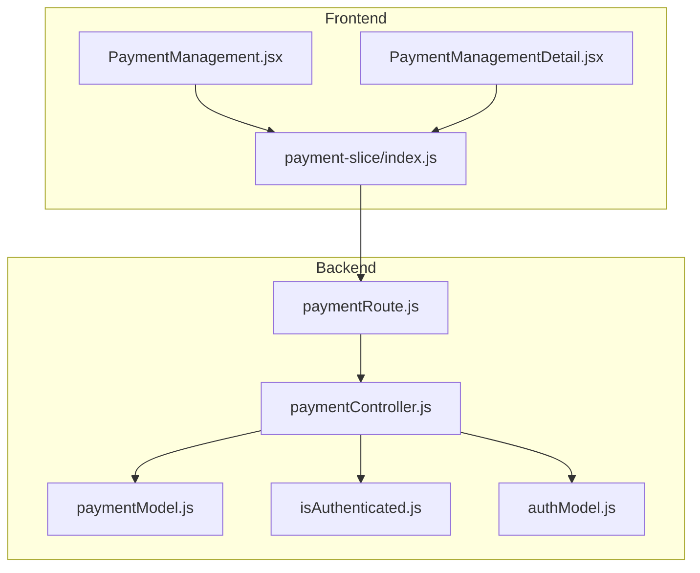
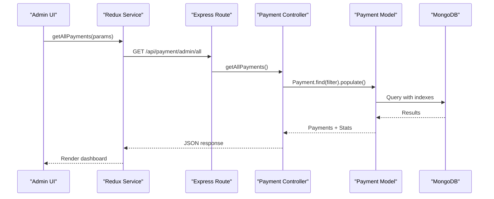
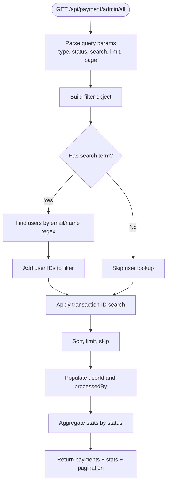
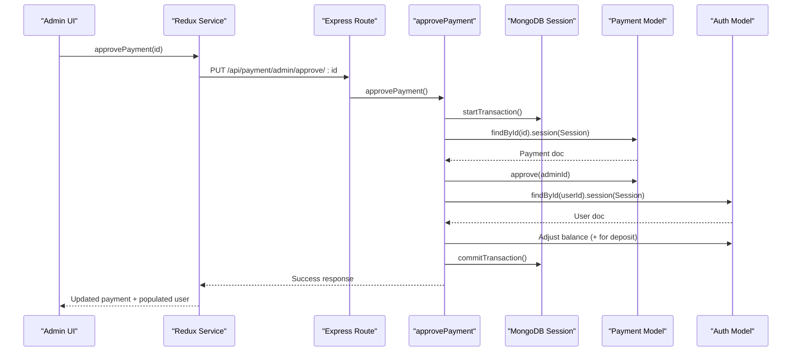
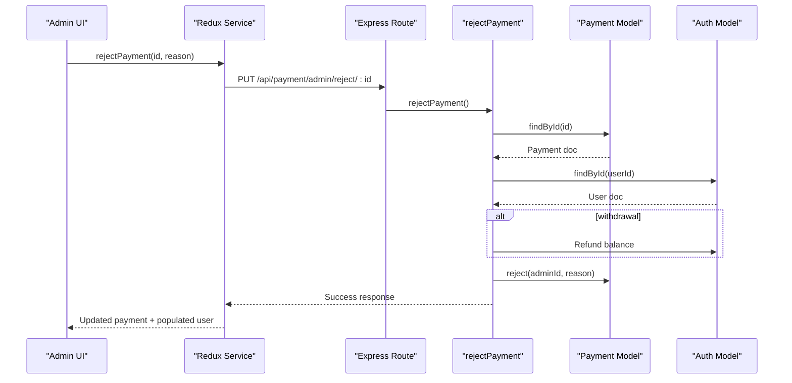
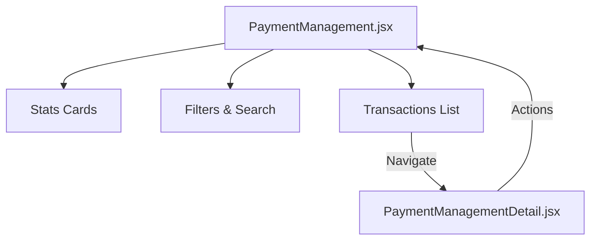
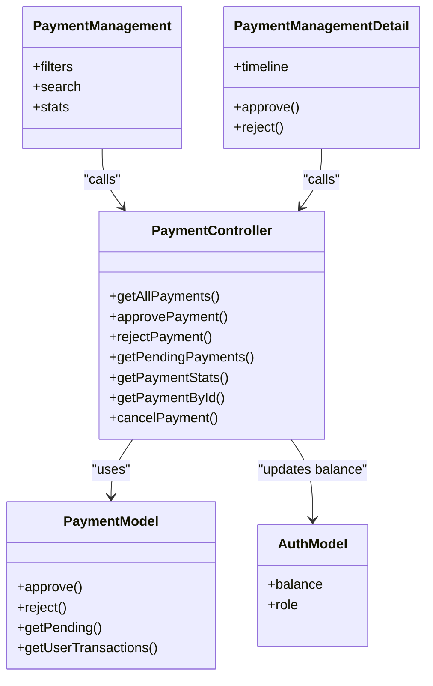

# Admin Payment Management

<cite>
**Referenced Files in This Document**
- [paymentController.js](file://server/controllers/payment/paymentController.js)
- [paymentModel.js](file://server/models/paymentModel.js)
- [PaymentManagement.jsx](file://client/src/Pages/adminPage/PaymentManagement.jsx)
- [PaymentManagementDetail.jsx](file://client/src/components/Admin/PaymentManagementDetail.jsx)
- [paymentRoute.js](file://server/routes/payment/paymentRoute.js)
- [index.js](file://client/src/store/user/payment-slice/index.js)
- [authModel.js](file://server/models/authModel.js)
- [isAuthenticated.js](file://server/middleware/isAuthenticated.js)
- [adminController.js](file://server/controllers/admin/adminController.js)
</cite>

## Table of Contents
1. [Introduction](#introduction)
2. [Project Structure](#project-structure)
3. [Core Components](#core-components)
4. [Architecture Overview](#architecture-overview)
5. [Detailed Component Analysis](#detailed-component-analysis)
6. [Dependency Analysis](#dependency-analysis)
7. [Performance Considerations](#performance-considerations)
8. [Troubleshooting Guide](#troubleshooting-guide)
9. [Conclusion](#conclusion)

## Introduction
This document provides comprehensive documentation for the administrative payment management system. It covers the getAllPayments controller for payment oversight with filtering and search capabilities, the payment approval and rejection workflow with MongoDB transaction handling, admin interface components for payment review and batch operations, payment statistics and dashboards, payment detail views, payment model methods with admin tracking, and operational procedures for compliance and dispute resolution.

## Project Structure
The payment management system spans backend controllers and models, frontend admin pages, Redux service layer, and routing/middleware layers. The backend exposes REST endpoints for admin operations, while the frontend provides interactive dashboards and detail views.

**Diagram sources**
- [paymentRoute.js](file://server/routes/payment/paymentRoute.js#L1-L82)
- [paymentController.js](file://server/controllers/payment/paymentController.js#L537-L794)
- [paymentModel.js](file://server/models/paymentModel.js#L1-L160)
- [PaymentManagement.jsx](file://client/src/Pages/adminPage/PaymentManagement.jsx#L1-L701)
- [PaymentManagementDetail.jsx](file://client/src/components/Admin/PaymentManagementDetail.jsx#L1-L823)
- [index.js](file://client/src/store/user/payment-slice/index.js#L1-L344)
- [isAuthenticated.js](file://server/middleware/isAuthenticated.js#L1-L62)
- [authModel.js](file://server/models/authModel.js#L1-L40)

**Section sources**
- [paymentRoute.js](file://server/routes/payment/paymentRoute.js#L1-L82)
- [paymentController.js](file://server/controllers/payment/paymentController.js#L537-L794)
- [paymentModel.js](file://server/models/paymentModel.js#L1-L160)
- [PaymentManagement.jsx](file://client/src/Pages/adminPage/PaymentManagement.jsx#L1-L701)
- [PaymentManagementDetail.jsx](file://client/src/components/Admin/PaymentManagementDetail.jsx#L1-L823)
- [index.js](file://client/src/store/user/payment-slice/index.js#L1-L344)
- [isAuthenticated.js](file://server/middleware/isAuthenticated.js#L1-L62)
- [authModel.js](file://server/models/authModel.js#L1-L40)

## Core Components
- Backend Controllers: getAllPayments, approvePayment, rejectPayment, getPendingPayments, getPaymentStats, getPaymentById, cancelPayment
- Payment Model: Schema, indexes, approve/reject methods, static helpers
- Frontend Admin Pages: Payment overview and detail views with filtering, search, and actions
- Redux Services: API wrappers for admin payment operations
- Routing/Middleware: Protected admin routes with role checks

Key implementation highlights:
- getAllPayments supports filtering by type and status, and search across transaction ID and user identity
- approvePayment uses MongoDB sessions for atomic updates to payment and user balance
- rejectPayment handles rejection reasons and refunds for withdrawals
- Frontend dashboards compute and display payment statistics and timelines

**Section sources**
- [paymentController.js](file://server/controllers/payment/paymentController.js#L537-L794)
- [paymentModel.js](file://server/models/paymentModel.js#L129-L156)
- [PaymentManagement.jsx](file://client/src/Pages/adminPage/PaymentManagement.jsx#L39-L245)
- [PaymentManagementDetail.jsx](file://client/src/components/Admin/PaymentManagementDetail.jsx#L155-L240)
- [index.js](file://client/src/store/user/payment-slice/index.js#L193-L302)

## Architecture Overview
The system follows a layered architecture:
- Presentation Layer: Admin UI components render payment lists and details
- Service Layer: Redux thunks encapsulate HTTP requests to backend endpoints
- Application Layer: Express routes delegate to controllers
- Domain Layer: Controllers orchestrate database operations and business logic
- Persistence Layer: Mongoose models define schemas and indexes

**Diagram sources**
- [paymentRoute.js](file://server/routes/payment/paymentRoute.js#L65-L65)
- [paymentController.js](file://server/controllers/payment/paymentController.js#L537-L597)
- [paymentModel.js](file://server/models/paymentModel.js#L117-L119)
- [index.js](file://client/src/store/user/payment-slice/index.js#L193-L214)

**Section sources**
- [paymentRoute.js](file://server/routes/payment/paymentRoute.js#L65-L65)
- [paymentController.js](file://server/controllers/payment/paymentController.js#L537-L597)
- [paymentModel.js](file://server/models/paymentModel.js#L117-L119)
- [index.js](file://client/src/store/user/payment-slice/index.js#L193-L214)

## Detailed Component Analysis

### getAllPayments Controller
Purpose: Provide comprehensive payment oversight with filtering, search, and aggregated statistics.

Capabilities:
- Filter by type (deposit/withdrawal) and status (pending/approved/rejected/completed/failed/cancelled)
- Search by transaction ID or user email/name
- Pagination support
- Aggregated statistics per status

Implementation details:
- Builds dynamic filter conditions based on query parameters
- Uses regex-based search against user records and transaction identifiers
- Populates user and processedBy fields for display
- Computes grouped statistics using aggregation pipeline

**Diagram sources**
- [paymentController.js](file://server/controllers/payment/paymentController.js#L537-L597)

**Section sources**
- [paymentController.js](file://server/controllers/payment/paymentController.js#L537-L597)

### Payment Approval Workflow (approvePayment)
Purpose: Approve payments with atomic updates to payment record and user balance.

Key steps:
- Start MongoDB session and transaction
- Validate payment exists and is pending
- Call payment.approve() to update status and metadata
- Load user and adjust balance (add for deposits)
- Commit transaction atomically

**Diagram sources**
- [paymentController.js](file://server/controllers/payment/paymentController.js#L627-L692)
- [paymentModel.js](file://server/models/paymentModel.js#L129-L135)
- [authModel.js](file://server/models/authModel.js#L22-L22)

**Section sources**
- [paymentController.js](file://server/controllers/payment/paymentController.js#L627-L692)
- [paymentModel.js](file://server/models/paymentModel.js#L129-L135)
- [authModel.js](file://server/models/authModel.js#L22-L22)

### Payment Rejection Workflow (rejectPayment)
Purpose: Reject payments with rejection reason and refund handling for withdrawals.

Key steps:
- Validate payment exists and is pending
- Refund balance for withdrawals
- Call payment.reject() to update status and metadata
- Populate user information for response

**Diagram sources**
- [paymentController.js](file://server/controllers/payment/paymentController.js#L694-L744)
- [paymentModel.js](file://server/models/paymentModel.js#L137-L144)

**Section sources**
- [paymentController.js](file://server/controllers/payment/paymentController.js#L694-L744)
- [paymentModel.js](file://server/models/paymentModel.js#L137-L144)

### Admin Interface Components
Overview: Two primary admin components provide payment management and detail views.

PaymentManagement.jsx:
- Filters: Type (all/deposit/withdrawal), Status (all/pending/approved/rejected/cancelled), Search (transaction ID, user email, user ID)
- Statistics cards: Total requests, pending/approved/rejected/cancelled counts and amounts
- Recent transactions list with status badges and navigation to detail view
- Debounced search input and pagination-aware loading

PaymentManagementDetail.jsx:
- Payment detail rendering with type-specific sections (deposit vs withdrawal)
- Action buttons: Approve, Reject, Refresh
- Timeline display: Created, Last Updated, Processed timestamps
- Quick summary and rejection reason display
- Screenshot preview and download link

**Diagram sources**
- [PaymentManagement.jsx](file://client/src/Pages/adminPage/PaymentManagement.jsx#L38-L513)
- [PaymentManagementDetail.jsx](file://client/src/components/Admin/PaymentManagementDetail.jsx#L155-L240)

**Section sources**
- [PaymentManagement.jsx](file://client/src/Pages/adminPage/PaymentManagement.jsx#L38-L513)
- [PaymentManagementDetail.jsx](file://client/src/components/Admin/PaymentManagementDetail.jsx#L155-L240)

### Payment Statistics Dashboard
The system computes and displays:
- Counts and totals per status category
- Approved deposit and withdrawal totals separately
- Combined total amount across all statuses
- Dedicated rows for total deposits and total withdrawals (approved only)

Frontend calculation logic aggregates approved amounts per type and merges with backend stats for a comprehensive view.

**Section sources**
- [PaymentManagement.jsx](file://client/src/Pages/adminPage/PaymentManagement.jsx#L225-L245)
- [paymentController.js](file://server/controllers/payment/paymentController.js#L574-L591)

### Payment Detail View
Features:
- User information (email, user ID)
- Transaction details (type, amount, status, processed by)
- Type-specific fields:
  - Deposit: beneficiary name, bank name, transaction ID, deposit date/time
  - Withdrawal: account holder, bank name, account number, CLABE
- Note and rejection reason fields
- Payment proof screenshot preview
- Timeline of creation/update/processing
- Action controls (approve, reject, refresh)

**Section sources**
- [PaymentManagementDetail.jsx](file://client/src/components/Admin/PaymentManagementDetail.jsx#L442-L673)
- [paymentController.js](file://server/controllers/payment/paymentController.js#L842-L867)

### Payment Model Methods
Methods:
- approve(adminId): Sets status to approved, records processedBy and processedAt
- reject(adminId, reason): Sets status to rejected, records processedBy, processedAt, and rejectionReason
- Static getPending(): Finds pending payments with user population
- Static getUserTransactions(userId): Retrieves user transaction history

Indexes:
- Compound indexes for efficient queries on userId+createdAt, paymentStatus, and type+paymentStatus

**Section sources**
- [paymentModel.js](file://server/models/paymentModel.js#L129-L156)
- [paymentModel.js](file://server/models/paymentModel.js#L117-L119)

### Payment Queue Management and Batch Operations
Current implementation focuses on individual payment operations:
- Pending payments retrieval via getPendingPayments
- Single payment approval/rejection endpoints
- No explicit batch endpoints in the reviewed code

Operational recommendation:
- For bulk operations, introduce batch endpoints that leverage the existing approve/reject logic with controlled concurrency and transaction boundaries.

**Section sources**
- [paymentController.js](file://server/controllers/payment/paymentController.js#L608-L625)
- [paymentRoute.js](file://server/routes/payment/paymentRoute.js#L67-L77)

### Automated Payment Processing
The codebase does not include scheduled jobs or queues for automated payment processing. Consider integrating:
- Background job workers (e.g., BullMQ/Agenda) for periodic reconciliation
- Scheduled tasks for pending payment expiration or cleanup
- Webhook handlers for external payment provider callbacks

[No sources needed since this section provides general guidance]

### Compliance, Regulatory Reporting, and Dispute Resolution
Compliance considerations derived from the codebase:
- Audit trail: Payment documents capture createdAt/updatedAt, processedAt, processedBy, and rejectionReason
- User and admin separation: Admin-only endpoints with role-based authorization
- Data retention: MongoDB timestamps enable historical reporting

Regulatory reporting:
- Use payment statistics endpoints to generate reports by status/type/amount
- Export functionality can be added to pull paginated data for external systems

Dispute resolution:
- RejectionReason field captures rationale for denials
- Timeline view supports investigation timelines
- Screenshot evidence preserved for review

**Section sources**
- [paymentModel.js](file://server/models/paymentModel.js#L74-L92)
- [isAuthenticated.js](file://server/middleware/isAuthenticated.js#L51-L61)
- [paymentController.js](file://server/controllers/payment/paymentController.js#L694-L744)

## Dependency Analysis
Component relationships and data flow:

**Diagram sources**
- [paymentController.js](file://server/controllers/payment/paymentController.js#L537-L867)
- [paymentModel.js](file://server/models/paymentModel.js#L129-L156)
- [authModel.js](file://server/models/authModel.js#L22-L22)
- [PaymentManagement.jsx](file://client/src/Pages/adminPage/PaymentManagement.jsx#L190-L261)
- [PaymentManagementDetail.jsx](file://client/src/components/Admin/PaymentManagementDetail.jsx#L189-L240)

**Section sources**
- [paymentController.js](file://server/controllers/payment/paymentController.js#L537-L867)
- [paymentModel.js](file://server/models/paymentModel.js#L129-L156)
- [authModel.js](file://server/models/authModel.js#L22-L22)
- [PaymentManagement.jsx](file://client/src/Pages/adminPage/PaymentManagement.jsx#L190-L261)
- [PaymentManagementDetail.jsx](file://client/src/components/Admin/PaymentManagementDetail.jsx#L189-L240)

## Performance Considerations
- Indexes: Compound indexes on userId+createdAt, paymentStatus, and type+paymentStatus improve query performance for large datasets
- Pagination: getAllPayments supports configurable limits and page numbers to avoid large result sets
- Population: Selective population of userId and processedBy reduces payload sizes
- Aggregation: Stats computed via aggregation minimize application-side computation
- Image handling: Backend optimizes screenshots with compression and HEIC conversion to reduce storage and bandwidth

Recommendations:
- Monitor slow query logs and add indexes for frequently filtered combinations
- Consider caching hot stats for dashboard rendering
- Implement cursor-based pagination for deep pagination scenarios

**Section sources**
- [paymentModel.js](file://server/models/paymentModel.js#L117-L119)
- [paymentController.js](file://server/controllers/payment/paymentController.js#L565-L572)

## Troubleshooting Guide
Common issues and resolutions:
- Authentication failures: Verify JWT token validity and sessionToken in Auth model
- Authorization errors: Ensure user role is admin/superadmin for protected routes
- Payment not found: Confirm payment ID and user permissions for detail endpoints
- Transaction conflicts: approvePayment uses MongoDB sessions; ensure no concurrent modifications
- Search yields no results: Check regex patterns and user existence for email/name searches

Debugging tips:
- Enable server logs around controller entry/exit points
- Validate frontend params passed to Redux services
- Inspect MongoDB aggregation results for stats computation

**Section sources**
- [isAuthenticated.js](file://server/middleware/isAuthenticated.js#L1-L62)
- [paymentRoute.js](file://server/routes/payment/paymentRoute.js#L65-L77)
- [paymentController.js](file://server/controllers/payment/paymentController.js#L627-L692)

## Conclusion
The administrative payment management system provides robust oversight with comprehensive filtering, search, and statistics. The approval/rejection workflows are secured with MongoDB transactions and admin authorization. The frontend admin components deliver intuitive dashboards and detail views with actionable controls. For production hardening, consider adding batch operations, automated processing hooks, and enhanced reporting/export capabilities.