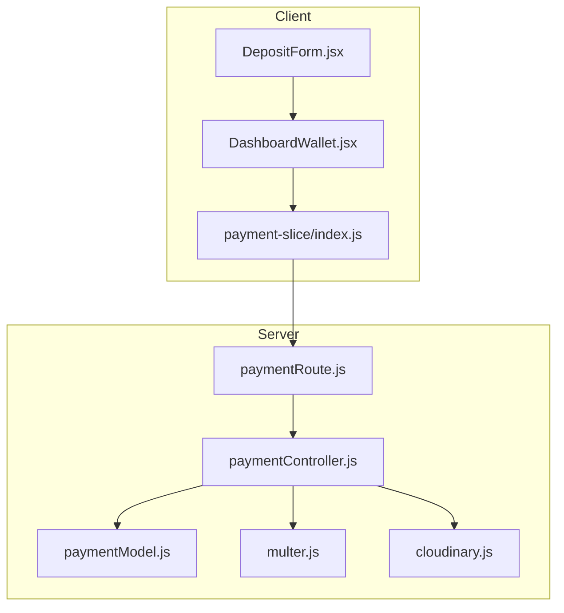
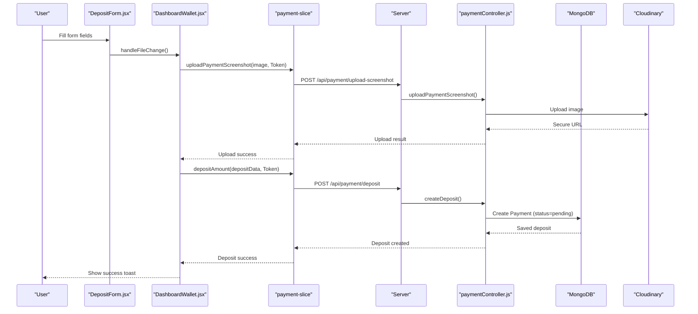
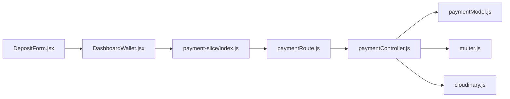

# Deposit Workflow

<cite>
**Referenced Files in This Document**
- [DepositForm.jsx](file://client/src/components/User/walletComponent/DepositForm.jsx)
- [DashboardWallet.jsx](file://client/src/components/User/DashboardWallet.jsx)
- [payment-slice/index.js](file://client/src/store/user/payment-slice/index.js)
- [paymentController.js](file://server/controllers/payment/paymentController.js)
- [paymentModel.js](file://server/models/paymentModel.js)
- [paymentRoute.js](file://server/routes/payment/paymentRoute.js)
- [cloudinary.js](file://server/config/cloudinary.js)
- [multer.js](file://server/middleware/multer.js)
- [PaymentManagement.jsx](file://client/src/pages/adminPage/PaymentManagement.jsx)
</cite>

## Table of Contents
1. [Introduction](#introduction)
2. [Project Structure](#project-structure)
3. [Core Components](#core-components)
4. [Architecture Overview](#architecture-overview)
5. [Detailed Component Analysis](#detailed-component-analysis)
6. [Dependency Analysis](#dependency-analysis)
7. [Performance Considerations](#performance-considerations)
8. [Troubleshooting Guide](#troubleshooting-guide)
9. [Conclusion](#conclusion)

## Introduction
This document explains the complete deposit workflow system from user initiation to admin approval. It covers form validation, screenshot upload via Cloudinary, MongoDB transaction handling, and the end-to-end process from initiation to completion. It also documents the DepositForm component, the createDeposit controller function, the payment model schema, route configuration, error handling strategies, minimum deposit limits, user feedback mechanisms, and security considerations.

## Project Structure
The deposit workflow spans both the client and server sides:
- Client-side: React components and Redux thunks orchestrate user input, file upload, and submission.
- Server-side: Express routes, controllers, and Mongoose models handle validation, Cloudinary integration, and database persistence.

**Diagram sources**
- [DepositForm.jsx](file://client/src/components/User/walletComponent/DepositForm.jsx#L1-L329)
- [DashboardWallet.jsx](file://client/src/components/User/DashboardWallet.jsx#L1-L819)
- [payment-slice/index.js](file://client/src/store/user/payment-slice/index.js#L1-L344)
- [paymentRoute.js](file://server/routes/payment/paymentRoute.js#L1-L82)
- [paymentController.js](file://server/controllers/payment/paymentController.js#L1-L868)
- [paymentModel.js](file://server/models/paymentModel.js#L1-L160)
- [multer.js](file://server/middleware/multer.js#L1-L88)
- [cloudinary.js](file://server/config/cloudinary.js#L1-L10)

**Section sources**
- [DepositForm.jsx](file://client/src/components/User/walletComponent/DepositForm.jsx#L1-L329)
- [DashboardWallet.jsx](file://client/src/components/User/DashboardWallet.jsx#L1-L819)
- [payment-slice/index.js](file://client/src/store/user/payment-slice/index.js#L1-L344)
- [paymentRoute.js](file://server/routes/payment/paymentRoute.js#L1-L82)
- [paymentController.js](file://server/controllers/payment/paymentController.js#L1-L868)
- [paymentModel.js](file://server/models/paymentModel.js#L1-L160)
- [multer.js](file://server/middleware/multer.js#L1-L88)
- [cloudinary.js](file://server/config/cloudinary.js#L1-L10)

## Core Components
- DepositForm: Collects user input for deposit including beneficiary name, bank name, deposit date/time, amount, transaction ID, and payment screenshot.
- DashboardWallet: Orchestrates form state, file upload, and submission flow, including progress tracking and user feedback.
- payment-slice: Redux thunks for uploadPaymentScreenshot and depositAmount, handling network requests and progress callbacks.
- paymentController: Server-side logic for upload, validation, and deposit creation, including Cloudinary integration and MongoDB transactions.
- paymentModel: Mongoose schema defining deposit fields and status lifecycle.
- paymentRoute: Route definitions for upload, deposit creation, and admin approvals.
- multer: File upload middleware with size limits and accepted formats.
- cloudinary: Cloudinary configuration for secure image uploads.

**Section sources**
- [DepositForm.jsx](file://client/src/components/User/walletComponent/DepositForm.jsx#L1-L329)
- [DashboardWallet.jsx](file://client/src/components/User/DashboardWallet.jsx#L126-L189)
- [payment-slice/index.js](file://client/src/store/user/payment-slice/index.js#L34-L127)
- [paymentController.js](file://server/controllers/payment/paymentController.js#L11-L200)
- [paymentModel.js](file://server/models/paymentModel.js#L3-L114)
- [paymentRoute.js](file://server/routes/payment/paymentRoute.js#L24-L61)
- [multer.js](file://server/middleware/multer.js#L31-L58)
- [cloudinary.js](file://server/config/cloudinary.js#L1-L10)

## Architecture Overview
The deposit workflow follows a clear client-server architecture:
- Client collects user input and validates locally.
- Client uploads the payment screenshot to the server via a dedicated endpoint.
- Client submits deposit details to the server.
- Server validates inputs, rounds amounts, persists a deposit record, and sets status to pending.
- Admin reviews and approves or rejects the deposit, updating balances accordingly.

**Diagram sources**
- [DepositForm.jsx](file://client/src/components/User/walletComponent/DepositForm.jsx#L236-L311)
- [DashboardWallet.jsx](file://client/src/components/User/DashboardWallet.jsx#L301-L401)
- [payment-slice/index.js](file://client/src/store/user/payment-slice/index.js#L34-L127)
- [paymentRoute.js](file://server/routes/payment/paymentRoute.js#L27-L50)
- [paymentController.js](file://server/controllers/payment/paymentController.js#L11-L200)
- [paymentModel.js](file://server/models/paymentModel.js#L3-L114)
- [cloudinary.js](file://server/config/cloudinary.js#L1-L10)

## Detailed Component Analysis

### DepositForm Component
The DepositForm component renders the deposit form with the following fields:
- Beneficiary Name (required)
- Bank Name (required)
- Deposit Date (required)
- Deposit Time (required)
- Amount (required, min $100, max $2,000,000)
- Transaction ID (required)
- Payment Screenshot (required, image/*, HEIC supported)
- Submit button

UI behavior:
- Static bank information display for reference.
- Date picker with localization support.
- File input with accept restrictions and progress indicator.
- Disabled submit during upload or submission.

Validation:
- Frontend checks for required fields before submission.
- Backend enforces amount minimum and required fields.

User feedback:
- Upload progress bar and percentage.
- Success/error toasts for upload and submission.

**Section sources**
- [DepositForm.jsx](file://client/src/components/User/walletComponent/DepositForm.jsx#L110-L321)

### DashboardWallet Integration
DashboardWallet manages the deposit flow:
- Maintains depositData state with all required fields.
- Handles file selection, size validation, and upload strategy (direct vs. compressed).
- Implements upload progress tracking and error handling.
- Submits deposit via Redux thunk depositAmount.
- Clears form fields upon successful submission.

Upload strategy:
- Small files (< 5MB): direct upload.
- Larger files: compress to JPEG, then upload.
- Progress mapped to 0–100% for small files and 30–100% for compressed uploads.

**Section sources**
- [DashboardWallet.jsx](file://client/src/components/User/DashboardWallet.jsx#L52-L63)
- [DashboardWallet.jsx](file://client/src/components/User/DashboardWallet.jsx#L126-L189)
- [DashboardWallet.jsx](file://client/src/components/User/DashboardWallet.jsx#L301-L401)

### Redux Thunks (payment-slice)
- uploadPaymentScreenshot: Posts FormData to /api/payment/upload-screenshot with progress tracking.
- depositAmount: Posts depositData to /api/payment/deposit.
- getUserTransactions, getTransactionById: Retrieve transaction history and details.

Error handling:
- Axios interceptors map timeouts, network errors, and 413 responses to user-friendly messages.

**Section sources**
- [payment-slice/index.js](file://client/src/store/user/payment-slice/index.js#L34-L127)
- [payment-slice/index.js](file://client/src/store/user/payment-slice/index.js#L172-L234)

### Server Routes (paymentRoute.js)
- POST /api/payment/upload-screenshot: Single-file upload with multer and Cloudinary.
- POST /api/payment/deposit: Creates deposit request with validation.
- GET /api/payment/my-transactions: User’s transaction history.
- GET /api/payment/:id: Single transaction by ID.
- PUT /api/payment/cancel/:id: Cancel pending payment.

Admin routes:
- GET /api/payment/admin/all: Paginated and searchable admin view.
- GET /api/payment/admin/pending: Pending payments.
- GET /api/payment/admin/stats: Aggregated stats.
- PUT /api/payment/admin/approve/:id: Approve payment and update user balance.
- PUT /api/payment/admin/reject/:id: Reject payment with reason.
- GET /api/payment/admin/:id: Admin view of a single payment.

**Section sources**
- [paymentRoute.js](file://server/routes/payment/paymentRoute.js#L24-L81)

### Controller: uploadPaymentScreenshot
Key steps:
- Validates file presence and existence.
- Converts HEIC/HEIF to JPEG using Sharp.
- Compresses large files (>10MB) to reduce size.
- Uploads to Cloudinary with transformations and chunked upload support.
- Cleans up temporary files.
- Returns secure URL and metadata.

Error handling:
- Maps 413 and ETIMEDOUT to user-friendly responses.
- Cleans up temp files on failure.

**Section sources**
- [paymentController.js](file://server/controllers/payment/paymentController.js#L11-L200)

### Controller: createDeposit
Validation and processing:
- Enforces minimum amount ($100) and requires all fields.
- Rounds amount to two decimal places.
- Creates Payment document with type=deposit, paymentStatus=pending.
- Populates user details for response.

**Section sources**
- [paymentController.js](file://server/controllers/payment/paymentController.js#L341-L396)

### Model Schema (paymentModel.js)
Fields for deposits:
- userId (required, ObjectId)
- type (enum: deposit, withdrawal)
- transactionId (required for deposit)
- amount (required, min 0)
- beneficiaryName (required for deposit)
- screenshot (URL/path, required for deposit)
- bankName (required)
- depositDate, depositTime (optional)
- paymentStatus (default: pending)
- processedBy, processedAt, rejectionReason (admin fields)
- note (max length 500)
- timestamps

Indexes:
- userId+createdAt, paymentStatus, type+paymentStatus for efficient queries.

Methods:
- approve(adminId): Sets status to approved and records admin.
- reject(adminId, reason): Sets status to rejected and records reason.
- static getPending(): Finds pending payments with user populated.

**Section sources**
- [paymentModel.js](file://server/models/paymentModel.js#L3-L151)

### Cloudinary Integration
- Configured with environment variables for secure uploads.
- Uses auto format and quality settings with transformations.
- Supports chunked uploads for very large files.

**Section sources**
- [cloudinary.js](file://server/config/cloudinary.js#L1-L10)
- [paymentController.js](file://server/controllers/payment/paymentController.js#L112-L129)

### Multer Middleware
- Disk storage with dynamic uploads directory.
- Accepts images and HEIC/HEIF sequences.
- File size limit 50MB, single file only.
- Error handler maps specific multer errors to HTTP status codes.

**Section sources**
- [multer.js](file://server/middleware/multer.js#L31-L88)

### Admin Workflow
Admin views and actions:
- PaymentManagement displays stats and filters.
- Approve: Starts MongoDB session, updates payment status, and increments user balance.
- Reject: Updates status and, for withdrawals, refunds balance.

**Section sources**
- [PaymentManagement.jsx](file://client/src/pages/adminPage/PaymentManagement.jsx#L189-L290)
- [paymentController.js](file://server/controllers/payment/paymentController.js#L627-L692)
- [paymentController.js](file://server/controllers/payment/paymentController.js#L694-L744)

## Dependency Analysis

**Diagram sources**
- [DepositForm.jsx](file://client/src/components/User/walletComponent/DepositForm.jsx#L1-L329)
- [DashboardWallet.jsx](file://client/src/components/User/DashboardWallet.jsx#L1-L819)
- [payment-slice/index.js](file://client/src/store/user/payment-slice/index.js#L1-L344)
- [paymentRoute.js](file://server/routes/payment/paymentRoute.js#L1-L82)
- [paymentController.js](file://server/controllers/payment/paymentController.js#L1-L868)
- [paymentModel.js](file://server/models/paymentModel.js#L1-L160)
- [multer.js](file://server/middleware/multer.js#L1-L88)
- [cloudinary.js](file://server/config/cloudinary.js#L1-L10)

**Section sources**
- [payment-slice/index.js](file://client/src/store/user/payment-slice/index.js#L34-L127)
- [paymentRoute.js](file://server/routes/payment/paymentRoute.js#L24-L61)
- [paymentController.js](file://server/controllers/payment/paymentController.js#L11-L200)

## Performance Considerations
- File compression: HEIC conversion and JPEG compression reduce upload sizes.
- Chunked uploads: Optional chunked upload endpoints for very large files.
- Cloudinary transformations: Automatic resizing and quality tuning.
- Pagination and filtering: Admin endpoints support pagination and search to reduce payload sizes.
- Session-based transactions: Admin approval uses MongoDB sessions to ensure atomicity.

[No sources needed since this section provides general guidance]

## Troubleshooting Guide
Common issues and resolutions:
- File too large: Ensure under 50MB; consider compression strategy.
- Upload timeout: Network issues or large file; retry with smaller image or better connection.
- Missing fields: Ensure all required fields are filled before submission.
- Duplicate or invalid transaction ID: Verify uniqueness and correctness.
- Insufficient balance (for withdrawals): Not applicable to deposits; check withdrawal logic.
- Admin approval failures: Confirm payment is pending and user exists.

Error handling highlights:
- Client-side: Axios maps ECONNABORTED to “Upload timeout” and ERR_NETWORK to “Network error.”
- Server-side: 413 for oversized files, 504 for upload timeout, and cleanup of temp files on failure.

**Section sources**
- [payment-slice/index.js](file://client/src/store/user/payment-slice/index.js#L84-L100)
- [paymentController.js](file://server/controllers/payment/paymentController.js#L182-L199)
- [multer.js](file://server/middleware/multer.js#L60-L86)

## Conclusion
The deposit workflow integrates a responsive client UI with robust server-side validation, secure file handling via Cloudinary, and a reliable MongoDB transaction model. The system enforces minimum deposit limits, rounds amounts, and provides clear user feedback. Admin controls ensure safe and auditable approvals with session-based transactions. Together, these components deliver a secure, scalable, and user-friendly deposit experience.