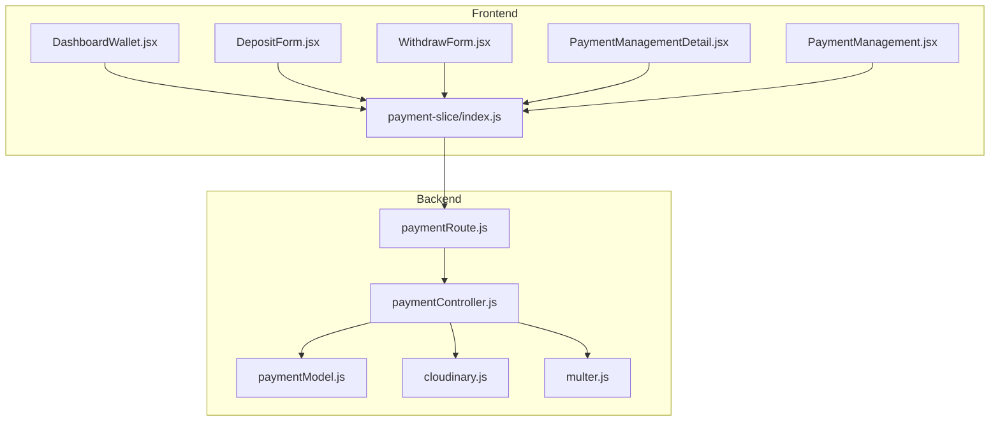
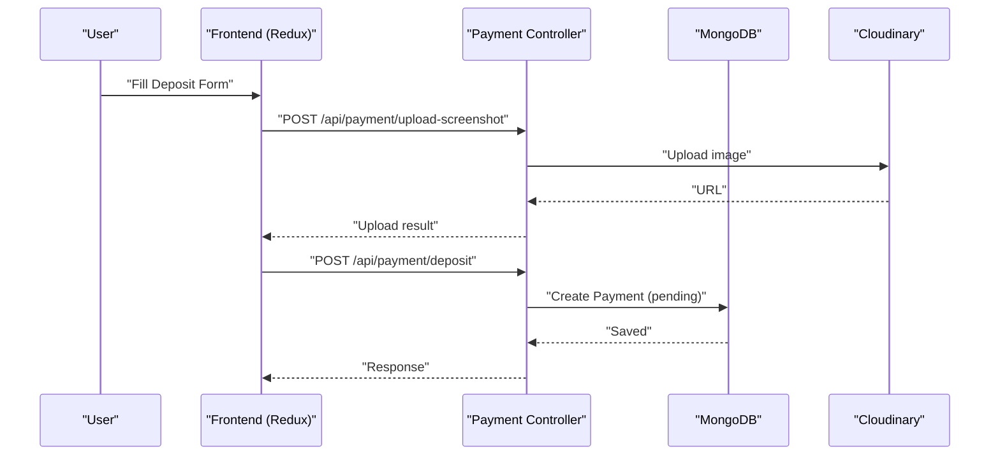
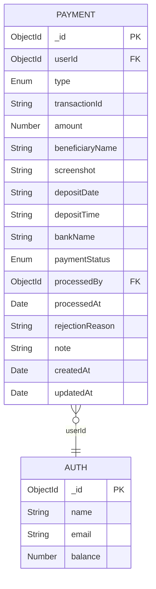
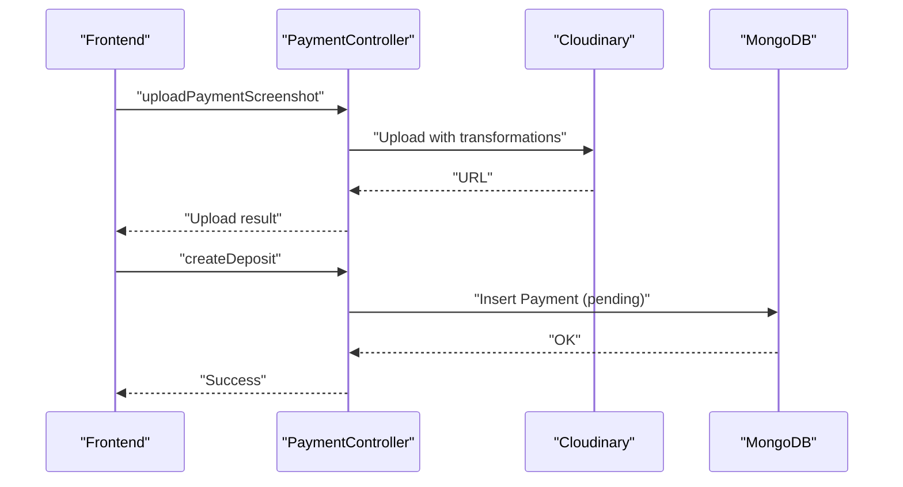
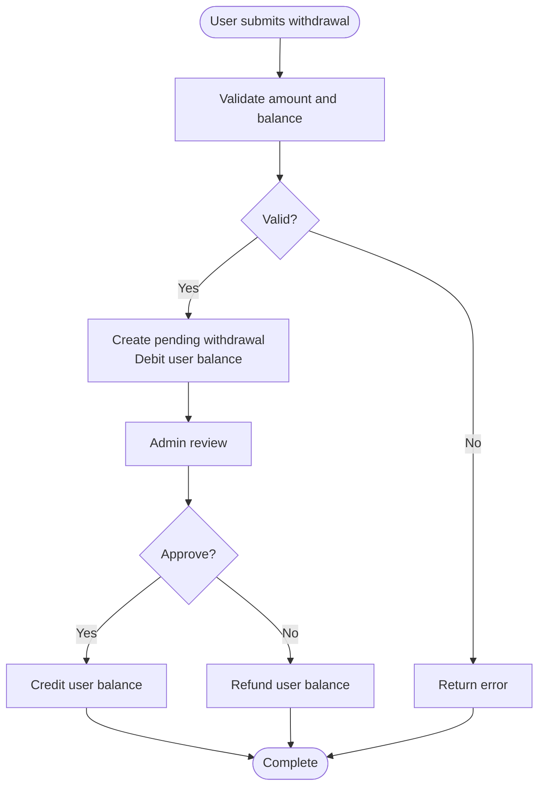
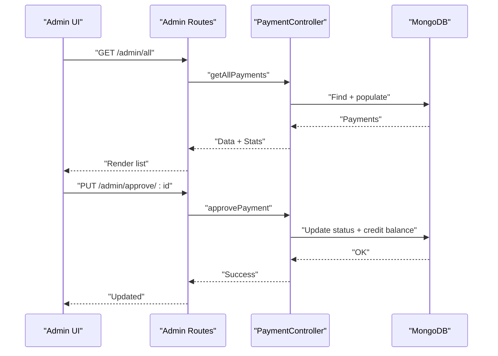
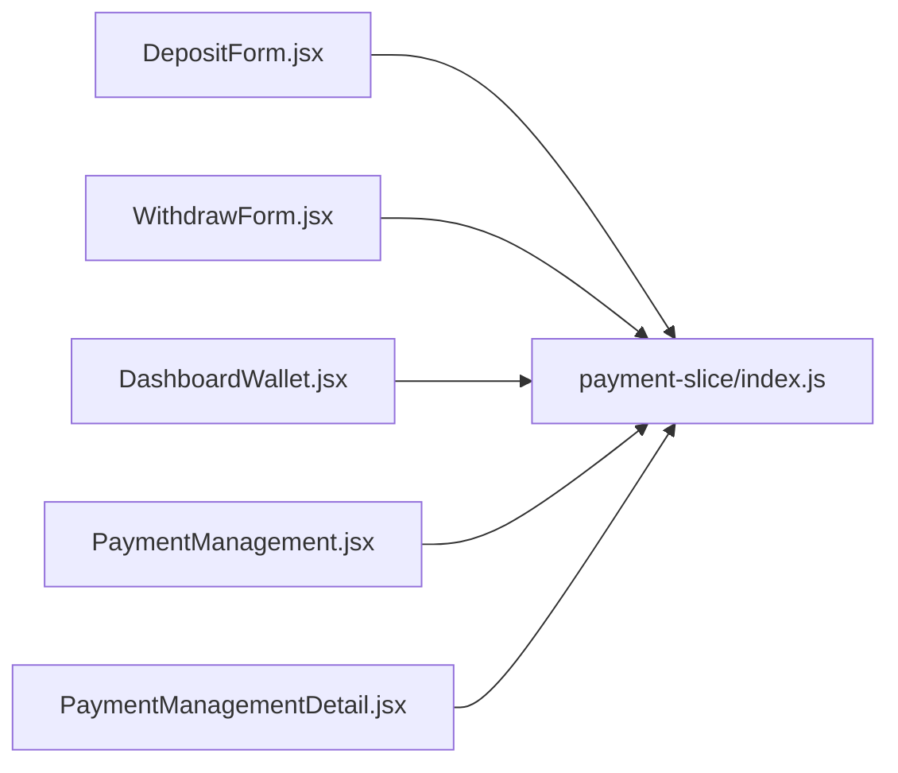
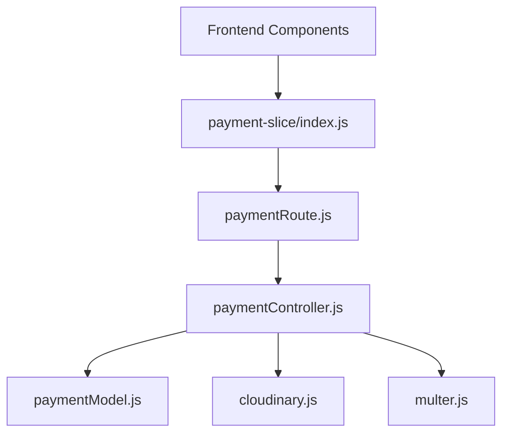

# Payment System

<cite>
**Referenced Files in This Document**
- [paymentModel.js](file://server/models/paymentModel.js)
- [paymentController.js](file://server/controllers/payment/paymentController.js)
- [paymentRoute.js](file://server/routes/payment/paymentRoute.js)
- [cloudinary.js](file://server/config/cloudinary.js)
- [multer.js](file://server/middleware/multer.js)
- [DepositForm.jsx](file://client/src/components/User/walletComponent/DepositForm.jsx)
- [WithdrawForm.jsx](file://client/src/components/User/walletComponent/WithdrawForm.jsx)
- [DashboardWallet.jsx](file://client/src/components/User/DashboardWallet.jsx)
- [PaymentManagement.jsx](file://client/src/Pages/adminPage/PaymentManagement.jsx)
- [PaymentManagementDetail.jsx](file://client/src/components/Admin/PaymentManagementDetail.jsx)
- [payment-slice/index.js](file://client/src/store/user/payment-slice/index.js)
</cite>

## Table of Contents
1. [Introduction](#introduction)
2. [Project Structure](#project-structure)
3. [Core Components](#core-components)
4. [Architecture Overview](#architecture-overview)
5. [Detailed Component Analysis](#detailed-component-analysis)
6. [Dependency Analysis](#dependency-analysis)
7. [Performance Considerations](#performance-considerations)
8. [Security Measures](#security-measures)
9. [Troubleshooting Guide](#troubleshooting-guide)
10. [Conclusion](#conclusion)

## Introduction
This document describes the payment system covering deposits, withdrawals, screenshots, admin approvals, and transaction tracking. It explains the backend payment model, controllers, and routes, and details the frontend wallet components and admin management UI. It also outlines security measures, performance characteristics, and common issue resolutions.

## Project Structure
The payment system spans two primary areas:
- Backend (Node.js + Express): payment model, controller, routes, Cloudinary integration, and Multer file handling
- Frontend (React + Redux Toolkit): wallet UI, forms, transaction lists, and admin panels

**Diagram sources**
- [paymentRoute.js](file://server/routes/payment/paymentRoute.js#L1-L82)
- [paymentController.js](file://server/controllers/payment/paymentController.js#L1-L868)
- [paymentModel.js](file://server/models/paymentModel.js#L1-L160)
- [cloudinary.js](file://server/config/cloudinary.js#L1-L10)
- [multer.js](file://server/middleware/multer.js#L1-L88)
- [DashboardWallet.jsx](file://client/src/components/User/DashboardWallet.jsx#L1-L819)
- [DepositForm.jsx](file://client/src/components/User/walletComponent/DepositForm.jsx#L1-L329)
- [WithdrawForm.jsx](file://client/src/components/User/walletComponent/WithdrawForm.jsx#L1-L118)
- [PaymentManagement.jsx](file://client/src/Pages/adminPage/PaymentManagement.jsx#L1-L200)
- [PaymentManagementDetail.jsx](file://client/src/components/Admin/PaymentManagementDetail.jsx#L1-L823)
- [payment-slice/index.js](file://client/src/store/user/payment-slice/index.js#L1-L344)

**Section sources**
- [paymentRoute.js](file://server/routes/payment/paymentRoute.js#L1-L82)
- [paymentController.js](file://server/controllers/payment/paymentController.js#L1-L868)
- [paymentModel.js](file://server/models/paymentModel.js#L1-L160)
- [cloudinary.js](file://server/config/cloudinary.js#L1-L10)
- [multer.js](file://server/middleware/multer.js#L1-L88)
- [DashboardWallet.jsx](file://client/src/components/User/DashboardWallet.jsx#L1-L819)
- [DepositForm.jsx](file://client/src/components/User/walletComponent/DepositForm.jsx#L1-L329)
- [WithdrawForm.jsx](file://client/src/components/User/walletComponent/WithdrawForm.jsx#L1-L118)
- [PaymentManagement.jsx](file://client/src/Pages/adminPage/PaymentManagement.jsx#L1-L200)
- [PaymentManagementDetail.jsx](file://client/src/components/Admin/PaymentManagementDetail.jsx#L1-L823)
- [payment-slice/index.js](file://client/src/store/user/payment-slice/index.js#L1-L344)

## Core Components
- Payment Model: Defines transaction schema, indexes, and helper methods for approvals and queries
- Payment Controller: Implements upload, deposit/withdraw creation, user/admin queries, approvals, rejections, cancellations, and stats
- Payment Routes: Exposes endpoints for user and admin workflows
- Frontend Wallet: Deposit and withdrawal forms, transaction list, and modal
- Admin Panel: Lists, filters, and approves/rejects transactions
- Cloudinary Integration: Secure image upload and transformations
- Multer Middleware: Local disk storage and file filtering

**Section sources**
- [paymentModel.js](file://server/models/paymentModel.js#L1-L160)
- [paymentController.js](file://server/controllers/payment/paymentController.js#L1-L868)
- [paymentRoute.js](file://server/routes/payment/paymentRoute.js#L1-L82)
- [cloudinary.js](file://server/config/cloudinary.js#L1-L10)
- [multer.js](file://server/middleware/multer.js#L1-L88)
- [DashboardWallet.jsx](file://client/src/components/User/DashboardWallet.jsx#L1-L819)
- [DepositForm.jsx](file://client/src/components/User/walletComponent/DepositForm.jsx#L1-L329)
- [WithdrawForm.jsx](file://client/src/components/User/walletComponent/WithdrawForm.jsx#L1-L118)
- [PaymentManagement.jsx](file://client/src/Pages/adminPage/PaymentManagement.jsx#L1-L200)
- [PaymentManagementDetail.jsx](file://client/src/components/Admin/PaymentManagementDetail.jsx#L1-L823)
- [payment-slice/index.js](file://client/src/store/user/payment-slice/index.js#L1-L344)

## Architecture Overview
The system follows a layered architecture:
- Presentation Layer: React components and Redux slices
- Application Layer: Route handlers and controller logic
- Domain Layer: Mongoose model with helper methods
- Infrastructure: Cloudinary and Multer

**Diagram sources**
- [paymentRoute.js](file://server/routes/payment/paymentRoute.js#L24-L61)
- [paymentController.js](file://server/controllers/payment/paymentController.js#L11-L200)
- [cloudinary.js](file://server/config/cloudinary.js#L1-L10)
- [paymentModel.js](file://server/models/paymentModel.js#L1-L160)
- [payment-slice/index.js](file://client/src/store/user/payment-slice/index.js#L34-L127)

## Detailed Component Analysis

### Payment Model Schema
The Payment model defines:
- Identity: userId, type (deposit/withdrawal)
- Deposit fields: transactionId, beneficiaryName, screenshot, depositDate, depositTime
- Withdrawal fields: accountHolderName, accountNumber, bankName
- Status lifecycle: pending, approved, rejected, completed, failed, cancelled
- Admin metadata: processedBy, processedAt, rejectionReason
- Timestamps and indexes for efficient queries

**Diagram sources**
- [paymentModel.js](file://server/models/paymentModel.js#L3-L114)

**Section sources**
- [paymentModel.js](file://server/models/paymentModel.js#L1-L160)

### Deposit Workflow
End-to-end flow:
- Upload screenshot with optional HEIC conversion and compression
- Submit deposit with beneficiary, bank, amount, transactionId, screenshot URL, deposit date/time
- Create pending deposit record
- Admin reviews and approves or rejects
- On approval, user balance credited

**Diagram sources**
- [paymentController.js](file://server/controllers/payment/paymentController.js#L11-L200)
- [paymentController.js](file://server/controllers/payment/paymentController.js#L341-L396)
- [cloudinary.js](file://server/config/cloudinary.js#L1-L10)
- [paymentModel.js](file://server/models/paymentModel.js#L1-L160)

**Section sources**
- [paymentController.js](file://server/controllers/payment/paymentController.js#L11-L200)
- [paymentController.js](file://server/controllers/payment/paymentController.js#L341-L396)
- [cloudinary.js](file://server/config/cloudinary.js#L1-L10)
- [multer.js](file://server/middleware/multer.js#L1-L88)
- [DepositForm.jsx](file://client/src/components/User/walletComponent/DepositForm.jsx#L1-L329)
- [DashboardWallet.jsx](file://client/src/components/User/DashboardWallet.jsx#L126-L189)
- [payment-slice/index.js](file://client/src/store/user/payment-slice/index.js#L34-L127)

### Withdrawal System
- User submits withdrawal with amount, account holder name, account number, bank name
- Backend validates minimum amount and sufficient balance
- Creates pending withdrawal and debits user balance immediately
- Admin can approve (credit user) or reject (refund balance)
- Optional cancellation of pending withdrawals

**Diagram sources**
- [paymentController.js](file://server/controllers/payment/paymentController.js#L398-L464)
- [paymentController.js](file://server/controllers/payment/paymentController.js#L627-L744)
- [paymentController.js](file://server/controllers/payment/paymentController.js#L800-L841)

**Section sources**
- [paymentController.js](file://server/controllers/payment/paymentController.js#L398-L464)
- [paymentController.js](file://server/controllers/payment/paymentController.js#L627-L744)
- [paymentController.js](file://server/controllers/payment/paymentController.js#L800-L841)
- [WithdrawForm.jsx](file://client/src/components/User/walletComponent/WithdrawForm.jsx#L1-L118)
- [DashboardWallet.jsx](file://client/src/components/User/DashboardWallet.jsx#L191-L247)

### Admin Payment Management
- Admin views all payments with filters (type, status), search by transactionId or user
- Approve or reject pending payments
- View payment statistics and individual details
- Download screenshots and track timelines

**Diagram sources**
- [paymentRoute.js](file://server/routes/payment/paymentRoute.js#L63-L81)
- [paymentController.js](file://server/controllers/payment/paymentController.js#L537-L625)
- [paymentController.js](file://server/controllers/payment/paymentController.js#L627-L692)
- [PaymentManagement.jsx](file://client/src/Pages/adminPage/PaymentManagement.jsx#L1-L200)
- [PaymentManagementDetail.jsx](file://client/src/components/Admin/PaymentManagementDetail.jsx#L1-L823)

**Section sources**
- [paymentRoute.js](file://server/routes/payment/paymentRoute.js#L63-L81)
- [paymentController.js](file://server/controllers/payment/paymentController.js#L537-L625)
- [paymentController.js](file://server/controllers/payment/paymentController.js#L627-L692)
- [PaymentManagement.jsx](file://client/src/Pages/adminPage/PaymentManagement.jsx#L1-L200)
- [PaymentManagementDetail.jsx](file://client/src/components/Admin/PaymentManagementDetail.jsx#L1-L823)

### Frontend Wallet Components
- DepositForm: Collects beneficiary, bank, date/time, amount, transactionId, and screenshot upload
- WithdrawForm: Collects withdrawal details and amount
- DashboardWallet: Tabs for deposit/withdraw, transaction list, upload progress, and cancellation
- Redux slice: Async thunks for uploads, deposits, withdrawals, transactions, and admin actions

**Diagram sources**
- [DepositForm.jsx](file://client/src/components/User/walletComponent/DepositForm.jsx#L1-L329)
- [WithdrawForm.jsx](file://client/src/components/User/walletComponent/WithdrawForm.jsx#L1-L118)
- [DashboardWallet.jsx](file://client/src/components/User/DashboardWallet.jsx#L1-L819)
- [payment-slice/index.js](file://client/src/store/user/payment-slice/index.js#L1-L344)
- [PaymentManagement.jsx](file://client/src/Pages/adminPage/PaymentManagement.jsx#L1-L200)
- [PaymentManagementDetail.jsx](file://client/src/components/Admin/PaymentManagementDetail.jsx#L1-L823)

**Section sources**
- [DepositForm.jsx](file://client/src/components/User/walletComponent/DepositForm.jsx#L1-L329)
- [WithdrawForm.jsx](file://client/src/components/User/walletComponent/WithdrawForm.jsx#L1-L118)
- [DashboardWallet.jsx](file://client/src/components/User/DashboardWallet.jsx#L1-L819)
- [payment-slice/index.js](file://client/src/store/user/payment-slice/index.js#L1-L344)
- [PaymentManagement.jsx](file://client/src/Pages/adminPage/PaymentManagement.jsx#L1-L200)
- [PaymentManagementDetail.jsx](file://client/src/components/Admin/PaymentManagementDetail.jsx#L1-L823)

## Dependency Analysis
- Controllers depend on the Payment model and Cloudinary/Multer
- Routes bind endpoints to controller actions
- Frontend Redux slices call backend APIs and update UI state
- Admin components rely on service wrappers for admin endpoints

**Diagram sources**
- [paymentController.js](file://server/controllers/payment/paymentController.js#L1-L868)
- [paymentModel.js](file://server/models/paymentModel.js#L1-L160)
- [cloudinary.js](file://server/config/cloudinary.js#L1-L10)
- [multer.js](file://server/middleware/multer.js#L1-L88)
- [paymentRoute.js](file://server/routes/payment/paymentRoute.js#L1-L82)
- [payment-slice/index.js](file://client/src/store/user/payment-slice/index.js#L1-L344)

**Section sources**
- [paymentController.js](file://server/controllers/payment/paymentController.js#L1-L868)
- [paymentModel.js](file://server/models/paymentModel.js#L1-L160)
- [cloudinary.js](file://server/config/cloudinary.js#L1-L10)
- [multer.js](file://server/middleware/multer.js#L1-L88)
- [paymentRoute.js](file://server/routes/payment/paymentRoute.js#L1-L82)
- [payment-slice/index.js](file://client/src/store/user/payment-slice/index.js#L1-L344)

## Performance Considerations
- Image optimization: HEIC conversion, server-side compression, and Cloudinary transformations reduce payload sizes
- Chunked uploads: Optional chunked upload handlers support large files
- Indexes: Strategic indexes on userId, status, and type/status improve query performance
- Pagination: Admin endpoints support pagination and filtering to limit payload sizes
- CDN: Cloudinary delivers optimized images efficiently

[No sources needed since this section provides general guidance]

## Security Measures
- Authentication and authorization: Admin-only endpoints require admin/superadmin roles
- File validation: Multer restricts allowed MIME types and extensions
- Size limits: Upload limits prevent oversized payloads
- Transaction isolation: Admin approvals use database sessions to atomically update balances
- CORS and HTTPS: Production deployment should enforce HTTPS and appropriate headers

**Section sources**
- [paymentRoute.js](file://server/routes/payment/paymentRoute.js#L63-L81)
- [multer.js](file://server/middleware/multer.js#L31-L58)
- [paymentController.js](file://server/controllers/payment/paymentController.js#L627-L692)

## Troubleshooting Guide
Common issues and resolutions:
- Upload failures
  - Symptoms: 413 errors, timeouts, or upload errors
  - Causes: File too large, network issues, unsupported formats
  - Resolution: Use smaller images, compress via frontend logic, verify allowed formats
- Insufficient balance for withdrawal
  - Symptoms: Validation error indicating insufficient funds
  - Resolution: Check user balance and ensure sufficient funds before submitting
- Pending payment not appearing for admin
  - Symptoms: Missing pending requests
  - Resolution: Use admin pending endpoint and verify status filters
- Approval/rejection errors
  - Symptoms: Payment already processed or not found
  - Resolution: Confirm payment status and retry after refreshing data
- Cancellation errors
  - Symptoms: Non-pending payments cannot be cancelled
  - Resolution: Only pending withdrawals can be cancelled; confirm status and refund logic

**Section sources**
- [paymentController.js](file://server/controllers/payment/paymentController.js#L182-L199)
- [paymentController.js](file://server/controllers/payment/paymentController.js#L398-L464)
- [paymentController.js](file://server/controllers/payment/paymentController.js#L608-L625)
- [paymentController.js](file://server/controllers/payment/paymentController.js#L627-L744)
- [paymentController.js](file://server/controllers/payment/paymentController.js#L800-L841)
- [multer.js](file://server/middleware/multer.js#L60-L86)

## Conclusion
The payment system integrates robust backend validation, secure image handling, and a comprehensive admin workflow. The frontend provides intuitive deposit/withdrawal experiences with real-time feedback and transaction visibility. With proper monitoring and adherence to security practices, the system supports reliable financial operations.