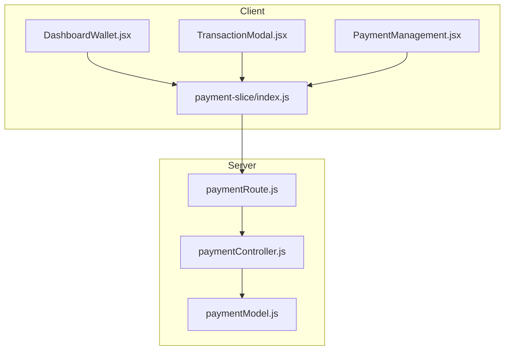
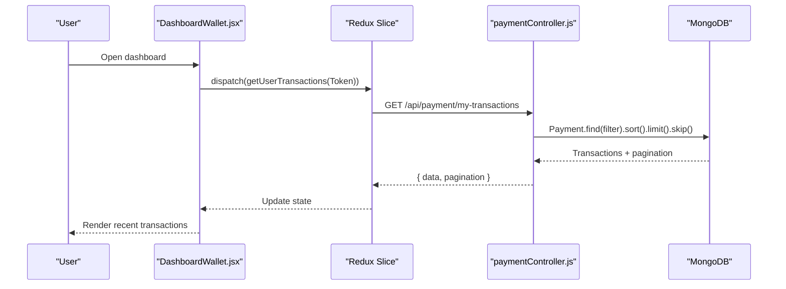
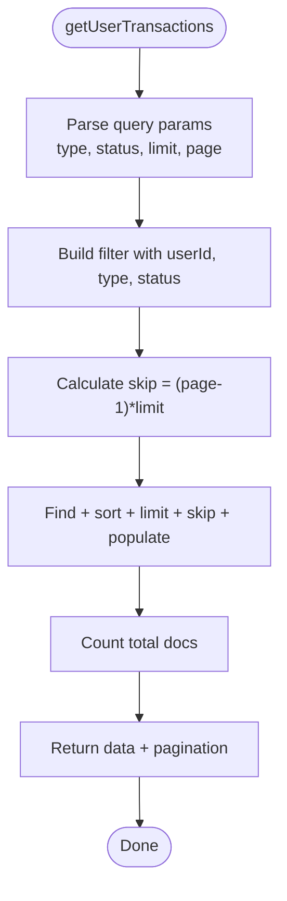
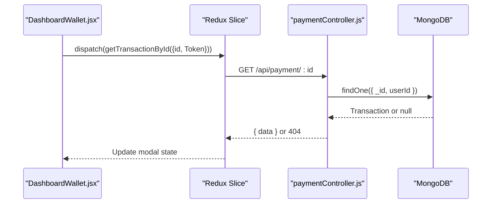
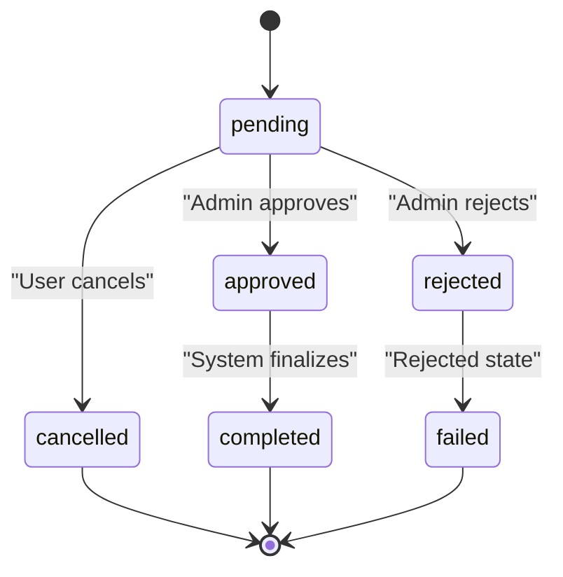
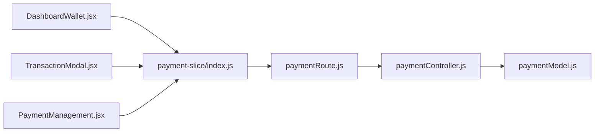

# Transaction Management

<cite>
**Referenced Files in This Document**
- [paymentController.js](file://server/controllers/payment/paymentController.js)
- [paymentModel.js](file://server/models/paymentModel.js)
- [paymentRoute.js](file://server/routes/payment/paymentRoute.js)
- [DashboardWallet.jsx](file://client/src/components/User/DashboardWallet.jsx)
- [TransactionModal.jsx](file://client/src/components/User/walletComponent/TransactionModal.jsx)
- [payment-slice/index.js](file://client/src/store/user/payment-slice/index.js)
- [PaymentManagement.jsx](file://client/src/Pages/adminPage/PaymentManagement.jsx)
</cite>

## Table of Contents
1. [Introduction](#introduction)
2. [Project Structure](#project-structure)
3. [Core Components](#core-components)
4. [Architecture Overview](#architecture-overview)
5. [Detailed Component Analysis](#detailed-component-analysis)
6. [Dependency Analysis](#dependency-analysis)
7. [Performance Considerations](#performance-considerations)
8. [Troubleshooting Guide](#troubleshooting-guide)
9. [Conclusion](#conclusion)
10. [Appendices](#appendices)

## Introduction
This document explains the transaction management system for user payment history and administrative oversight. It covers:
- Fetching user-specific transactions with filtering by type and status
- Viewing individual transactions and updating statuses
- Pagination with limit and page parameters
- Transaction status lifecycle and its impact on user balances
- The DashboardWallet component for transaction history display
- Transaction model schema including timestamps and admin tracking
- Search and filtering capabilities
- Audit trail and compliance considerations

## Project Structure
The transaction management spans backend controllers and models, frontend Redux slices and components, and routing.

**Diagram sources**
- [paymentRoute.js](file://server/routes/payment/paymentRoute.js#L1-L82)
- [paymentController.js](file://server/controllers/payment/paymentController.js#L1-L868)
- [paymentModel.js](file://server/models/paymentModel.js#L1-L160)
- [DashboardWallet.jsx](file://client/src/components/User/DashboardWallet.jsx#L1-L819)
- [TransactionModal.jsx](file://client/src/components/User/walletComponent/TransactionModal.jsx#L1-L369)
- [payment-slice/index.js](file://client/src/store/user/payment-slice/index.js#L1-L344)
- [PaymentManagement.jsx](file://client/src/Pages/adminPage/PaymentManagement.jsx#L1-L701)

**Section sources**
- [paymentRoute.js](file://server/routes/payment/paymentRoute.js#L1-L82)
- [paymentController.js](file://server/controllers/payment/paymentController.js#L1-L868)
- [paymentModel.js](file://server/models/paymentModel.js#L1-L160)
- [DashboardWallet.jsx](file://client/src/components/User/DashboardWallet.jsx#L1-L819)
- [TransactionModal.jsx](file://client/src/components/User/walletComponent/TransactionModal.jsx#L1-L369)
- [payment-slice/index.js](file://client/src/store/user/payment-slice/index.js#L1-L344)
- [PaymentManagement.jsx](file://client/src/Pages/adminPage/PaymentManagement.jsx#L1-L701)

## Core Components
- Backend controllers implement endpoints for user and admin transaction operations, including pagination, filtering, and status transitions.
- The payment model defines the schema, indexes, and helper methods for approvals and rejections.
- Frontend Redux slice encapsulates API calls for transactions and uploads.
- DashboardWallet displays recent transactions and supports viewing details and cancellation.
- TransactionModal renders detailed transaction information and status indicators.
- PaymentManagement provides admin views with search, filtering, and approval/rejection actions.

**Section sources**
- [paymentController.js](file://server/controllers/payment/paymentController.js#L466-L533)
- [paymentModel.js](file://server/models/paymentModel.js#L1-L160)
- [payment-slice/index.js](file://client/src/store/user/payment-slice/index.js#L172-L234)
- [DashboardWallet.jsx](file://client/src/components/User/DashboardWallet.jsx#L691-L819)
- [TransactionModal.jsx](file://client/src/components/User/walletComponent/TransactionModal.jsx#L1-L369)
- [PaymentManagement.jsx](file://client/src/Pages/adminPage/PaymentManagement.jsx#L189-L328)

## Architecture Overview
The system follows a layered architecture:
- Routes define endpoints for user and admin operations.
- Controllers implement business logic, enforce authorization, and orchestrate database operations.
- Models define schema, indexes, and methods for status transitions.
- Frontend Redux slices call server endpoints and update UI state.
- Components render transaction lists, details, and modals.

**Diagram sources**
- [paymentRoute.js](file://server/routes/payment/paymentRoute.js#L55-L59)
- [paymentController.js](file://server/controllers/payment/paymentController.js#L466-L503)
- [payment-slice/index.js](file://client/src/store/user/payment-slice/index.js#L172-L192)
- [DashboardWallet.jsx](file://client/src/components/User/DashboardWallet.jsx#L76-L82)

## Detailed Component Analysis

### getUserTransactions Controller
Purpose:
- Retrieve a user’s transaction history with optional type and status filters.
- Apply pagination via limit and page query parameters.
- Sort by creation time descending and populate user and processedBy references.

Key behaviors:
- Builds a filter object using userId, type, and status.
- Calculates skip = (page - 1) × limit.
- Counts total documents for pagination metadata.
- Returns data and pagination info.

**Diagram sources**
- [paymentController.js](file://server/controllers/payment/paymentController.js#L466-L503)

**Section sources**
- [paymentController.js](file://server/controllers/payment/paymentController.js#L466-L503)

### getTransactionById Endpoint
Purpose:
- Fetch a single transaction by ID for the authenticated user.
- Populate user and processedBy fields for display.

Behavior:
- Validates existence and ownership.
- Returns transaction data or 404.

**Diagram sources**
- [paymentRoute.js](file://server/routes/payment/paymentRoute.js#L58-L59)
- [paymentController.js](file://server/controllers/payment/paymentController.js#L505-L533)
- [payment-slice/index.js](file://client/src/store/user/payment-slice/index.js#L215-L234)

**Section sources**
- [paymentController.js](file://server/controllers/payment/paymentController.js#L505-L533)
- [payment-slice/index.js](file://client/src/store/user/payment-slice/index.js#L215-L234)

### Transaction Pagination System
- Query parameters: type, status, limit, page.
- Backend computes skip and total pages.
- Frontend Redux slice handles requests and updates state.

Implementation highlights:
- Backend sorts by createdAt descending and applies limit/skip.
- Pagination metadata includes total, current page, and total pages.

**Section sources**
- [paymentController.js](file://server/controllers/payment/paymentController.js#L469-L494)
- [payment-slice/index.js](file://client/src/store/user/payment-slice/index.js#L172-L192)

### Transaction Status Lifecycle and Balance Impact
Statuses:
- pending, approved, rejected, completed, failed, cancelled.

Lifecycle and effects:
- approved (deposit): increases user balance by amount.
- approved (withdrawal): decreases user balance by amount.
- rejected (withdrawal): refunds amount to user balance.
- cancelled: indicates user-initiated cancellation.

**Diagram sources**
- [paymentModel.js](file://server/models/paymentModel.js#L74-L92)
- [paymentController.js](file://server/controllers/payment/paymentController.js#L627-L692)
- [paymentController.js](file://server/controllers/payment/paymentController.js#L694-L744)

**Section sources**
- [paymentModel.js](file://server/models/paymentModel.js#L74-L92)
- [paymentController.js](file://server/controllers/payment/paymentController.js#L627-L692)
- [paymentController.js](file://server/controllers/payment/paymentController.js#L694-L744)

### DashboardWallet Component
Responsibilities:
- Displays recent transactions with type, amount, and status badges.
- Opens TransactionModal for detailed view.
- Supports cancellation of pending withdrawals.
- Integrates with Redux slice for fetching transactions and uploads.

UI highlights:
- Renders transaction rows with icons and status indicators.
- Uses localized labels and status translations.
- Provides “Details” action to view modal.

**Section sources**
- [DashboardWallet.jsx](file://client/src/components/User/DashboardWallet.jsx#L691-L819)
- [TransactionModal.jsx](file://client/src/components/User/walletComponent/TransactionModal.jsx#L1-L369)

### Transaction Model Schema
Fields and constraints:
- userId: ObjectId referencing Auth (required)
- type: enum ['deposit', 'withdrawal'] (required)
- transactionId: String (required for deposit)
- amount: Number (min 0, required)
- beneficiaryName: String (required for deposit)
- screenshot: String (required for deposit)
- accountHolderName, accountNumber: Strings (required for withdrawal)
- bankName: String (required)
- paymentStatus: enum ['pending','approved','rejected','completed','failed','cancelled'] (default 'pending')
- processedBy: ObjectId referencing Auth
- processedAt: Date
- rejectionReason: String
- note: String (max length 500)
- createdAt, updatedAt: Date (timestamps managed automatically)

Indexes:
- Compound indexes for userId+createdAt, paymentStatus, type+paymentStatus.

Methods:
- approve(adminId): sets status to approved, sets processedBy and processedAt.
- reject(adminId, reason): sets status to rejected, sets processedBy, processedAt, and rejectionReason.
- Static getPending(): finds pending payments and populates user.

**Section sources**
- [paymentModel.js](file://server/models/paymentModel.js#L1-L160)

### Transaction Search and Filtering
- Admin endpoint supports search by transactionId or user email/name.
- Search is applied alongside type and status filters.
- Pagination is supported with limit and page parameters.

**Section sources**
- [paymentController.js](file://server/controllers/payment/paymentController.js#L537-L561)
- [PaymentManagement.jsx](file://client/src/Pages/adminPage/PaymentManagement.jsx#L281-L289)

### Export Capabilities
- Admin PaymentManagement component transforms API data for display.
- While the provided files do not show explicit export functionality, the component prepares structured data suitable for CSV generation elsewhere in the codebase.

**Section sources**
- [PaymentManagement.jsx](file://client/src/Pages/adminPage/PaymentManagement.jsx#L301-L325)

### Audit Trails and Compliance
- Timestamps: createdAt and updatedAt are tracked.
- Admin actions: processedBy and processedAt capture who handled the transaction and when.
- Rejection reasons: stored for transparency.
- Search and aggregation: enable reporting and compliance queries.

**Section sources**
- [paymentModel.js](file://server/models/paymentModel.js#L80-L98)
- [paymentController.js](file://server/controllers/payment/paymentController.js#L574-L583)

## Dependency Analysis

**Diagram sources**
- [paymentRoute.js](file://server/routes/payment/paymentRoute.js#L1-L82)
- [paymentController.js](file://server/controllers/payment/paymentController.js#L1-L868)
- [paymentModel.js](file://server/models/paymentModel.js#L1-L160)
- [DashboardWallet.jsx](file://client/src/components/User/DashboardWallet.jsx#L1-L819)
- [TransactionModal.jsx](file://client/src/components/User/walletComponent/TransactionModal.jsx#L1-L369)
- [payment-slice/index.js](file://client/src/store/user/payment-slice/index.js#L1-L344)
- [PaymentManagement.jsx](file://client/src/Pages/adminPage/PaymentManagement.jsx#L1-L701)

**Section sources**
- [paymentRoute.js](file://server/routes/payment/paymentRoute.js#L1-L82)
- [paymentController.js](file://server/controllers/payment/paymentController.js#L1-L868)
- [paymentModel.js](file://server/models/paymentModel.js#L1-L160)
- [payment-slice/index.js](file://client/src/store/user/payment-slice/index.js#L1-L344)

## Performance Considerations
- Indexes: Compound indexes on userId+createdAt, paymentStatus, and type+paymentStatus improve query performance.
- Pagination: limit and skip reduce payload sizes and memory usage.
- Population: Populate only necessary fields (name, email, phone) to minimize overhead.
- File uploads: Client-side compression and progress tracking optimize large screenshots.

[No sources needed since this section provides general guidance]

## Troubleshooting Guide
Common issues and resolutions:
- Transaction not found: Ensure the user owns the transaction ID; backend enforces ownership.
- Pagination errors: Verify limit and page are integers; backend converts to integer and computes pages.
- Approval/Rejection failures: Confirm payment is pending; otherwise, abort with appropriate message.
- Upload timeouts: Client detects network and timeout errors; retry with smaller files or better connectivity.

**Section sources**
- [paymentController.js](file://server/controllers/payment/paymentController.js#L505-L533)
- [paymentController.js](file://server/controllers/payment/paymentController.js#L645-L651)
- [payment-slice/index.js](file://client/src/store/user/payment-slice/index.js#L75-L101)

## Conclusion
The transaction management system provides robust user and admin capabilities:
- Efficient pagination and filtering for user transaction history.
- Clear status lifecycle with precise balance impacts.
- Comprehensive audit trail with timestamps and admin tracking.
- Intuitive UI components for viewing details and managing transactions.

[No sources needed since this section summarizes without analyzing specific files]

## Appendices

### API Endpoints Summary
- GET /api/payment/my-transactions (user): fetch user transactions with type/status filters and pagination.
- GET /api/payment/:id (user): fetch a single transaction by ID.
- GET /api/payment/admin/all (admin): fetch all transactions with type/status/search filters and pagination; includes stats and pagination metadata.
- PUT /api/payment/admin/approve/:id (admin): approve a pending payment; adjusts user balance for deposits.
- PUT /api/payment/admin/reject/:id (admin): reject a pending payment; refunds withdrawal amount if applicable.
- GET /api/payment/admin/pending (admin): list pending payments.
- GET /api/payment/admin/stats (admin): aggregated counts and amounts by status.

**Section sources**
- [paymentRoute.js](file://server/routes/payment/paymentRoute.js#L55-L81)
- [paymentController.js](file://server/controllers/payment/paymentController.js#L466-L744)