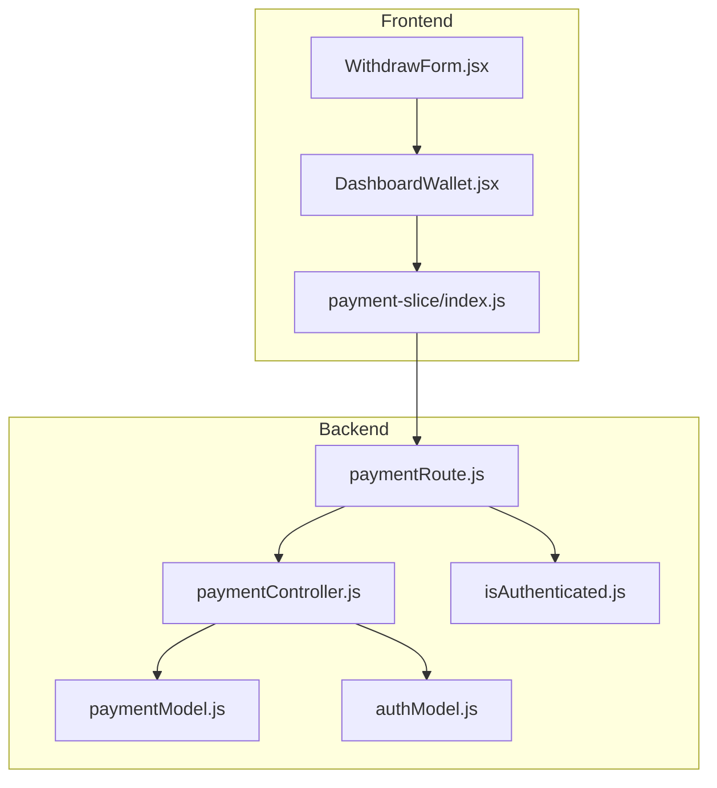
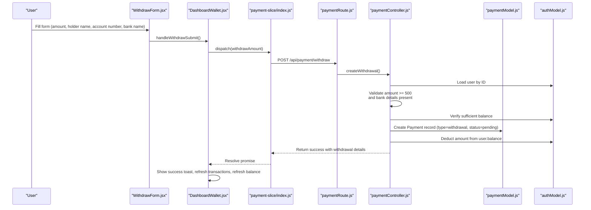
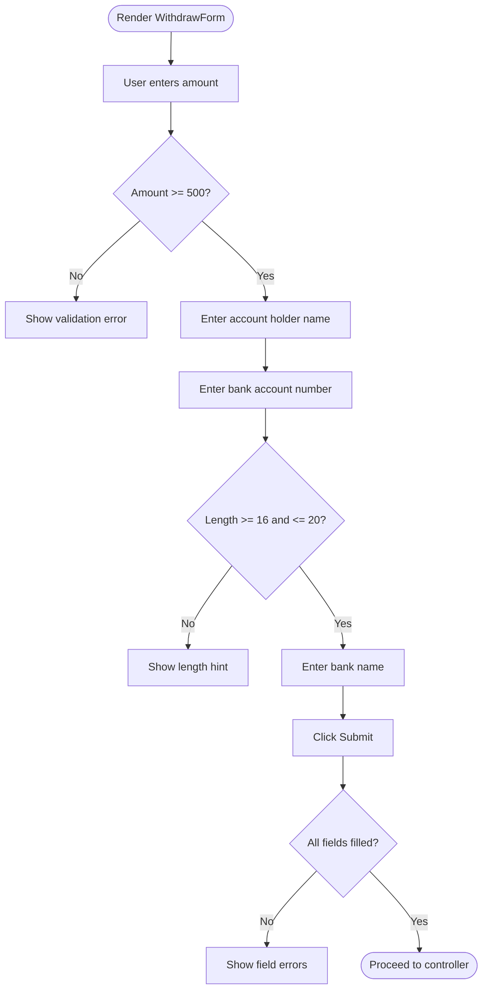
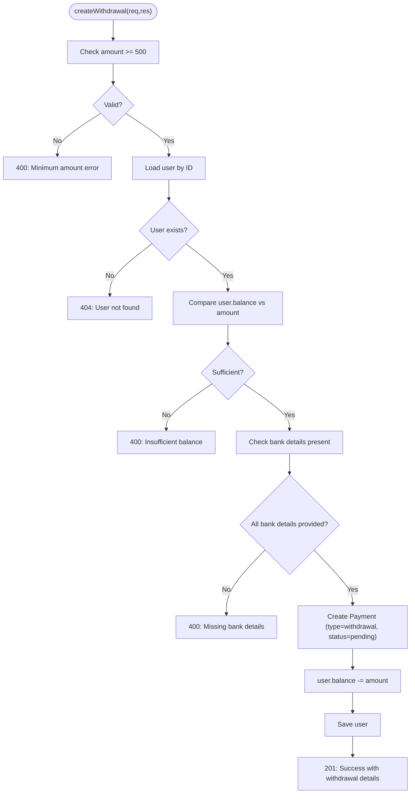
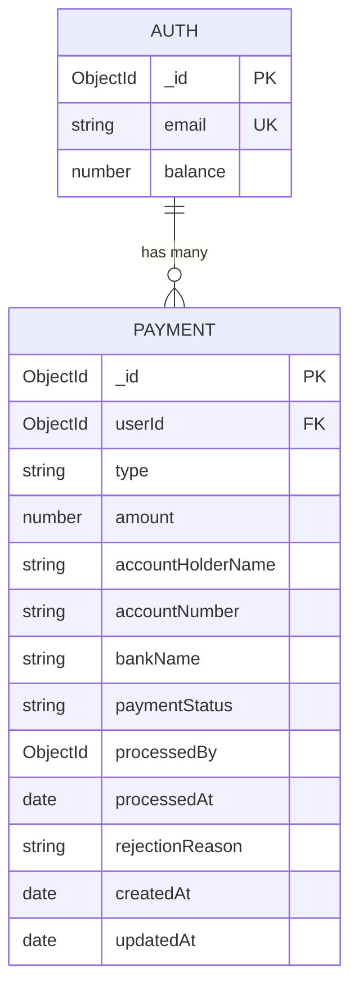
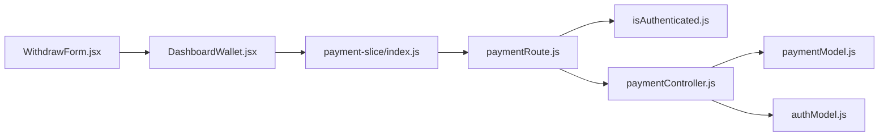

# Withdrawal Processing

<cite>
**Referenced Files in This Document**
- [WithdrawForm.jsx](file://client/src/components/User/walletComponent/WithdrawForm.jsx)
- [DashboardWallet.jsx](file://client/src/components/User/DashboardWallet.jsx)
- [payment-slice/index.js](file://client/src/store/user/payment-slice/index.js)
- [paymentController.js](file://server/controllers/payment/paymentController.js)
- [paymentModel.js](file://server/models/paymentModel.js)
- [paymentRoute.js](file://server/routes/payment/paymentRoute.js)
- [authModel.js](file://server/models/authModel.js)
- [isAuthenticated.js](file://server/middleware/isAuthenticated.js)
- [authController.js](file://server/controllers/auth/authController.js)
- [emailValidator.js](file://server/config/emailValidator.js)
</cite>

## Table of Contents
1. [Introduction](#introduction)
2. [Project Structure](#project-structure)
3. [Core Components](#core-components)
4. [Architecture Overview](#architecture-overview)
5. [Detailed Component Analysis](#detailed-component-analysis)
6. [Dependency Analysis](#dependency-analysis)
7. [Performance Considerations](#performance-considerations)
8. [Security Measures and Fraud Detection](#security-measures-and-fraud-detection)
9. [Troubleshooting Guide](#troubleshooting-guide)
10. [Conclusion](#conclusion)

## Introduction
This document explains the withdrawal processing system, covering the end-to-end workflow from form submission to completion. It details the frontend WithdrawForm component, the backend createWithdrawal controller, the payment model schema, route configuration, balance adjustment logic, notifications, processing expectations, and security measures.

## Project Structure
The withdrawal system spans three layers:
- Frontend: React components and Redux slices for user interaction and API communication
- Backend: Express routes, controllers, and Mongoose models for business logic and persistence
- Middleware and Security: Authentication and authorization enforcement

**Diagram sources**
- [WithdrawForm.jsx](file://client/src/components/User/walletComponent/WithdrawForm.jsx#L1-L118)
- [DashboardWallet.jsx](file://client/src/components/User/DashboardWallet.jsx#L191-L247)
- [payment-slice/index.js](file://client/src/store/user/payment-slice/index.js#L128-L147)
- [paymentRoute.js](file://server/routes/payment/paymentRoute.js#L52-L53)
- [paymentController.js](file://server/controllers/payment/paymentController.js#L398-L464)
- [paymentModel.js](file://server/models/paymentModel.js#L1-L160)
- [authModel.js](file://server/models/authModel.js#L22)
- [isAuthenticated.js](file://server/middleware/isAuthenticated.js#L1-L62)

**Section sources**
- [WithdrawForm.jsx](file://client/src/components/User/walletComponent/WithdrawForm.jsx#L1-L118)
- [DashboardWallet.jsx](file://client/src/components/User/DashboardWallet.jsx#L191-L247)
- [payment-slice/index.js](file://client/src/store/user/payment-slice/index.js#L128-L147)
- [paymentRoute.js](file://server/routes/payment/paymentRoute.js#L52-L53)
- [paymentController.js](file://server/controllers/payment/paymentController.js#L398-L464)
- [paymentModel.js](file://server/models/paymentModel.js#L1-L160)
- [authModel.js](file://server/models/authModel.js#L22)
- [isAuthenticated.js](file://server/middleware/isAuthenticated.js#L1-L62)

## Core Components
- WithdrawForm: Collects withdrawal amount, bank holder name, bank account number, and bank name with validation rules.
- DashboardWallet: Orchestrates form submission, displays feedback, and refreshes user balance.
- payment-slice: Defines the withdrawAmount async thunk that posts to the withdrawal endpoint.
- paymentController.createWithdrawal: Validates inputs, checks user balance, creates a withdrawal record, and adjusts user balance.
- paymentModel: Defines the schema for withdrawals including bank details and status tracking.
- paymentRoute: Exposes the POST /api/payment/withdraw endpoint guarded by authentication.
- authModel: Stores user balance and other profile data.
- isAuthenticated: Enforces JWT-based authentication and session validity.

**Section sources**
- [WithdrawForm.jsx](file://client/src/components/User/walletComponent/WithdrawForm.jsx#L27-L100)
- [DashboardWallet.jsx](file://client/src/components/User/DashboardWallet.jsx#L191-L247)
- [payment-slice/index.js](file://client/src/store/user/payment-slice/index.js#L128-L147)
- [paymentController.js](file://server/controllers/payment/paymentController.js#L398-L464)
- [paymentModel.js](file://server/models/paymentModel.js#L44-L71)
- [paymentRoute.js](file://server/routes/payment/paymentRoute.js#L52-L53)
- [authModel.js](file://server/models/authModel.js#L22)
- [isAuthenticated.js](file://server/middleware/isAuthenticated.js#L1-L62)

## Architecture Overview
The withdrawal workflow follows a clear request-response pattern:
1. User fills the WithdrawForm and submits via DashboardWallet.
2. Redux slice sends a POST request to /api/payment/withdraw.
3. Route authenticates the request and invokes the controller.
4. Controller validates amount and bank details, checks user balance, persists a withdrawal record, and decrements user balance.
5. Frontend receives success/error response, updates UI, and refreshes balance.

**Diagram sources**
- [WithdrawForm.jsx](file://client/src/components/User/walletComponent/WithdrawForm.jsx#L103-L111)
- [DashboardWallet.jsx](file://client/src/components/User/DashboardWallet.jsx#L191-L247)
- [payment-slice/index.js](file://client/src/store/user/payment-slice/index.js#L128-L147)
- [paymentRoute.js](file://server/routes/payment/paymentRoute.js#L52-L53)
- [paymentController.js](file://server/controllers/payment/paymentController.js#L398-L464)
- [paymentModel.js](file://server/models/paymentModel.js#L44-L71)
- [authModel.js](file://server/models/authModel.js#L22)

## Detailed Component Analysis

### WithdrawForm Component
- Purpose: Capture withdrawal request details with validation hints.
- Required fields:
  - Withdrawal Amount: numeric input with minimum value and max constrained by user balance.
  - Account Holder Name: free text aligned with bank records.
  - Bank Account Number: validated length and character constraints.
  - Bank Name: financial institution name.
- Validation rules:
  - Amount must be at least the configured minimum (₹500).
  - All bank details are mandatory.
  - Account number length guidance provided to the user.
- UX: Displays available balance and processing timeframe messaging.

**Diagram sources**
- [WithdrawForm.jsx](file://client/src/components/User/walletComponent/WithdrawForm.jsx#L27-L100)

**Section sources**
- [WithdrawForm.jsx](file://client/src/components/User/walletComponent/WithdrawForm.jsx#L27-L100)

### createWithdrawal Controller Function
- Responsibilities:
  - Validate amount (minimum threshold).
  - Verify presence of bank details.
  - Load user and confirm sufficient balance.
  - Persist a withdrawal record with type=withdrawal and status=pending.
  - Decrement user balance atomically.
  - Return structured success response with withdrawal details.
- Error handling:
  - Insufficient funds, missing fields, and user not found are handled with appropriate HTTP status codes and messages.

**Diagram sources**
- [paymentController.js](file://server/controllers/payment/paymentController.js#L398-L464)
- [authModel.js](file://server/models/authModel.js#L22)
- [paymentModel.js](file://server/models/paymentModel.js#L44-L71)

**Section sources**
- [paymentController.js](file://server/controllers/payment/paymentController.js#L398-L464)
- [authModel.js](file://server/models/authModel.js#L22)
- [paymentModel.js](file://server/models/paymentModel.js#L44-L71)

### Payment Model Schema for Withdrawals
- Fields:
  - type: Enumerated as "withdrawal".
  - accountHolderName, accountNumber, bankName: Required for withdrawal type.
  - amount: Numeric amount with min 0.
  - paymentStatus: Enumerated with lifecycle statuses including pending.
  - References: userId (Auth), processedBy (Auth), timestamps.
- Methods:
  - approve(): Sets status to approved and records admin action.
  - reject(): Sets status to rejected and records admin action and reason.
- Static helpers:
  - getPending(): Fetches pending payments with user population.

**Diagram sources**
- [authModel.js](file://server/models/authModel.js#L1-L40)
- [paymentModel.js](file://server/models/paymentModel.js#L1-L160)

**Section sources**
- [paymentModel.js](file://server/models/paymentModel.js#L44-L71)
- [paymentModel.js](file://server/models/paymentModel.js#L129-L144)
- [paymentModel.js](file://server/models/paymentModel.js#L146-L151)

### Withdrawal Route Configuration and API Endpoint Specifications
- Endpoint: POST /api/payment/withdraw
- Authentication: Requires valid JWT via isAuthenticated middleware.
- Authorization: Users can create withdrawals; admin endpoints exist for approvals/rejections.
- Request body: Includes amount, accountHolderName, accountNumber, bankName, and optional note.
- Response: Returns success with withdrawal details and message indicating processing timeframe.

**Section sources**
- [paymentRoute.js](file://server/routes/payment/paymentRoute.js#L52-L53)
- [isAuthenticated.js](file://server/middleware/isAuthenticated.js#L1-L62)

### Balance Adjustment Logic
- During withdrawal creation, the controller deducts the requested amount from the user’s balance.
- The operation occurs alongside the creation of the withdrawal record to maintain consistency.
- On admin rejection of a withdrawal, the system refunds the amount back to the user’s balance.

**Section sources**
- [paymentController.js](file://server/controllers/payment/paymentController.js#L449-L450)
- [paymentController.js](file://server/controllers/payment/paymentController.js#L721-L724)

### User Notification Mechanisms
- Frontend:
  - Toast notifications provide immediate feedback on success or failure.
  - Transaction list updates automatically to reflect the new pending withdrawal.
  - User balance is refreshed after a successful submission.
- Backend:
  - Controller returns a message indicating processing timeframe (24–48 hours).
  - Admin actions (approve/reject) also trigger user notifications via the admin workflow.

**Section sources**
- [DashboardWallet.jsx](file://client/src/components/User/DashboardWallet.jsx#L210-L237)
- [paymentController.js](file://server/controllers/payment/paymentController.js#L451-L455)

### Processing Time Expectations
- The system communicates a processing window of 24–48 hours for withdrawal requests.
- Pending status indicates the request awaits administrative review and processing.

**Section sources**
- [WithdrawForm.jsx](file://client/src/components/User/walletComponent/WithdrawForm.jsx#L16-L18)
- [paymentController.js](file://server/controllers/payment/paymentController.js#L451-L455)
- [paymentModel.js](file://server/models/paymentModel.js#L74-L78)

## Dependency Analysis
- Frontend depends on Redux for state management and Axios for HTTP requests.
- Backend routes depend on authentication middleware and controllers.
- Controllers depend on models for data access and Mongoose sessions for atomicity in admin operations.
- Payment model depends on Auth model for user references.

**Diagram sources**
- [WithdrawForm.jsx](file://client/src/components/User/walletComponent/WithdrawForm.jsx#L1-L118)
- [DashboardWallet.jsx](file://client/src/components/User/DashboardWallet.jsx#L191-L247)
- [payment-slice/index.js](file://client/src/store/user/payment-slice/index.js#L128-L147)
- [paymentRoute.js](file://server/routes/payment/paymentRoute.js#L52-L53)
- [isAuthenticated.js](file://server/middleware/isAuthenticated.js#L1-L62)
- [paymentController.js](file://server/controllers/payment/paymentController.js#L398-L464)
- [paymentModel.js](file://server/models/paymentModel.js#L1-L160)
- [authModel.js](file://server/models/authModel.js#L1-L40)

**Section sources**
- [payment-slice/index.js](file://client/src/store/user/payment-slice/index.js#L128-L147)
- [paymentRoute.js](file://server/routes/payment/paymentRoute.js#L52-L53)
- [paymentController.js](file://server/controllers/payment/paymentController.js#L398-L464)
- [paymentModel.js](file://server/models/paymentModel.js#L1-L160)
- [authModel.js](file://server/models/authModel.js#L1-L40)

## Performance Considerations
- Input validation occurs on both frontend and backend to reduce unnecessary server calls.
- The withdrawal controller performs minimal queries (user lookup and balance check) followed by a single write for the payment record and user balance update.
- Consider adding rate limiting for withdrawal submissions to prevent abuse.
- Indexes on paymentStatus and composite indices on Payment collection can improve admin queries for pending withdrawals.

## Security Measures and Fraud Detection
- Authentication and Session Management:
  - Requests are validated via JWT with expiration and forced logout capability when tokens change.
  - Session token stored per user prevents concurrent sessions from sharing tokens.
- Email Verification and Domain Checks:
  - Email validation integrates with ZeroBounce and DNS MX record checks to detect disposable or invalid domains.
- Bank Detail Validation:
  - Frontend enforces minimum account number length and character limits.
  - Backend enforces presence of required bank details and amount thresholds.
- Administrative Controls:
  - Admin-only endpoints exist for approving or rejecting withdrawals, with audit trails via processedBy and processedAt.
- Additional Recommendations:
  - Implement IP-based rate limiting for withdrawal requests.
  - Add device fingerprinting and behavioral analytics for anomaly detection.
  - Consider two-factor authentication for high-value withdrawals.
  - Log all withdrawal attempts with metadata for forensic analysis.

**Section sources**
- [isAuthenticated.js](file://server/middleware/isAuthenticated.js#L1-L62)
- [authController.js](file://server/controllers/auth/authController.js#L227-L245)
- [emailValidator.js](file://server/config/emailValidator.js#L10-L126)
- [WithdrawForm.jsx](file://client/src/components/User/walletComponent/WithdrawForm.jsx#L76-L81)
- [paymentController.js](file://server/controllers/payment/paymentController.js#L427-L432)

## Troubleshooting Guide
- Common Issues and Resolutions:
  - Insufficient balance: Ensure the user has at least the minimum withdrawal amount before submitting.
  - Missing fields: All bank details and amount must be provided.
  - Invalid token/session expired: Re-authenticate the user; session termination requires re-login.
  - Network timeouts: Retry submission; ensure stable connectivity.
- Frontend Feedback:
  - Toast notifications indicate success or failure messages returned by the backend.
  - Transaction list reflects pending status until admin processing completes.
- Backend Logs:
  - Controller logs include request details and error contexts for debugging.

**Section sources**
- [paymentController.js](file://server/controllers/payment/paymentController.js#L420-L425)
- [paymentController.js](file://server/controllers/payment/paymentController.js#L427-L432)
- [isAuthenticated.js](file://server/middleware/isAuthenticated.js#L12-L48)
- [DashboardWallet.jsx](file://client/src/components/User/DashboardWallet.jsx#L210-L237)

## Conclusion
The withdrawal processing system combines robust frontend validation, secure backend controllers, and a well-defined data model to support reliable user-initiated withdrawals. With clear processing expectations, user notifications, and layered security controls, the system provides a solid foundation for financial operations. Extending with advanced fraud detection and rate limiting would further strengthen resilience against abuse.