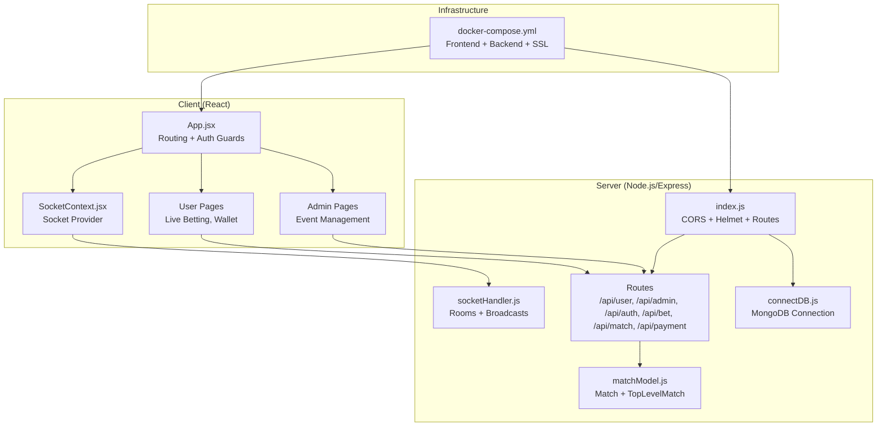
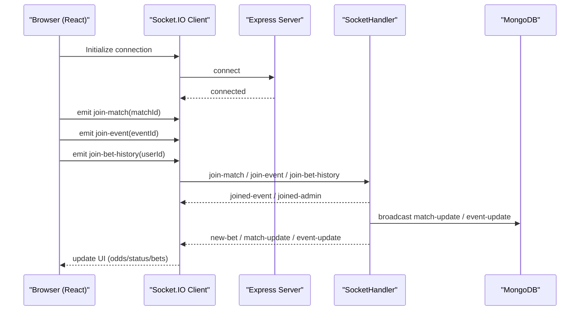
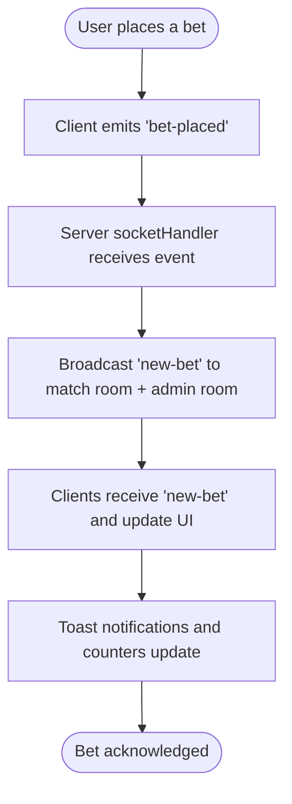
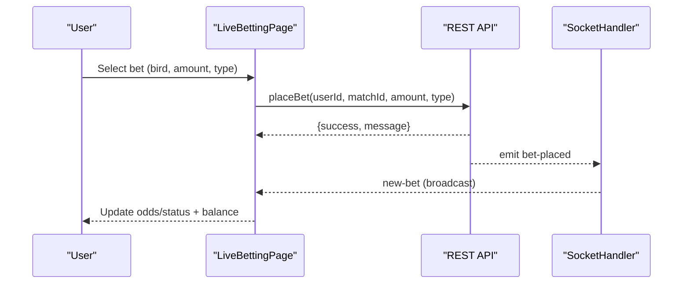
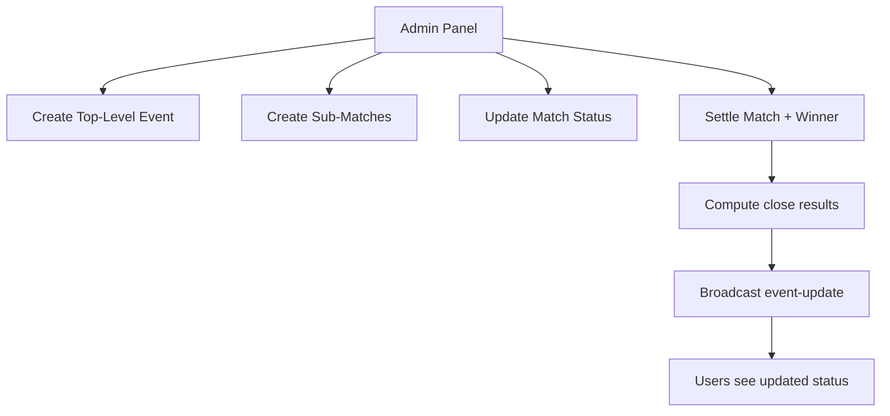
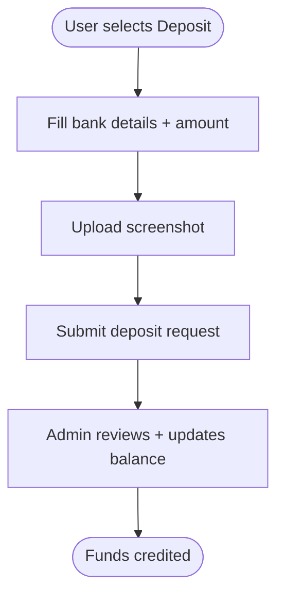
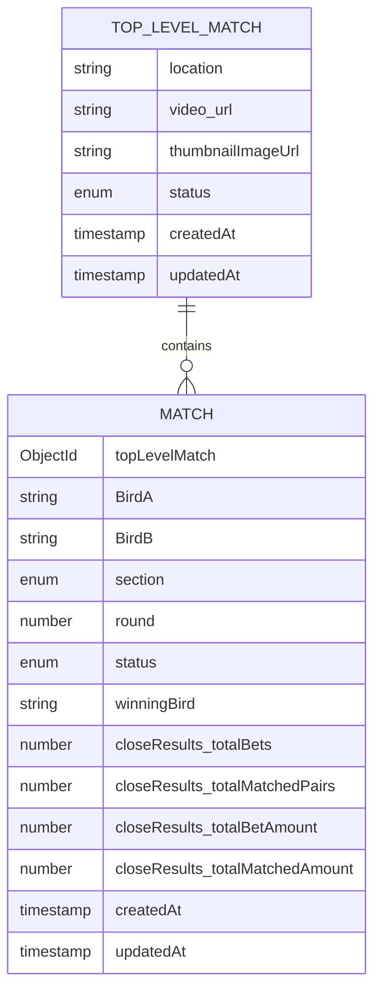
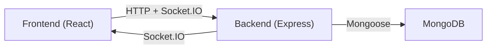

# Project Overview

<cite>
**Referenced Files in This Document**
- [README.md](file://README.md)
- [client/package.json](file://client/package.json)
- [server/package.json](file://server/package.json)
- [client/src/App.jsx](file://client/src/App.jsx)
- [server/index.js](file://server/index.js)
- [client/src/context/SocketContext.jsx](file://client/src/context/SocketContext.jsx)
- [server/socket/socketHandler.js](file://server/socket/socketHandler.js)
- [client/src/Pages/Bet/LiveBettingPage.jsx](file://client/src/Pages/Bet/LiveBettingPage.jsx)
- [client/src/Pages/User/Home.jsx](file://client/src/Pages/User/Home.jsx)
- [client/src/Pages/adminPage/ManageEvents.jsx](file://client/src/Pages/adminPage/ManageEvents.jsx)
- [client/src/components/User/walletComponent/DepositForm.jsx](file://client/src/components/User/walletComponent/DepositForm.jsx)
- [server/models/matchModel.js](file://server/models/matchModel.js)
- [server/config/connectDB.js](file://server/config/connectDB.js)
- [docker-compose.yml](file://docker-compose.yml)
</cite>

## Table of Contents
1. [Introduction](#introduction)
2. [Project Structure](#project-structure)
3. [Core Components](#core-components)
4. [Architecture Overview](#architecture-overview)
5. [Detailed Component Analysis](#detailed-component-analysis)
6. [Dependency Analysis](#dependency-analysis)
7. [Performance Considerations](#performance-considerations)
8. [Troubleshooting Guide](#troubleshooting-guide)
9. [Conclusion](#conclusion)
10. [Appendices](#appendices)

## Introduction
Gallerolive is a real-time sports betting platform designed for fast-paced, interactive wagering on head-to-head contests. Its core value proposition lies in delivering seamless live betting experiences with instant updates, secure user authentication, flexible payment workflows, and powerful administrative controls. The platform targets sports enthusiasts who want to engage dynamically during live events, with a focus on transparency, responsiveness, and trust.

Key audience segments:
- Casual and serious bettors seeking real-time odds and live streams
- Administrators managing events, matches, and financial settlements
- Users requiring secure, multi-language support and localized payment methods

## Project Structure
The repository follows a modern full-stack layout:
- Frontend (React + Vite): Single-page application with routing, Redux Toolkit for state, and Socket.IO for real-time updates
- Backend (Node.js + Express): RESTful API with modular route/controller structure, Socket.IO for real-time notifications, and Mongoose for MongoDB persistence
- Shared real-time layer: Socket rooms for matches, events, and admin notifications
- Deployment: Docker Compose orchestrating frontend, backend, and SSL termination

**Diagram sources**
- [client/src/App.jsx](file://client/src/App.jsx#L27-L114)
- [client/src/context/SocketContext.jsx](file://client/src/context/SocketContext.jsx#L14-L61)
- [server/index.js](file://server/index.js#L19-L101)
- [server/config/connectDB.js](file://server/config/connectDB.js#L3-L16)
- [server/socket/socketHandler.js](file://server/socket/socketHandler.js#L3-L91)
- [server/models/matchModel.js](file://server/models/matchModel.js#L3-L98)
- [docker-compose.yml](file://docker-compose.yml#L3-L46)

**Section sources**
- [client/src/App.jsx](file://client/src/App.jsx#L27-L114)
- [server/index.js](file://server/index.js#L19-L101)
- [docker-compose.yml](file://docker-compose.yml#L3-L46)

## Core Components
- Real-time communication: Socket.IO provider and handlers manage match rooms, event broadcasts, and admin feeds
- Authentication: Protected routes and JWT-based sessions with role-aware guards
- Live betting: Dual-section live betting interface with dynamic odds and status updates
- Payments: Localized deposit workflows with bank transfer instructions and proof uploads
- Administration: Event lifecycle management, match creation, status updates, and settlement controls

**Section sources**
- [client/src/context/SocketContext.jsx](file://client/src/context/SocketContext.jsx#L14-L61)
- [server/socket/socketHandler.js](file://server/socket/socketHandler.js#L3-L91)
- [client/src/Pages/Bet/LiveBettingPage.jsx](file://client/src/Pages/Bet/LiveBettingPage.jsx#L20-L110)
- [client/src/components/User/walletComponent/DepositForm.jsx](file://client/src/components/User/walletComponent/DepositForm.jsx#L24-L108)
- [client/src/Pages/adminPage/ManageEvents.jsx](file://client/src/Pages/adminPage/ManageEvents.jsx#L57-L176)

## Architecture Overview
The system is client-server centric with bidirectional real-time updates:
- Client connects to Socket.IO server and joins rooms per match/event
- Server emits live updates for status changes, odds adjustments, and bet confirmations
- REST endpoints handle authentication, user actions, payments, and administrative tasks
- MongoDB stores match hierarchy, betting records, and settlement metadata

**Diagram sources**
- [client/src/context/SocketContext.jsx](file://client/src/context/SocketContext.jsx#L18-L54)
- [server/socket/socketHandler.js](file://server/socket/socketHandler.js#L9-L88)
- [client/src/Pages/Bet/LiveBettingPage.jsx](file://client/src/Pages/Bet/LiveBettingPage.jsx#L208-L408)

## Detailed Component Analysis

### Real-Time Communication Layer
- Socket provider establishes persistent connections with reconnection logic and transport fallback
- Rooms:
  - match-{id}: per-match live updates
  - event-{id}: broadcast for all matches in an event
  - admin-room: admin dashboard notifications
  - user-{userId}: personal bet history and close summaries
- Events:
  - bet-placed → new-bet and new-bet-admin
  - match-update / event-update → UI refresh
  - bet-history-update / bet-close-update → user panel sync

**Diagram sources**
- [client/src/Pages/Bet/LiveBettingPage.jsx](file://client/src/Pages/Bet/LiveBettingPage.jsx#L420-L517)
- [server/socket/socketHandler.js](file://server/socket/socketHandler.js#L58-L72)

**Section sources**
- [client/src/context/SocketContext.jsx](file://client/src/context/SocketContext.jsx#L14-L61)
- [server/socket/socketHandler.js](file://server/socket/socketHandler.js#L3-L91)
- [client/src/Pages/Bet/LiveBettingPage.jsx](file://client/src/Pages/Bet/LiveBettingPage.jsx#L208-L408)

### Live Betting Experience
- Dual-section live betting interface with:
  - Real-time status indicators (Active/Closed/Completed)
  - Dynamic odds and notifications
  - Bet placement with validation (amount, balance, type)
  - Local storage-backed bet history and close summaries
- Socket-driven updates:
  - Room joins/leaves on mount/unmount
  - Event-level updates for new matches and status changes
  - Personal bet history and close summaries

**Diagram sources**
- [client/src/Pages/Bet/LiveBettingPage.jsx](file://client/src/Pages/Bet/LiveBettingPage.jsx#L420-L517)
- [server/socket/socketHandler.js](file://server/socket/socketHandler.js#L58-L72)

**Section sources**
- [client/src/Pages/Bet/LiveBettingPage.jsx](file://client/src/Pages/Bet/LiveBettingPage.jsx#L20-L110)
- [client/src/Pages/User/Home.jsx](file://client/src/Pages/User/Home.jsx#L7-L27)

### Administrative Controls
- Event lifecycle:
  - Create top-level events and nested matches
  - Update statuses (Upcoming → Active → Closed → Completed)
  - Settle matches with winners and compute close results
- Real-time admin feed:
  - Notifications for new bets, status changes, and match settlements
  - Live refresh of event grids and match tables

**Diagram sources**
- [client/src/Pages/adminPage/ManageEvents.jsx](file://client/src/Pages/adminPage/ManageEvents.jsx#L203-L313)
- [server/socket/socketHandler.js](file://server/socket/socketHandler.js#L25-L56)

**Section sources**
- [client/src/Pages/adminPage/ManageEvents.jsx](file://client/src/Pages/adminPage/ManageEvents.jsx#L57-L176)
- [server/models/matchModel.js](file://server/models/matchModel.js#L17-L98)

### Payment Processing (Wallet)
- Deposit workflow:
  - Static bank details and CLABE for transfers
  - Captcha-style form fields for beneficiary, bank, date/time, amount, reference
  - Screenshot upload with progress feedback
- Multi-language support and date formatting for internationalization

**Diagram sources**
- [client/src/components/User/walletComponent/DepositForm.jsx](file://client/src/components/User/walletComponent/DepositForm.jsx#L24-L108)

**Section sources**
- [client/src/components/User/walletComponent/DepositForm.jsx](file://client/src/components/User/walletComponent/DepositForm.jsx#L24-L108)

### Data Model Overview
- Top-level matches define event metadata (location, media, status)
- Sub-matches belong to a top-level event, track rounds, sides, and close results
- Close results capture matched/unmatched aggregates and per-user summaries

**Diagram sources**
- [server/models/matchModel.js](file://server/models/matchModel.js#L3-L98)

**Section sources**
- [server/models/matchModel.js](file://server/models/matchModel.js#L3-L98)

## Dependency Analysis
- Frontend dependencies include React, React Router, Redux Toolkit, Tailwind UI primitives, and socket.io-client
- Backend dependencies include Express, Helmet, CORS, Mongoose, Socket.IO, and rate limiting
- Real-time coupling is explicit via Socket rooms and emitted events
- Database coupling is through Mongoose models and indexes for efficient queries

**Diagram sources**
- [client/package.json](file://client/package.json#L14-L51)
- [server/package.json](file://server/package.json#L19-L37)
- [server/config/connectDB.js](file://server/config/connectDB.js#L3-L16)

**Section sources**
- [client/package.json](file://client/package.json#L14-L51)
- [server/package.json](file://server/package.json#L19-L37)
- [server/config/connectDB.js](file://server/config/connectDB.js#L3-L16)

## Performance Considerations
- Socket reconnection and transport fallback improve resilience
- Room-based broadcasting reduces unnecessary client updates
- Frontend debouncing and memoization reduce render churn in admin grids
- Backend timeouts and rate limiting protect against abuse
- Database indexing on match and top-level match improves query performance

## Troubleshooting Guide
Common operational checks:
- Health endpoint: GET /api/health for server uptime and memory metrics
- CORS policy: Origin validation prevents unauthorized clients
- Socket connectivity: Connection/disconnect/reconnect events indicate network stability
- Database connection: Mongoose connection logs and pool settings

Operational references:
- Health check route and response format
- CORS origin allowlist and credentials handling
- Socket initialization and error logging
- MongoDB connection and error handling

**Section sources**
- [server/index.js](file://server/index.js#L82-L91)
- [server/index.js](file://server/index.js#L34-L51)
- [client/src/context/SocketContext.jsx](file://client/src/context/SocketContext.jsx#L18-L54)
- [server/config/connectDB.js](file://server/config/connectDB.js#L3-L16)

## Conclusion
Gallerolive delivers a modern, real-time betting platform with strong separation of concerns, robust real-time updates, and scalable administration. Its technology stack balances developer productivity (React/Express) with reliability (Socket.IO/MongoDB), while Docker Compose simplifies deployment. The platform’s key differentiators include live dual-section betting, transparent settlement reporting, and admin-driven lifecycle controls.

## Appendices

### Technology Stack
- Frontend: React 18, React Router, Redux Toolkit, Tailwind CSS, Socket.IO Client
- Backend: Node.js, Express, Socket.IO, Mongoose, Helmet, CORS
- Database: MongoDB
- Deployment: Docker Compose with Nginx SSL

**Section sources**
- [client/package.json](file://client/package.json#L14-L51)
- [server/package.json](file://server/package.json#L19-L37)
- [docker-compose.yml](file://docker-compose.yml#L3-L46)

### System Requirements
- Node.js LTS for backend
- Modern browser for frontend
- MongoDB instance reachable by backend
- Docker and Docker Compose for orchestrated deployment

**Section sources**
- [server/package.json](file://server/package.json#L19-L37)
- [docker-compose.yml](file://docker-compose.yml#L3-L46)

### Deployment Options
- Docker Compose: Full-stack containers with health checks and SSL volume mounting
- Production hardening: Environment-specific variables for ports, origins, and cloud storage keys

**Section sources**
- [docker-compose.yml](file://docker-compose.yml#L3-L46)

### Practical User Workflows
- Live betting:
  - Navigate to live betting page for a top-level event
  - Place bets on either section with validation and immediate feedback
  - Observe real-time status changes and notifications
- Wallet deposit:
  - Access wallet, choose deposit, fill bank details and upload screenshot
  - Submit request and await admin review
- Admin operations:
  - Create events and matches, open/close bets, settle matches, and monitor real-time notifications

**Section sources**
- [client/src/Pages/Bet/LiveBettingPage.jsx](file://client/src/Pages/Bet/LiveBettingPage.jsx#L420-L517)
- [client/src/components/User/walletComponent/DepositForm.jsx](file://client/src/components/User/walletComponent/DepositForm.jsx#L24-L108)
- [client/src/Pages/adminPage/ManageEvents.jsx](file://client/src/Pages/adminPage/ManageEvents.jsx#L203-L313)