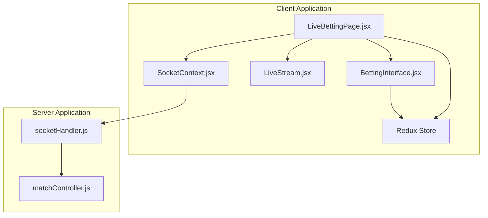
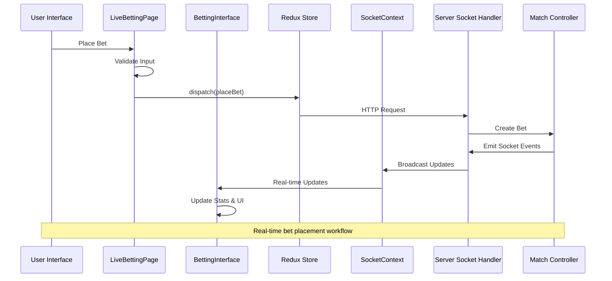
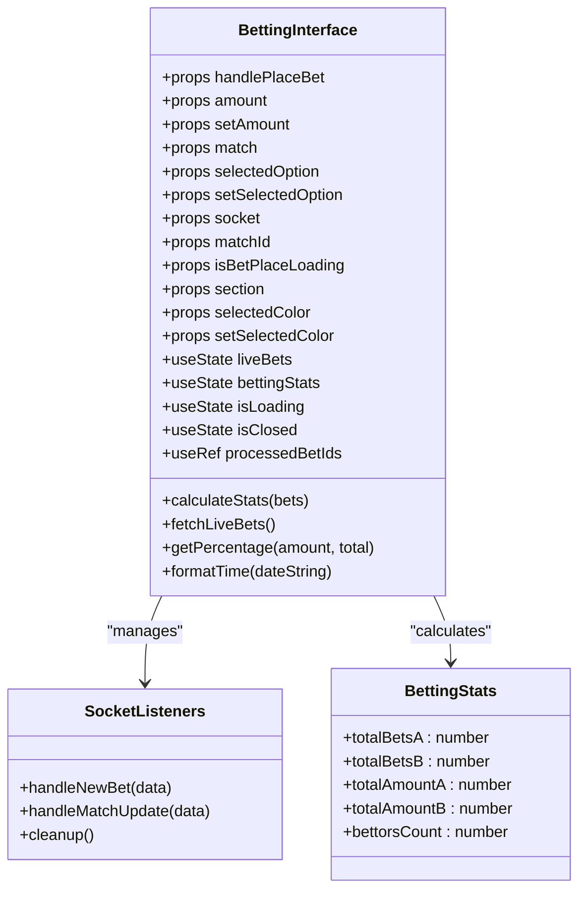
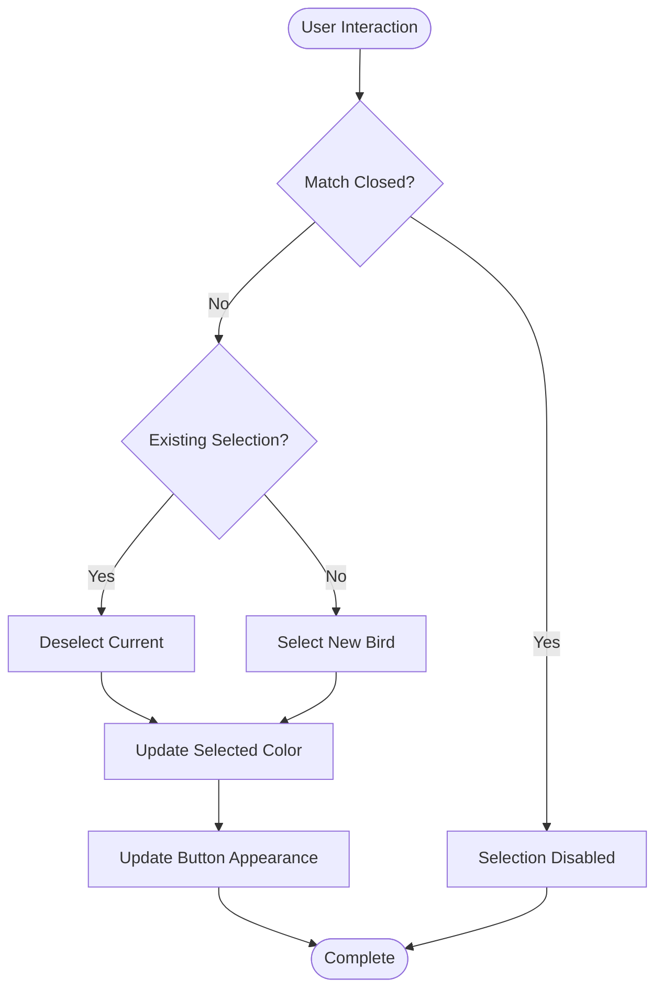
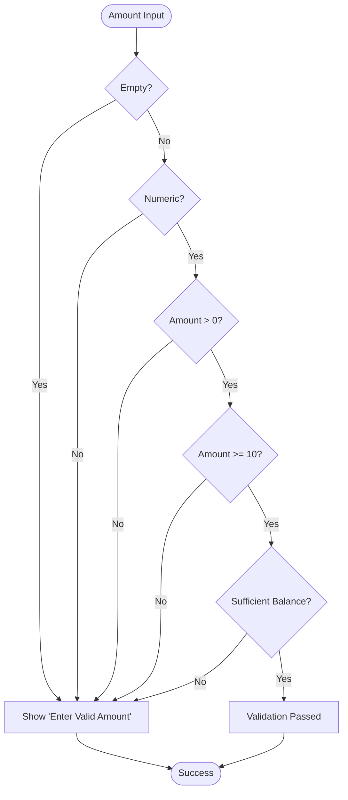
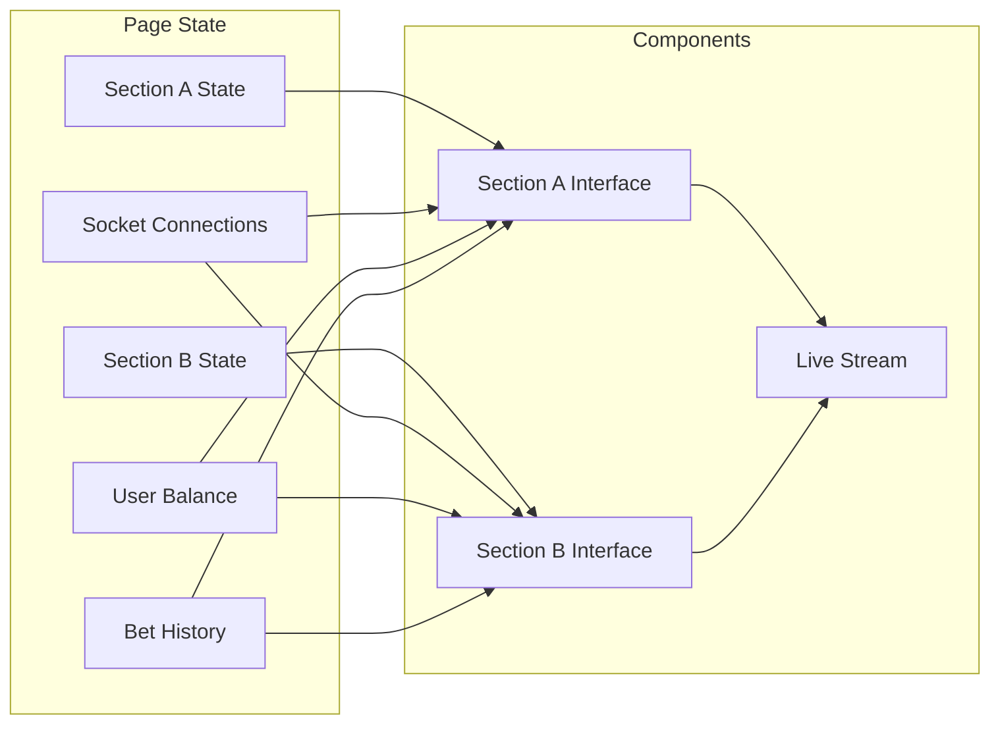
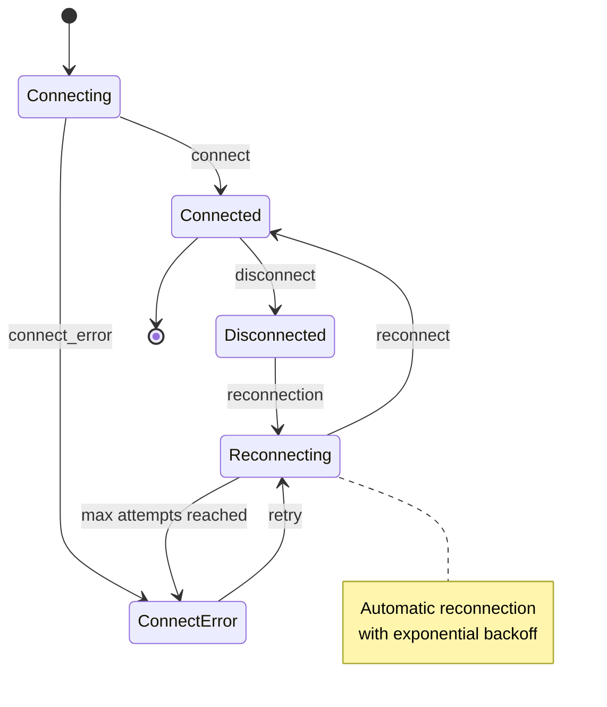
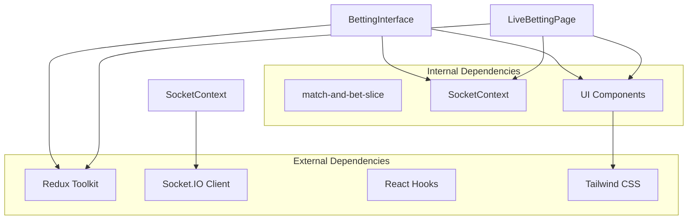

# Live Betting Interface

<cite>
**Referenced Files in This Document**
- [LiveBettingInterface.jsx](file://client/src/components/Bet/LiveBettingInterface.jsx)
- [LiveBettingPage.jsx](file://client/src/Pages/Bet/LiveBettingPage.jsx)
- [SocketContext.jsx](file://client/src/context/SocketContext.jsx)
- [match-and-bet-slice/index.js](file://client/src/store/user/match-and-bet-slice/index.js)
- [store.js](file://client/src/store/store.js)
- [LiveStream.jsx](file://client/src/components/Bet/LiveStream.jsx)
- [BetTab.jsx](file://client/src/components/Bet/BetTab.jsx)
- [socketHandler.js](file://server/socket/socketHandler.js)
- [matchController.js](file://server/controllers/admin/matchController.js)
- [tailwind.config.js](file://client/tailwind.config.js)
</cite>

## Table of Contents
1. [Introduction](#introduction)
2. [Project Structure](#project-structure)
3. [Core Components](#core-components)
4. [Architecture Overview](#architecture-overview)
5. [Detailed Component Analysis](#detailed-component-analysis)
6. [Dependency Analysis](#dependency-analysis)
7. [Performance Considerations](#performance-considerations)
8. [Troubleshooting Guide](#troubleshooting-guide)
9. [Conclusion](#conclusion)

## Introduction
This document provides comprehensive technical documentation for the live betting interface components in the betting application. It covers the BettingInterface component architecture, state management for bet placement, real-time data synchronization, betting options system, color selection mechanics, amount input validation, live statistics display, responsive design implementation, user interaction patterns, form validation, and integration with Redux and Socket.IO for real-time updates.

## Project Structure
The live betting interface spans multiple layers:
- **Presentation Layer**: React components for betting interface and live stream
- **State Management**: Redux slices for matches, bets, and user data
- **Real-time Communication**: Socket.IO integration for live updates
- **Server-Side**: Socket event broadcasting and match management

**Diagram sources**
- [LiveBettingPage.jsx](file://client/src/Pages/Bet/LiveBettingPage.jsx#L1-L943)
- [LiveBettingInterface.jsx](file://client/src/components/Bet/LiveBettingInterface.jsx#L1-L439)
- [SocketContext.jsx](file://client/src/context/SocketContext.jsx#L1-L62)
- [socketHandler.js](file://server/socket/socketHandler.js#L1-L44)

**Section sources**
- [LiveBettingPage.jsx](file://client/src/Pages/Bet/LiveBettingPage.jsx#L1-L943)
- [LiveBettingInterface.jsx](file://client/src/components/Bet/LiveBettingInterface.jsx#L1-L439)
- [SocketContext.jsx](file://client/src/context/SocketContext.jsx#L1-L62)

## Core Components
The live betting interface consists of several interconnected components:

### BettingInterface Component
The central betting interface component manages:
- **Betting Options**: Straight, Lay90, and Call90 betting types
- **Color Selection**: Bird selection mechanics with visual feedback
- **Amount Input**: Numeric input with preset amount buttons
- **Real-time Statistics**: Live pool calculations and bet distributions
- **Recent Bets Feed**: Real-time bet notifications
- **State Management**: Local state for UI interactions and Redux integration

### LiveBettingPage Component
The main page orchestrates:
- **Dual Match Support**: Section A and Section B betting interfaces
- **Socket Integration**: Room management and event listeners
- **User Authentication**: Balance checks and validation
- **Bet Placement Workflow**: Complete validation and submission pipeline
- **Local Storage**: Persistent bet history and close updates

### SocketContext Provider
Manages real-time communication:
- **Connection Lifecycle**: Automatic reconnection handling
- **Room Management**: Dynamic room joining/leaving
- **Event Broadcasting**: Centralized socket event management

**Section sources**
- [LiveBettingInterface.jsx](file://client/src/components/Bet/LiveBettingInterface.jsx#L8-L439)
- [LiveBettingPage.jsx](file://client/src/Pages/Bet/LiveBettingPage.jsx#L20-L943)
- [SocketContext.jsx](file://client/src/context/SocketContext.jsx#L14-L62)

## Architecture Overview
The live betting system follows a reactive architecture with real-time updates:

**Diagram sources**
- [LiveBettingPage.jsx](file://client/src/Pages/Bet/LiveBettingPage.jsx#L420-L517)
- [LiveBettingInterface.jsx](file://client/src/components/Bet/LiveBettingInterface.jsx#L110-L169)
- [match-and-bet-slice/index.js](file://client/src/store/user/match-and-bet-slice/index.js#L95-L114)
- [socketHandler.js](file://server/socket/socketHandler.js#L1-L44)

## Detailed Component Analysis

### BettingInterface Component Architecture
The BettingInterface component serves as the primary betting interface with comprehensive state management:

**Diagram sources**
- [LiveBettingInterface.jsx](file://client/src/components/Bet/LiveBettingInterface.jsx#L8-L439)

#### Betting Options System
The component supports three betting types through the options configuration:

| Betting Type | Description | Availability |
|--------------|-------------|--------------|
| Straight | Standard bet on selected bird | Available |
| Lay90 | Advanced betting option | Coming Soon (disabled) |
| Call90 | Advanced betting option | Coming Soon (disabled) |

The options system uses internationalization keys for dynamic labeling and maintains state through the parent component.

#### Color Selection Mechanics
Bird selection follows a two-color system with visual feedback:

**Diagram sources**
- [LiveBettingInterface.jsx](file://client/src/components/Bet/LiveBettingInterface.jsx#L237-L264)

#### Amount Input Validation
The betting interface implements comprehensive validation:

**Diagram sources**
- [LiveBettingPage.jsx](file://client/src/Pages/Bet/LiveBettingPage.jsx#L420-L471)

#### Real-time Statistics Display
The component calculates and displays live betting statistics:

| Statistic | Calculation Method | Display Format |
|-----------|-------------------|----------------|
| Total Pool | A + B | Currency format |
| Bird A Pool | Sum of all A bets | Currency format |
| Bird B Pool | Sum of all B bets | Currency format |
| Bet Distribution | (Amount/Total) × 100 | Percentage with bar chart |
| Unique Bettors | Set of user IDs | Count format |

**Section sources**
- [LiveBettingInterface.jsx](file://client/src/components/Bet/LiveBettingInterface.jsx#L27-L73)
- [LiveBettingInterface.jsx](file://client/src/components/Bet/LiveBettingInterface.jsx#L171-L176)

### LiveBettingPage Component Analysis
The main page coordinates dual betting interfaces and manages complex state:

**Diagram sources**
- [LiveBettingPage.jsx](file://client/src/Pages/Bet/LiveBettingPage.jsx#L20-L943)

#### Socket Event Management
The page implements sophisticated socket room management:

| Event Type | Purpose | Room Target | Implementation |
|------------|---------|-------------|----------------|
| join-match | Individual match updates | match-{id} | Dynamic room joining |
| join-event | Event-wide updates | event-{id} | Multi-match coordination |
| join-bet-history | Personal bet history | user-{id} | User-specific updates |
| bet-close-update | Betting closure notifications | user-{id} | Settlement summaries |

**Section sources**
- [LiveBettingPage.jsx](file://client/src/Pages/Bet/LiveBettingPage.jsx#L205-L408)
- [socketHandler.js](file://server/socket/socketHandler.js#L9-L40)

### SocketContext Integration
The SocketContext provider manages connection lifecycle and reconnection:

**Diagram sources**
- [SocketContext.jsx](file://client/src/context/SocketContext.jsx#L18-L54)

**Section sources**
- [SocketContext.jsx](file://client/src/context/SocketContext.jsx#L1-L62)

## Dependency Analysis
The betting interface has well-defined dependencies and integration points:

**Diagram sources**
- [LiveBettingInterface.jsx](file://client/src/components/Bet/LiveBettingInterface.jsx#L1-L8)
- [LiveBettingPage.jsx](file://client/src/Pages/Bet/LiveBettingPage.jsx#L1-L18)
- [store.js](file://client/src/store/store.js#L1-L26)

### Redux Integration
The application uses Redux for state persistence and cross-component communication:

| Slice | Purpose | Actions |
|-------|---------|---------|
| auth-slice | User authentication state | login, logout, register |
| payment-slice | Wallet and balance management | userBalance, transactions |
| match-and-bet-slice | Betting data and operations | placeBet, getMatchBets, fetchMatchById |
| tabSlice | UI navigation state | tab management |

**Section sources**
- [store.js](file://client/src/store/store.js#L1-L26)
- [match-and-bet-slice/index.js](file://client/src/store/user/match-and-bet-slice/index.js#L1-L127)

## Performance Considerations
The live betting interface implements several performance optimizations:

### Memory Management
- **Processed Bet Tracking**: Uses Set to prevent duplicate bet processing
- **Cleanup Functions**: Proper socket listener cleanup to prevent memory leaks
- **State Optimization**: useCallback and useMemo for expensive calculations

### Network Efficiency
- **Single Socket Instance**: Shared socket connection across components
- **Room-based Updates**: Targeted event broadcasting reduces bandwidth
- **Lazy Loading**: Statistics calculated only when needed

### UI Responsiveness
- **Debounced Calculations**: Efficient percentage calculations
- **Virtual Scrolling**: Recent bets feed uses scrollable container
- **Conditional Rendering**: Loading states prevent unnecessary re-renders

## Troubleshooting Guide

### Common Issues and Solutions

#### Socket Connection Problems
**Symptoms**: Real-time updates not working
**Causes**: 
- Socket connection timeout
- Room join failures
- Server disconnections

**Solutions**:
- Verify server connectivity
- Check room IDs in socket logs
- Monitor reconnection attempts

#### Bet Placement Failures
**Symptoms**: Bet placement errors despite valid input
**Causes**:
- Insufficient user balance
- Match status changes during placement
- Server-side validation failures

**Solutions**:
- Verify user balance before placement
- Check match status before submitting
- Review server-side error messages

#### State Synchronization Issues
**Symptoms**: UI shows outdated statistics
**Causes**:
- Socket event processing delays
- State update conflicts
- Component unmounting during updates

**Solutions**:
- Implement proper cleanup functions
- Use atomic state updates
- Add error boundaries for socket events

**Section sources**
- [LiveBettingPage.jsx](file://client/src/Pages/Bet/LiveBettingPage.jsx#L420-L517)
- [LiveBettingInterface.jsx](file://client/src/components/Bet/LiveBettingInterface.jsx#L110-L169)

## Conclusion
The live betting interface demonstrates a robust, scalable architecture for real-time sports betting applications. The implementation successfully balances real-time responsiveness with performance optimization while maintaining clean separation of concerns through Redux and Socket.IO integration. The modular component design allows for easy maintenance and extension, while comprehensive validation ensures data integrity and user experience quality.

The system's strength lies in its real-time capabilities, efficient state management, and responsive design that works across multiple device types. The socket-based architecture enables seamless synchronization between clients and servers, while the Redux integration provides predictable state management for complex betting scenarios.

Future enhancements could include advanced betting types (Lay90, Call90), expanded analytics dashboards, and enhanced mobile experience optimization.