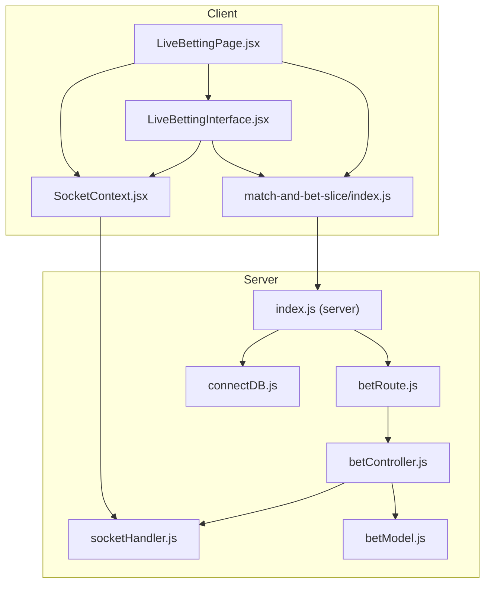
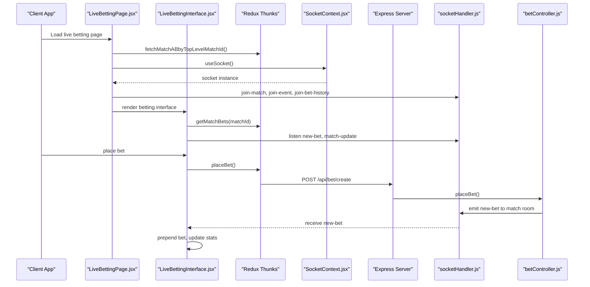
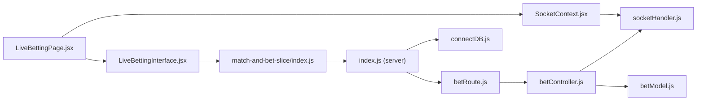

# Performance Optimization

<cite>
**Referenced Files in This Document**
- [LiveBettingPage.jsx](file://client/src/Pages/Bet/LiveBettingPage.jsx)
- [LiveBettingInterface.jsx](file://client/src/components/Bet/LiveBettingInterface.jsx)
- [SocketContext.jsx](file://client/src/context/SocketContext.jsx)
- [match-and-bet-slice/index.js](file://client/src/store/user/match-and-bet-slice/index.js)
- [socketHandler.js](file://server/socket/socketHandler.js)
- [betController.js](file://server/controllers/bet/betController.js)
- [betModel.js](file://server/models/betModel.js)
- [betRoute.js](file://server/routes/bet/betRoute.js)
- [index.js (server)](file://server/index.js)
- [connectDB.js](file://server/config/connectDB.js)
- [.env (client)](file://client/.env)
</cite>

## Table of Contents
1. [Introduction](#introduction)
2. [Project Structure](#project-structure)
3. [Core Components](#core-components)
4. [Architecture Overview](#architecture-overview)
5. [Detailed Component Analysis](#detailed-component-analysis)
6. [Dependency Analysis](#dependency-analysis)
7. [Performance Considerations](#performance-considerations)
8. [Troubleshooting Guide](#troubleshooting-guide)
9. [Conclusion](#conclusion)
10. [Appendices](#appendices)

## Introduction
This document provides a comprehensive guide to performance optimization for the real-time betting system. It focuses on memory management for high-concurrency scenarios, efficient rendering for live feeds, network optimization strategies, server-side performance, and operational practices for scaling during peak events.

## Project Structure
The system comprises a React client and an Express server with Socket.IO for real-time updates. The client manages live betting interfaces, Redux slices for data fetching, and a Socket provider. The server exposes REST endpoints for betting and match data, and emits real-time updates to clients via rooms.

**Diagram sources**
- [LiveBettingPage.jsx](file://client/src/Pages/Bet/LiveBettingPage.jsx#L1-L943)
- [LiveBettingInterface.jsx](file://client/src/components/Bet/LiveBettingInterface.jsx#L1-L439)
- [SocketContext.jsx](file://client/src/context/SocketContext.jsx#L1-L62)
- [match-and-bet-slice/index.js](file://client/src/store/user/match-and-bet-slice/index.js#L1-L127)
- [socketHandler.js](file://server/socket/socketHandler.js#L1-L101)
- [betController.js](file://server/controllers/bet/betController.js#L1-L125)
- [betModel.js](file://server/models/betModel.js#L1-L24)
- [betRoute.js](file://server/routes/bet/betRoute.js#L1-L11)
- [index.js (server)](file://server/index.js#L1-L150)
- [connectDB.js](file://server/config/connectDB.js#L1-L17)

**Section sources**
- [LiveBettingPage.jsx](file://client/src/Pages/Bet/LiveBettingPage.jsx#L1-L943)
- [LiveBettingInterface.jsx](file://client/src/components/Bet/LiveBettingInterface.jsx#L1-L439)
- [SocketContext.jsx](file://client/src/context/SocketContext.jsx#L1-L62)
- [match-and-bet-slice/index.js](file://client/src/store/user/match-and-bet-slice/index.js#L1-L127)
- [socketHandler.js](file://server/socket/socketHandler.js#L1-L101)
- [betController.js](file://server/controllers/bet/betController.js#L1-L125)
- [betModel.js](file://server/models/betModel.js#L1-L24)
- [betRoute.js](file://server/routes/bet/betRoute.js#L1-L11)
- [index.js (server)](file://server/index.js#L1-L150)
- [connectDB.js](file://server/config/connectDB.js#L1-L17)

## Core Components
- Real-time socket provider with reconnection and transport configuration.
- Live betting interface with incremental stats updates and capped recent bets feed.
- Redux async thunks for fetching match data and placing bets.
- Server-side socket rooms for targeted broadcasting and bet notifications.

Key performance-relevant behaviors:
- Single socket listeners per component to avoid duplication.
- Incremental stats updates and capped recent bets to limit DOM growth.
- Room-based broadcasting to reduce unnecessary fan-out.

**Section sources**
- [SocketContext.jsx](file://client/src/context/SocketContext.jsx#L14-L61)
- [LiveBettingInterface.jsx](file://client/src/components/Bet/LiveBettingInterface.jsx#L110-L169)
- [match-and-bet-slice/index.js](file://client/src/store/user/match-and-bet-slice/index.js#L49-L127)
- [socketHandler.js](file://server/socket/socketHandler.js#L6-L90)

## Architecture Overview
The client connects to the server via Socket.IO and REST endpoints. Socket rooms isolate match updates, while REST endpoints serve historical data and user balances. The server emits real-time updates only to relevant rooms.

**Diagram sources**
- [LiveBettingPage.jsx](file://client/src/Pages/Bet/LiveBettingPage.jsx#L208-L408)
- [LiveBettingInterface.jsx](file://client/src/components/Bet/LiveBettingInterface.jsx#L75-L169)
- [match-and-bet-slice/index.js](file://client/src/store/user/match-and-bet-slice/index.js#L95-L127)
- [SocketContext.jsx](file://client/src/context/SocketContext.jsx#L18-L54)
- [socketHandler.js](file://server/socket/socketHandler.js#L9-L90)
- [betController.js](file://server/controllers/bet/betController.js#L43-L106)
- [betRoute.js](file://server/routes/bet/betRoute.js#L6-L8)

## Detailed Component Analysis

### Real-Time Socket Provider
- Reconnection strategy with exponential backoff and polling fallback.
- Connection lifecycle logging for diagnostics.
- Single socket instance provided via context to avoid duplication.

Optimization notes:
- Keep transports aligned with network conditions.
- Monitor reconnection attempts and delays to prevent overload.

**Section sources**
- [SocketContext.jsx](file://client/src/context/SocketContext.jsx#L18-L54)

### Live Betting Page
- Manages two match sections with separate loading states and IDs.
- Joins socket rooms for both matches and the event, leaving on cleanup.
- Uses memoized derived values to minimize re-computation.
- Tracks completed matches and clears local bet history when both are settled.
- Places bets with validation and refreshes affected match data.

Memory and rendering considerations:
- Separate loading flags per section to avoid blocking UI.
- Local storage-backed bet history and close updates to reduce server load.
- Cleanup of socket listeners and rooms prevents leaks.

**Section sources**
- [LiveBettingPage.jsx](file://client/src/Pages/Bet/LiveBettingPage.jsx#L41-L66)
- [LiveBettingPage.jsx](file://client/src/Pages/Bet/LiveBettingPage.jsx#L170-L203)
- [LiveBettingPage.jsx](file://client/src/Pages/Bet/LiveBettingPage.jsx#L208-L408)
- [LiveBettingPage.jsx](file://client/src/Pages/Bet/LiveBettingPage.jsx#L410-L418)
- [LiveBettingPage.jsx](file://client/src/Pages/Bet/LiveBettingPage.jsx#L420-L517)

### Live Betting Interface
- Fetches initial bets and calculates stats; maintains a processed bet set to deduplicate.
- Listens for new bets and match updates via a single socket listener per component.
- Increments stats and prepends new bets to the visible feed.
- Caps recent bets display to a fixed number for performance.

Efficient rendering techniques:
- Incremental stats updates instead of full recalculation.
- Prepending new bets avoids expensive array reordering.
- Capped recent bets list reduces DOM nodes.

**Section sources**
- [LiveBettingInterface.jsx](file://client/src/components/Bet/LiveBettingInterface.jsx#L75-L108)
- [LiveBettingInterface.jsx](file://client/src/components/Bet/LiveBettingInterface.jsx#L110-L169)
- [LiveBettingInterface.jsx](file://client/src/components/Bet/LiveBettingInterface.jsx#L389-L433)

### Redux Thunks for Betting Operations
- Async thunks for fetching match data, placing bets, and retrieving match bets.
- Centralized error handling with rejectWithValue for UI feedback.

Network optimization:
- REST endpoints avoid redundant polling by relying on socket updates.
- Place bet triggers immediate socket emission to match room.

**Section sources**
- [match-and-bet-slice/index.js](file://client/src/store/user/match-and-bet-slice/index.js#L49-L127)

### Server-Side Socket Handling
- Room-based broadcasting for match and event updates.
- Dedicated admin room for administrative notifications.
- Single emit per bet to match room to minimize overhead.

Scalability:
- Rooms decouple broadcast scope from global fan-out.
- Admin room allows targeted notifications.

**Section sources**
- [socketHandler.js](file://server/socket/socketHandler.js#L9-L90)

### Bet Placement Controller
- Validates inputs, checks user balance, and persists bet.
- Emits a single socket event to the match room with populated user data.

Broadcast efficiency:
- Targeted room emission reduces unnecessary network traffic.

**Section sources**
- [betController.js](file://server/controllers/bet/betController.js#L43-L106)

### Database Model and Indexes
- Bet model includes timestamps and composite indexes for matchId and status.
- Sorts bets by creation time for recent-first retrieval.

Query optimization:
- Composite index supports efficient filtering and sorting for match bets.

**Section sources**
- [betModel.js](file://server/models/betModel.js#L21-L23)

### REST Routes for Betting
- Provides endpoints for placing bets, retrieving user bet status, and fetching match bets.

Endpoint coverage:
- POST create bet
- GET match bets
- GET user bet status

**Section sources**
- [betRoute.js](file://server/routes/bet/betRoute.js#L6-L8)

### Server Boot and Middleware
- Health check endpoint with memory usage metrics.
- CORS and Helmet for security.
- Body parsing with increased limits.
- Global error handling and unhandled rejection logging.

Operational visibility:
- Health endpoint enables monitoring uptime and memory.
- Logging middleware aids in diagnosing slow endpoints.

**Section sources**
- [index.js (server)](file://server/index.js#L82-L91)
- [index.js (server)](file://server/index.js#L66-L70)
- [index.js (server)](file://server/index.js#L110-L140)

### Database Connection
- Configured pool size and timeouts for MongoDB connections.

Connection stability:
- Controlled pool size prevents resource exhaustion.
- Socket and server selection timeouts improve reliability.

**Section sources**
- [connectDB.js](file://server/config/connectDB.js#L5-L9)

## Dependency Analysis
The client depends on Redux thunks for data access and Socket.IO for real-time updates. The server orchestrates socket rooms and REST endpoints, with the database supporting bet queries.

**Diagram sources**
- [LiveBettingPage.jsx](file://client/src/Pages/Bet/LiveBettingPage.jsx#L1-L20)
- [LiveBettingInterface.jsx](file://client/src/components/Bet/LiveBettingInterface.jsx#L1-L10)
- [SocketContext.jsx](file://client/src/context/SocketContext.jsx#L1-L12)
- [match-and-bet-slice/index.js](file://client/src/store/user/match-and-bet-slice/index.js#L1-L10)
- [socketHandler.js](file://server/socket/socketHandler.js#L1-L10)
- [betController.js](file://server/controllers/bet/betController.js#L1-L10)
- [betModel.js](file://server/models/betModel.js#L1-L10)
- [betRoute.js](file://server/routes/bet/betRoute.js#L1-L10)
- [index.js (server)](file://server/index.js#L1-L20)
- [connectDB.js](file://server/config/connectDB.js#L1-L10)

**Section sources**
- [LiveBettingPage.jsx](file://client/src/Pages/Bet/LiveBettingPage.jsx#L1-L20)
- [LiveBettingInterface.jsx](file://client/src/components/Bet/LiveBettingInterface.jsx#L1-L10)
- [SocketContext.jsx](file://client/src/context/SocketContext.jsx#L1-L12)
- [match-and-bet-slice/index.js](file://client/src/store/user/match-and-bet-slice/index.js#L1-L10)
- [socketHandler.js](file://server/socket/socketHandler.js#L1-L10)
- [betController.js](file://server/controllers/bet/betController.js#L1-L10)
- [betModel.js](file://server/models/betModel.js#L1-L10)
- [betRoute.js](file://server/routes/bet/betRoute.js#L1-L10)
- [index.js (server)](file://server/index.js#L1-L20)
- [connectDB.js](file://server/config/connectDB.js#L1-L10)

## Performance Considerations

### Memory Management Strategies
- Client-side
  - Deduplication of incoming bets using a Set to avoid repeated renders.
  - Capped recent bets list to limit DOM nodes and memory footprint.
  - Cleanup of socket listeners and rooms on component unmount.
  - Local storage-backed bet history and close updates to reduce server round-trips.
- Server-side
  - Room-based broadcasting minimizes fan-out and reduces memory pressure on clients.
  - Efficient database indexes support fast queries for recent bets.

**Section sources**
- [LiveBettingInterface.jsx](file://client/src/components/Bet/LiveBettingInterface.jsx#L35-L36)
- [LiveBettingInterface.jsx](file://client/src/components/Bet/LiveBettingInterface.jsx#L122-L128)
- [LiveBettingInterface.jsx](file://client/src/components/Bet/LiveBettingInterface.jsx#L392-L433)
- [LiveBettingPage.jsx](file://client/src/Pages/Bet/LiveBettingPage.jsx#L392-L407)
- [LiveBettingPage.jsx](file://client/src/Pages/Bet/LiveBettingPage.jsx#L51-L63)
- [socketHandler.js](file://server/socket/socketHandler.js#L9-L90)
- [betModel.js](file://server/models/betModel.js#L21-L23)

### Efficient Rendering Techniques
- Virtual scrolling
  - Not implemented in the current codebase.
  - Recommendation: Use a virtualized list library for the recent bets feed to render only visible items.
- Component memoization
  - Derived values are computed with useMemo to avoid unnecessary recalculations.
  - Socket listeners are attached conditionally and cleaned up to prevent stale closures.
- Incremental updates
  - Stats are updated incrementally upon new bets.
  - New bets are prepended to the list to keep recent activity at the top.

**Section sources**
- [LiveBettingPage.jsx](file://client/src/Pages/Bet/LiveBettingPage.jsx#L113-L133)
- [LiveBettingInterface.jsx](file://client/src/components/Bet/LiveBettingInterface.jsx#L134-L152)
- [LiveBettingInterface.jsx](file://client/src/components/Bet/LiveBettingInterface.jsx#L131)

### Network Optimization Strategies
- Connection pooling
  - Client sockets configured with reconnection and polling transport.
- Message batching
  - Not implemented; recommendation: batch frequent updates (e.g., odds changes) to reduce network overhead.
- Bandwidth management
  - Room-based targeting ensures clients receive only relevant updates.
  - REST endpoints return lean data; consider pagination for large lists.

**Section sources**
- [SocketContext.jsx](file://client/src/context/SocketContext.jsx#L21-L27)
- [socketHandler.js](file://server/socket/socketHandler.js#L9-L90)
- [match-and-bet-slice/index.js](file://client/src/store/user/match-and-bet-slice/index.js#L116-L127)

### Server-Side Performance Considerations
- Socket cluster management
  - Current implementation initializes a single IO instance; consider clustering for horizontal scaling.
- Database query optimization
  - Composite indexes on Bet collection support efficient filtering and sorting.
- Redis caching
  - Not present; recommendation: cache frequently accessed match data and user balances to reduce DB load.

**Section sources**
- [socketHandler.js](file://server/socket/socketHandler.js#L3-L5)
- [betModel.js](file://server/models/betModel.js#L21-L23)

### Monitoring and Profiling
- Health endpoint provides memory usage and environment details.
- Logging middleware records request metadata.
- Socket connection/disconnection and error events aid in diagnosing connectivity issues.

**Section sources**
- [index.js (server)](file://server/index.js#L82-L91)
- [index.js (server)](file://server/index.js#L66-L70)
- [socketHandler.js](file://server/socket/socketHandler.js#L74-L87)
- [SocketContext.jsx](file://client/src/context/SocketContext.jsx#L29-L47)

### Scaling Strategies
- Horizontal scaling
  - Use multiple server instances behind a load balancer.
  - Ensure sticky sessions or shared state for user rooms.
- Load balancing
  - Distribute WebSocket connections across instances using a reverse proxy with appropriate WebSocket support.
- Peak traffic preparation
  - Pre-warm database connections and caches.
  - Monitor health endpoint and auto-scale based on CPU/memory metrics.

[No sources needed since this section provides general guidance]

## Troubleshooting Guide
Common issues and remedies:
- Socket reconnection loops
  - Verify reconnection attempts and delays; adjust for network conditions.
- Excessive memory usage
  - Confirm deduplication Set is functioning and recent bets list is capped.
- Stale or missing updates
  - Ensure rooms are joined/leaved correctly and listeners are cleaned up.
- Slow bet placement
  - Check database indexes and server logs for latency spikes.

**Section sources**
- [SocketContext.jsx](file://client/src/context/SocketContext.jsx#L21-L27)
- [LiveBettingInterface.jsx](file://client/src/components/Bet/LiveBettingInterface.jsx#L35-L36)
- [LiveBettingInterface.jsx](file://client/src/components/Bet/LiveBettingInterface.jsx#L392-L433)
- [LiveBettingPage.jsx](file://client/src/Pages/Bet/LiveBettingPage.jsx#L208-L408)
- [index.js (server)](file://server/index.js#L143-L147)

## Conclusion
The system employs room-based real-time updates, incremental rendering, and deduplication to manage performance under load. To further optimize, consider implementing virtual scrolling, message batching, Redis caching, and horizontal scaling with proper load balancing and monitoring.

[No sources needed since this section summarizes without analyzing specific files]

## Appendices

### Environment Variables
- Client base URL for API and socket connections.

**Section sources**
- [.env (client)](file://client/.env#L1-L2)