# Real-time Betting System

<cite>
**Referenced Files in This Document**
- [server.js](file://server/server.js)
- [index.js](file://server/index.js)
- [socketHandler.js](file://server/socket/socketHandler.js)
- [betController.js](file://server/controllers/bet/betController.js)
- [betRoute.js](file://server/routes/bet/betRoute.js)
- [betModel.js](file://server/models/betModel.js)
- [main.jsx](file://client/src/main.jsx)
- [SocketContext.jsx](file://client/src/context/SocketContext.jsx)
- [LiveBettingPage.jsx](file://client/src/Pages/Bet/LiveBettingPage.jsx)
- [LiveBettingInterface.jsx](file://client/src/components/Bet/LiveBettingInterface.jsx)
- [LiveStream.jsx](file://client/src/components/Bet/LiveStream.jsx)
- [index.js](file://client/src/store/user/match-and-bet-slice/index.js)
</cite>

## Table of Contents
1. [Introduction](#introduction)
2. [Project Structure](#project-structure)
3. [Core Components](#core-components)
4. [Architecture Overview](#architecture-overview)
5. [Detailed Component Analysis](#detailed-component-analysis)
6. [Dependency Analysis](#dependency-analysis)
7. [Performance Considerations](#performance-considerations)
8. [Troubleshooting Guide](#troubleshooting-guide)
9. [Conclusion](#conclusion)

## Introduction
This document provides comprehensive documentation for the real-time betting system, focusing on the Socket.IO implementation for live match updates, odds changes, and bet notifications. It explains the room-based architecture for match-specific communications, the event broadcasting mechanism, and the live betting interface components including odds display, bet placement forms, and real-time statistics. The document also covers WebSocket connection handling, reconnection logic, error recovery strategies, data synchronization between frontend and backend, state consistency, conflict resolution, live streaming integration, and performance optimization techniques for handling multiple concurrent connections and high-frequency updates.

## Project Structure
The system follows a clear separation of concerns:
- Backend: Express server with Socket.IO for real-time communication, MongoDB for persistence, and REST APIs for CRUD operations.
- Frontend: React application with Redux Toolkit for state management, Socket.IO client for real-time updates, and integrated live streaming.

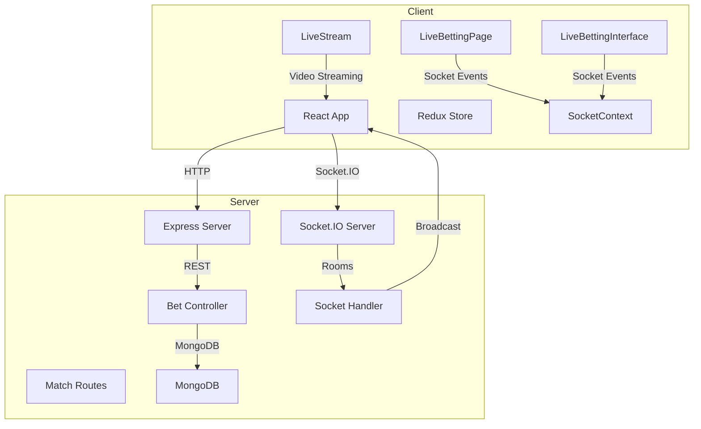

**Diagram sources**
- [server.js](file://server/server.js#L1-L92)
- [index.js](file://server/index.js#L1-L150)
- [socketHandler.js](file://server/socket/socketHandler.js#L1-L101)
- [LiveBettingPage.jsx](file://client/src/Pages/Bet/LiveBettingPage.jsx#L1-L943)
- [LiveBettingInterface.jsx](file://client/src/components/Bet/LiveBettingInterface.jsx#L1-L439)
- [LiveStream.jsx](file://client/src/components/Bet/LiveStream.jsx#L1-L462)

**Section sources**
- [server.js](file://server/server.js#L1-L92)
- [index.js](file://server/index.js#L1-L150)
- [main.jsx](file://client/src/main.jsx#L1-L20)

## Core Components
The real-time betting system consists of several core components:

### Backend Components
- **Socket Handler**: Manages Socket.IO connections, rooms, and event broadcasting
- **Bet Controller**: Handles bet placement, validation, and real-time notifications
- **REST Routes**: Expose endpoints for match data, bet history, and user operations
- **Database Models**: Define schemas for matches, bets, and user data

### Frontend Components
- **Socket Context**: Provides global Socket.IO connection with reconnection logic
- **Live Betting Page**: Orchestrates match data fetching, room management, and event listeners
- **Live Betting Interface**: Displays real-time odds, handles bet placement, and shows live statistics
- **Live Stream**: Integrates various video platforms for match viewing

**Section sources**
- [socketHandler.js](file://server/socket/socketHandler.js#L1-L101)
- [betController.js](file://server/controllers/bet/betController.js#L1-L125)
- [LiveBettingPage.jsx](file://client/src/Pages/Bet/LiveBettingPage.jsx#L1-L943)
- [LiveBettingInterface.jsx](file://client/src/components/Bet/LiveBettingInterface.jsx#L1-L439)
- [LiveStream.jsx](file://client/src/components/Bet/LiveStream.jsx#L1-L462)

## Architecture Overview
The system implements a room-based architecture for efficient real-time communication:

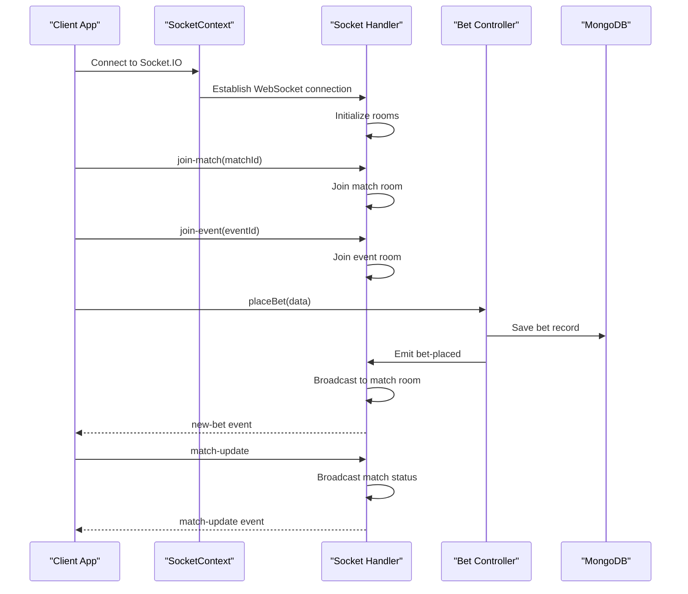

**Diagram sources**
- [SocketContext.jsx](file://client/src/context/SocketContext.jsx#L1-L62)
- [socketHandler.js](file://server/socket/socketHandler.js#L1-L101)
- [betController.js](file://server/controllers/bet/betController.js#L43-L106)

The architecture supports:
- **Match-specific rooms**: Isolated communication per match
- **Event rooms**: Broadcasting to all matches within an event
- **Admin rooms**: Specialized notifications for administrators
- **User-specific rooms**: Personal bet history and notifications

## Detailed Component Analysis

### Socket.IO Implementation
The backend Socket.IO implementation manages multiple room types and handles real-time events efficiently.

#### Room Management
The system creates specialized rooms for different communication scopes:

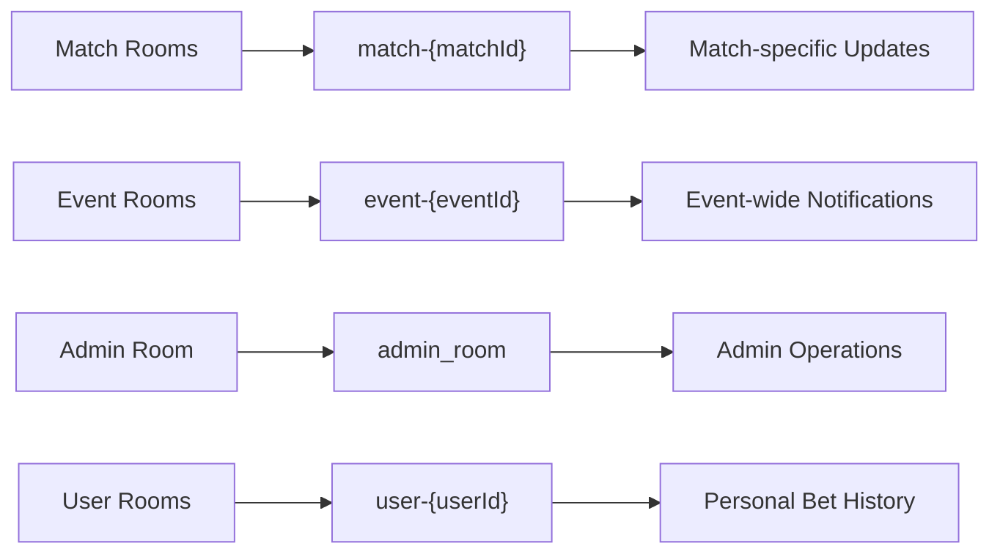

**Diagram sources**
- [socketHandler.js](file://server/socket/socketHandler.js#L9-L56)

#### Event Broadcasting Mechanism
The system implements targeted broadcasting to minimize unnecessary network traffic:

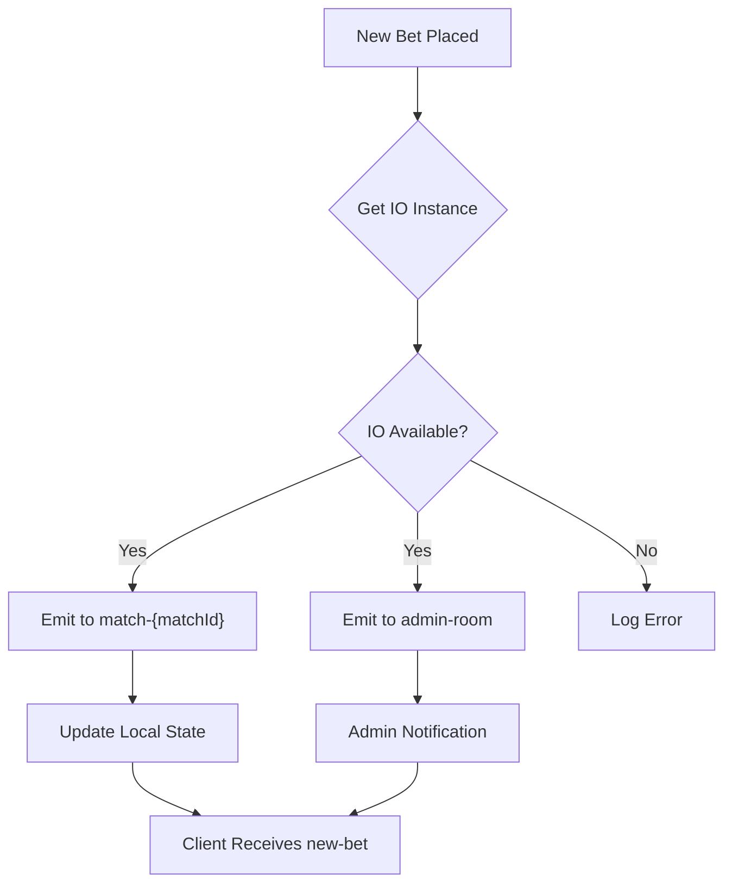

**Diagram sources**
- [betController.js](file://server/controllers/bet/betController.js#L79-L96)
- [socketHandler.js](file://server/socket/socketHandler.js#L58-L72)

**Section sources**
- [socketHandler.js](file://server/socket/socketHandler.js#L1-L101)
- [betController.js](file://server/controllers/bet/betController.js#L1-L125)

### WebSocket Connection Handling
The frontend implements robust connection management with automatic reconnection:

#### Connection Lifecycle
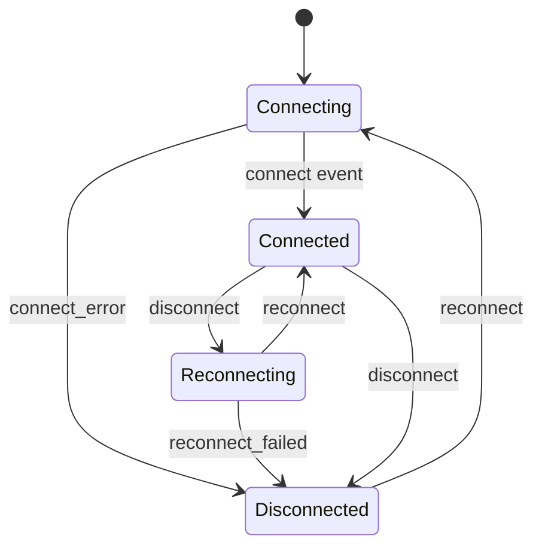

**Diagram sources**
- [SocketContext.jsx](file://client/src/context/SocketContext.jsx#L18-L54)

#### Reconnection Logic
The system implements exponential backoff with configurable attempts:
- Maximum 5 reconnection attempts
- Base delay of 1 second with exponential increase
- Maximum delay cap of 5 seconds
- Supports both WebSocket and polling transports

**Section sources**
- [SocketContext.jsx](file://client/src/context/SocketContext.jsx#L1-L62)

### Live Betting Interface Components
The betting interface provides comprehensive real-time functionality:

#### Real-time Statistics
The interface maintains live betting statistics with incremental updates:

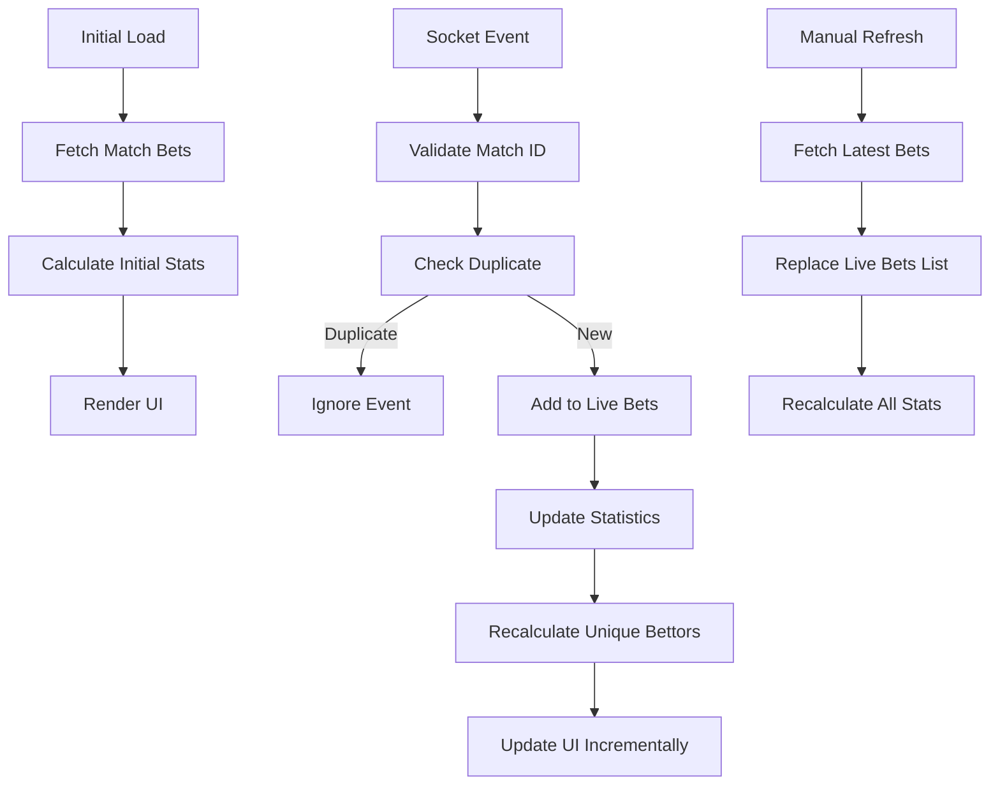

**Diagram sources**
- [LiveBettingInterface.jsx](file://client/src/components/Bet/LiveBettingInterface.jsx#L75-L169)

#### Bet Placement Form
The form validates user input and handles various bet types:

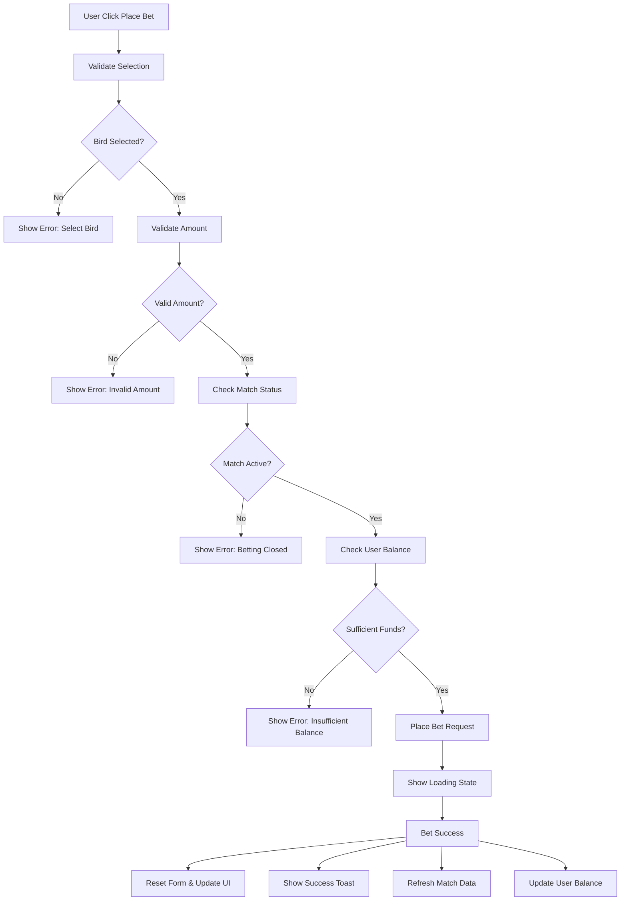

**Diagram sources**
- [LiveBettingPage.jsx](file://client/src/Pages/Bet/LiveBettingPage.jsx#L420-L517)

**Section sources**
- [LiveBettingInterface.jsx](file://client/src/components/Bet/LiveBettingInterface.jsx#L1-L439)
- [LiveBettingPage.jsx](file://client/src/Pages/Bet/LiveBettingPage.jsx#L1-L943)

### Live Streaming Integration
The system integrates multiple video streaming platforms:

#### Platform Support Matrix
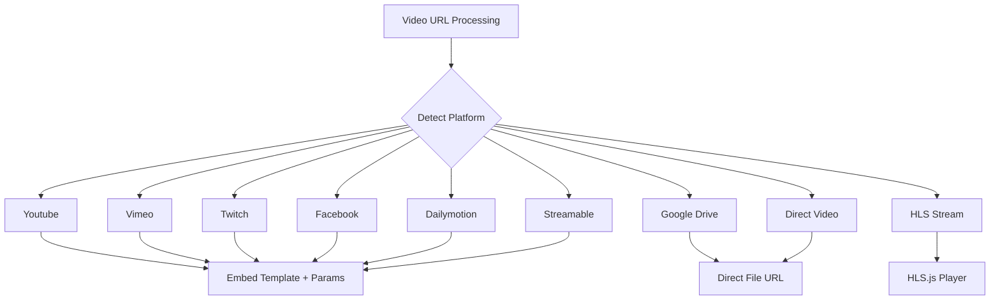

**Diagram sources**
- [LiveStream.jsx](file://client/src/components/Bet/LiveStream.jsx#L101-L218)

#### Streaming Features
- **Multi-platform support**: YouTube, Vimeo, Twitch, Facebook, Dailymotion, Google Drive, Streamable
- **HLS streaming**: Native Safari support with HLS.js polyfill for other browsers
- **Auto-play management**: Intelligent autoplay handling with mute controls
- **Error recovery**: Automatic retry mechanisms and user-initiated retries
- **Responsive design**: Adaptive video player with fullscreen capability

**Section sources**
- [LiveStream.jsx](file://client/src/components/Bet/LiveStream.jsx#L1-L462)

### Data Synchronization and State Management
The system ensures consistency between frontend and backend through multiple synchronization points:

#### Frontend State Management
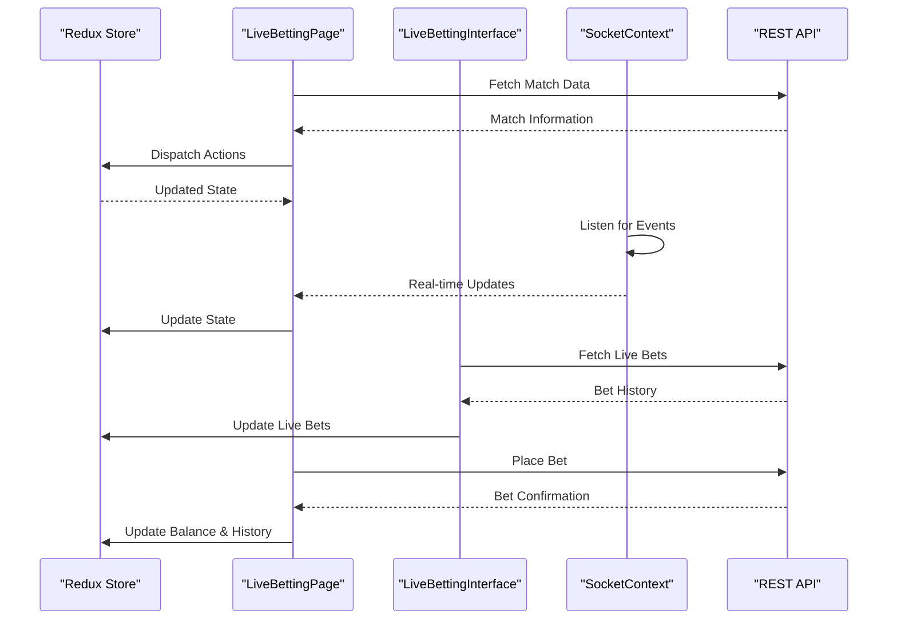

**Diagram sources**
- [index.js](file://client/src/store/user/match-and-bet-slice/index.js#L1-L127)
- [LiveBettingPage.jsx](file://client/src/Pages/Bet/LiveBettingPage.jsx#L1-L943)

#### Conflict Resolution Strategies
- **Processed Bet Tracking**: Prevents duplicate processing of the same bet event
- **Match ID Validation**: Ensures events are only processed for the current match
- **State Synchronization**: Manual refresh complements real-time updates
- **Local Storage Backup**: Maintains user bet history and close updates locally

**Section sources**
- [LiveBettingInterface.jsx](file://client/src/components/Bet/LiveBettingInterface.jsx#L35-L169)
- [LiveBettingPage.jsx](file://client/src/Pages/Bet/LiveBettingPage.jsx#L208-L408)

## Dependency Analysis
The system exhibits clean dependency management with clear separation of concerns:

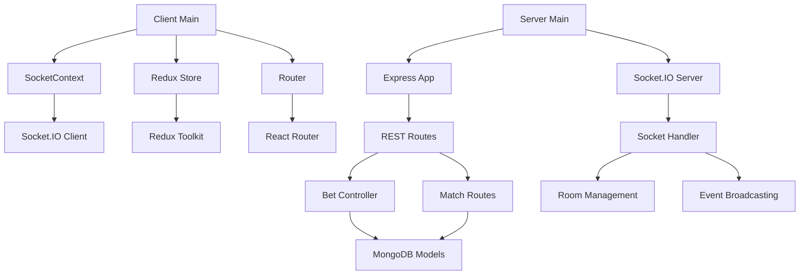

**Diagram sources**
- [main.jsx](file://client/src/main.jsx#L1-L20)
- [server.js](file://server/server.js#L1-L92)
- [index.js](file://server/index.js#L1-L150)

**Section sources**
- [main.jsx](file://client/src/main.jsx#L1-L20)
- [server.js](file://server/server.js#L1-L92)
- [index.js](file://server/index.js#L1-L150)

## Performance Considerations
The system implements several optimization techniques for handling high-frequency updates and multiple concurrent connections:

### Backend Optimizations
- **Connection Pooling**: Socket.IO server configured with optimal buffer sizes
- **Room-based Broadcasting**: Minimizes broadcast overhead by targeting specific rooms
- **Database Indexing**: Strategic indexes on frequently queried fields (createdAt, matchId, status)
- **Memory Management**: Proper cleanup of event listeners and room memberships

### Frontend Optimizations
- **Efficient State Updates**: Incremental updates to betting statistics instead of full recalculations
- **Debounced Updates**: Prevents excessive re-renders during rapid bet placements
- **Virtual Scrolling**: Efficient rendering of large bet history lists
- **Lazy Loading**: Conditional loading of HLS.js library only when needed

### Network Optimization
- **Transport Selection**: Automatic fallback between WebSocket and polling based on network conditions
- **Compression**: Configurable compression for reduced bandwidth usage
- **Heartbeat Monitoring**: Ping/pong mechanism for connection health verification

## Troubleshooting Guide

### Common Connection Issues
1. **Connection Drops**: Verify reconnection attempts are configured correctly
2. **Room Join Failures**: Check match IDs are properly formatted and exist in database
3. **Event Delivery**: Ensure proper event names match between frontend and backend

### Error Recovery Strategies
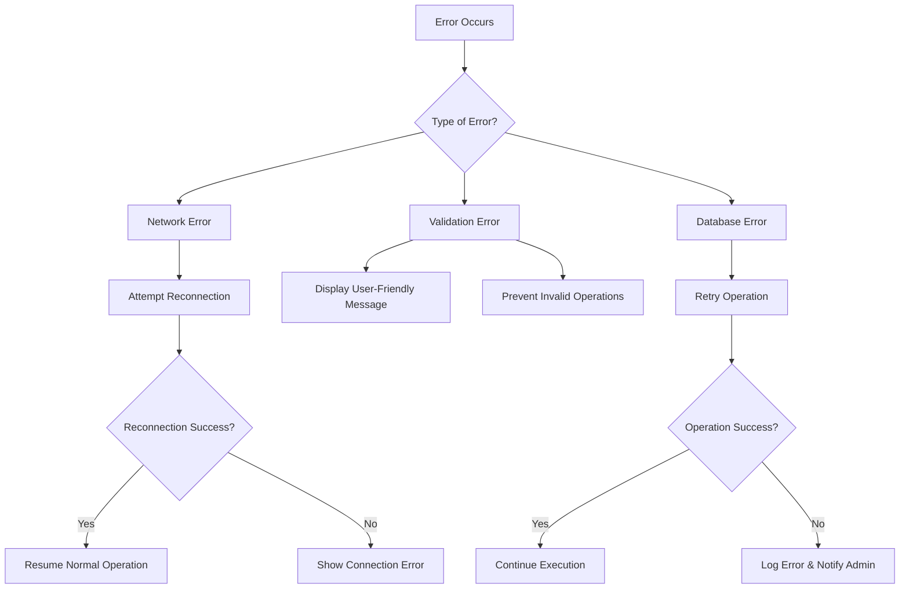

### Debugging Tools
- **Server Logs**: Monitor connection events, room joins/leaves, and error messages
- **Client Console**: Track Socket.IO events and connection states
- **Database Queries**: Verify bet records and match status updates
- **Network Tab**: Inspect WebSocket frames and HTTP requests

**Section sources**
- [socketHandler.js](file://server/socket/socketHandler.js#L74-L88)
- [SocketContext.jsx](file://client/src/context/SocketContext.jsx#L39-L47)

## Conclusion
The real-time betting system demonstrates robust implementation of Socket.IO for live sports betting applications. The room-based architecture ensures efficient communication isolation, while comprehensive reconnection logic provides resilience against network interruptions. The integration of live streaming enhances the user experience by combining betting functionality with match viewing capabilities.

Key strengths of the implementation include:
- **Scalable Architecture**: Room-based communication minimizes broadcast overhead
- **Robust Error Handling**: Comprehensive reconnection and recovery mechanisms
- **Performance Optimization**: Efficient state management and selective updates
- **Multi-platform Support**: Flexible video streaming integration
- **User Experience**: Real-time feedback and responsive interface

The system provides a solid foundation for real-time betting applications with clear extensibility points for additional features such as odds updates, advanced statistics, and enhanced administrative capabilities.