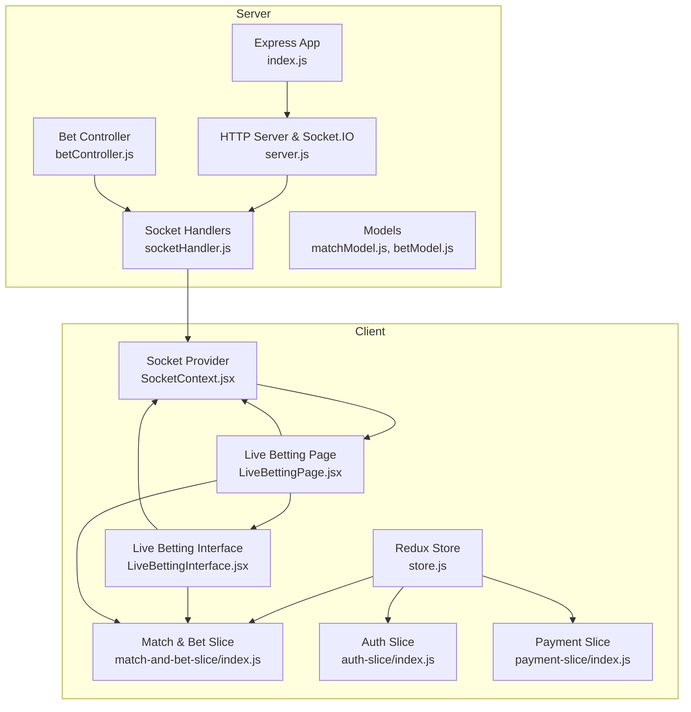
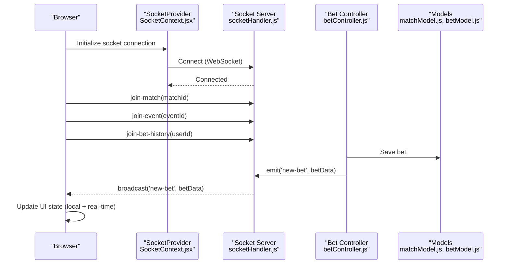
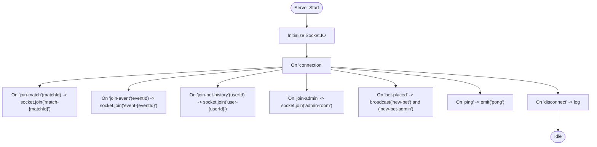
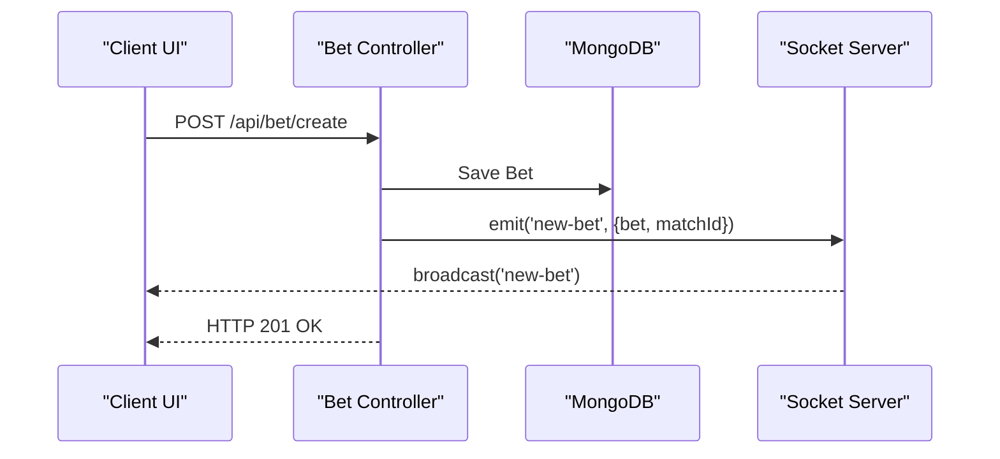
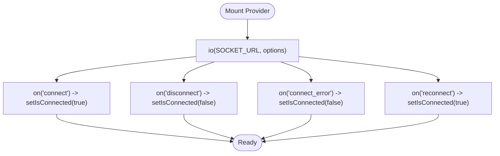
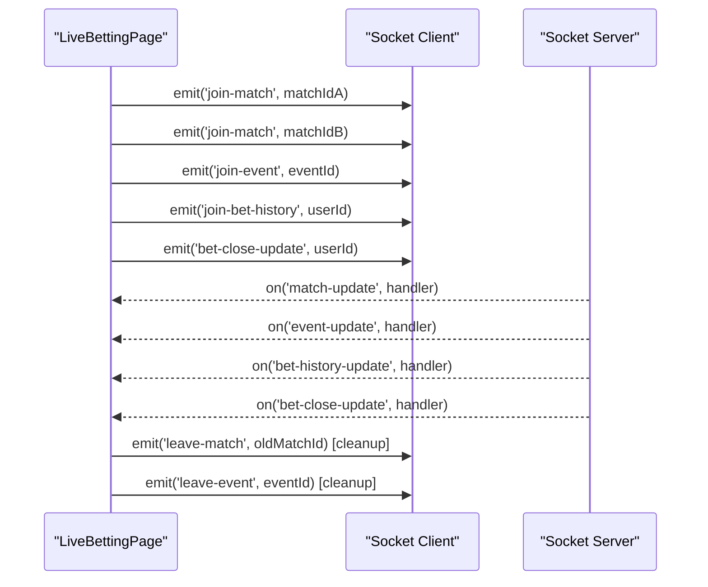
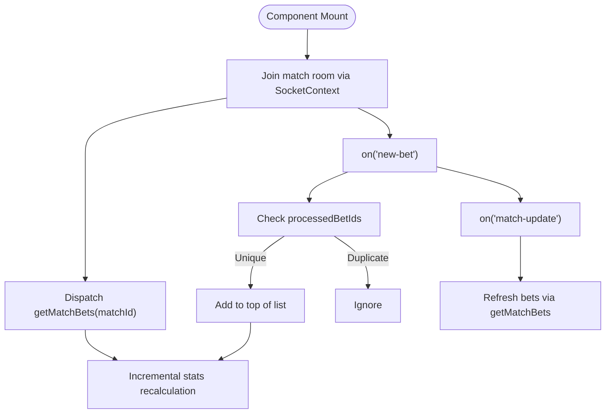
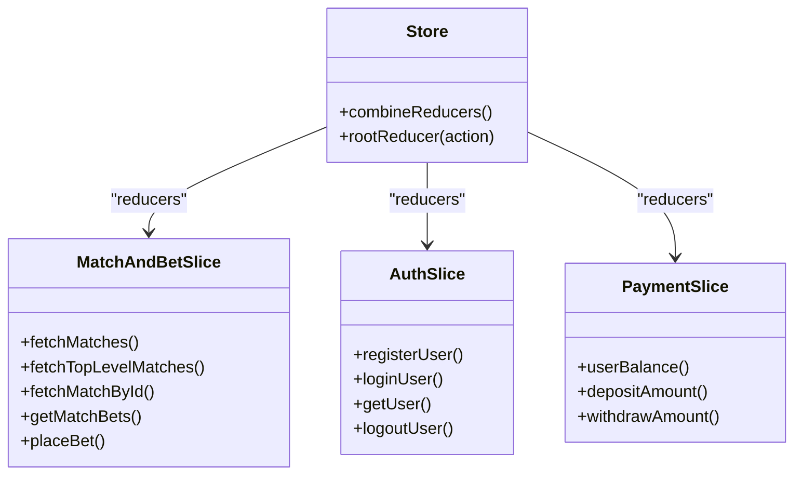
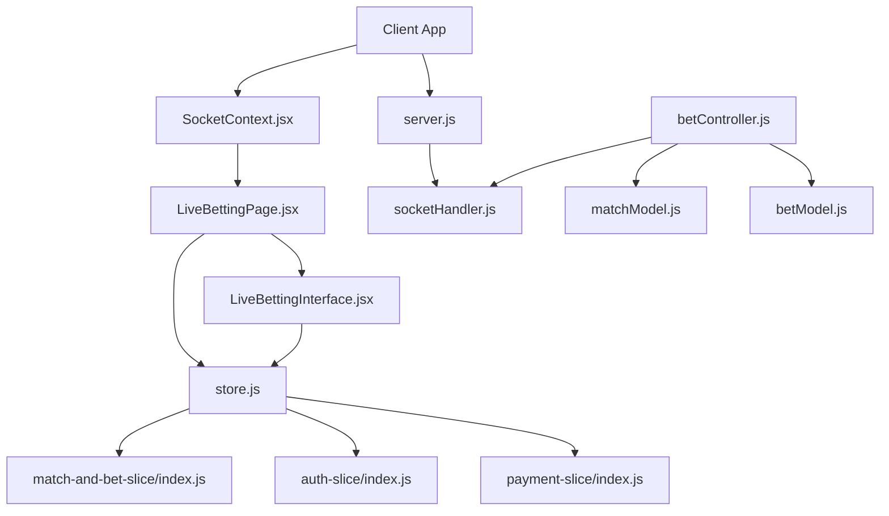

# Real-time Data Synchronization

<cite>
**Referenced Files in This Document**
- [server.js](file://server/server.js)
- [index.js](file://server/index.js)
- [socketHandler.js](file://server/socket/socketHandler.js)
- [betController.js](file://server/controllers/bet/betController.js)
- [matchModel.js](file://server/models/matchModel.js)
- [betModel.js](file://server/models/betModel.js)
- [SocketContext.jsx](file://client/src/context/SocketContext.jsx)
- [LiveBettingPage.jsx](file://client/src/Pages/Bet/LiveBettingPage.jsx)
- [LiveBettingInterface.jsx](file://client/src/components/Bet/LiveBettingInterface.jsx)
- [index.js](file://client/src/store/user/match-and-bet-slice/index.js)
- [store.js](file://client/src/store/store.js)
- [index.js](file://client/src/store/auth-slice/index.js)
- [index.js](file://client/src/store/user/payment-slice/index.js)
</cite>

## Table of Contents
1. [Introduction](#introduction)
2. [Project Structure](#project-structure)
3. [Core Components](#core-components)
4. [Architecture Overview](#architecture-overview)
5. [Detailed Component Analysis](#detailed-component-analysis)
6. [Dependency Analysis](#dependency-analysis)
7. [Performance Considerations](#performance-considerations)
8. [Troubleshooting Guide](#troubleshooting-guide)
9. [Conclusion](#conclusion)

## Introduction
This document explains the real-time data synchronization mechanisms in the betting system. It covers bidirectional data flow between the frontend and backend, including initial data loading and continuous real-time updates. The system uses Socket.IO for instant bet notifications and match status updates, with an event-driven architecture. It also documents data consistency strategies, conflict resolution for simultaneous bets, state synchronization across multiple clients, Redux integration for local state consistency, debouncing mechanisms to prevent update storms, data transformation, caching strategies, offline fallback scenarios, and performance optimizations for high-frequency updates and large datasets.

## Project Structure
The real-time synchronization spans both the server and client sides:
- Server: Express application with Socket.IO for real-time events, controllers for business logic, and Mongoose models for persistence.
- Client: React application with Socket.IO client, Redux Toolkit for state management, and UI components that render live betting data.

**Diagram sources**
- [server.js](file://server/server.js#L1-L92)
- [index.js](file://server/index.js#L1-L150)
- [socketHandler.js](file://server/socket/socketHandler.js#L1-L101)
- [betController.js](file://server/controllers/bet/betController.js#L1-L125)
- [matchModel.js](file://server/models/matchModel.js#L1-L83)
- [betModel.js](file://server/models/betModel.js#L1-L23)
- [SocketContext.jsx](file://client/src/context/SocketContext.jsx#L1-L62)
- [LiveBettingPage.jsx](file://client/src/Pages/Bet/LiveBettingPage.jsx#L1-L943)
- [LiveBettingInterface.jsx](file://client/src/components/Bet/LiveBettingInterface.jsx#L1-L439)
- [index.js](file://client/src/store/user/match-and-bet-slice/index.js#L1-L127)
- [store.js](file://client/src/store/store.js#L1-L26)
- [index.js](file://client/src/store/auth-slice/index.js#L1-L342)
- [index.js](file://client/src/store/user/payment-slice/index.js#L1-L344)

**Section sources**
- [server.js](file://server/server.js#L1-L92)
- [index.js](file://server/index.js#L1-L150)
- [socketHandler.js](file://server/socket/socketHandler.js#L1-L101)
- [betController.js](file://server/controllers/bet/betController.js#L1-L125)
- [matchModel.js](file://server/models/matchModel.js#L1-L83)
- [betModel.js](file://server/models/betModel.js#L1-L23)
- [SocketContext.jsx](file://client/src/context/SocketContext.jsx#L1-L62)
- [LiveBettingPage.jsx](file://client/src/Pages/Bet/LiveBettingPage.jsx#L1-L943)
- [LiveBettingInterface.jsx](file://client/src/components/Bet/LiveBettingInterface.jsx#L1-L439)
- [index.js](file://client/src/store/user/match-and-bet-slice/index.js#L1-L127)
- [store.js](file://client/src/store/store.js#L1-L26)
- [index.js](file://client/src/store/auth-slice/index.js#L1-L342)
- [index.js](file://client/src/store/user/payment-slice/index.js#L1-L344)

## Core Components
- Socket.IO server initialization and rooms: Manages connections, rooms for matches, events, and users, and emits real-time updates.
- Bet controller: Handles bet placement, validates state, persists data, and emits Socket.IO events to match rooms and admins.
- Frontend Socket provider: Establishes and manages the Socket.IO client connection with reconnection logic.
- Live betting page and interface: Orchestrates initial data loading, room joining/joining, real-time listeners, and UI updates.
- Redux slices: Provide asynchronous thunks for initial data loading and manage user balance and authentication state.

Key responsibilities:
- Bidirectional flow: Initial load via HTTP (REST), real-time updates via Socket.IO.
- Event-driven model: Controllers emit events; clients listen and update UI.
- Consistency: Local state augmented by real-time events; optimistic updates with reconciliation on server confirmation.

**Section sources**
- [socketHandler.js](file://server/socket/socketHandler.js#L1-L101)
- [betController.js](file://server/controllers/bet/betController.js#L43-L106)
- [SocketContext.jsx](file://client/src/context/SocketContext.jsx#L14-L61)
- [LiveBettingPage.jsx](file://client/src/Pages/Bet/LiveBettingPage.jsx#L208-L408)
- [LiveBettingInterface.jsx](file://client/src/components/Bet/LiveBettingInterface.jsx#L110-L169)
- [index.js](file://client/src/store/user/match-and-bet-slice/index.js#L5-L127)
- [store.js](file://client/src/store/store.js#L1-L26)

## Architecture Overview
The system uses a hybrid HTTP + WebSocket architecture:
- HTTP REST endpoints for initial data and CRUD operations.
- Socket.IO for real-time updates, room-based broadcasting, and targeted user notifications.

**Diagram sources**
- [SocketContext.jsx](file://client/src/context/SocketContext.jsx#L18-L54)
- [socketHandler.js](file://server/socket/socketHandler.js#L6-L88)
- [betController.js](file://server/controllers/bet/betController.js#L66-L96)
- [matchModel.js](file://server/models/matchModel.js#L17-L75)
- [betModel.js](file://server/models/betModel.js#L3-L23)

## Detailed Component Analysis

### Socket.IO Server Initialization and Rooms
- Initializes Socket.IO with CORS, timeouts, and transport preferences.
- Defines room-based channels: match rooms, event rooms, user-specific rooms, and admin room.
- Emits targeted events to rooms and supports heartbeat checks.

**Diagram sources**
- [server.js](file://server/server.js#L25-L48)
- [socketHandler.js](file://server/socket/socketHandler.js#L3-L88)

**Section sources**
- [server.js](file://server/server.js#L25-L48)
- [socketHandler.js](file://server/socket/socketHandler.js#L3-L88)

### Bet Placement and Real-time Notification
- Validates bet parameters and user balance.
- Persists bet and emits a single Socket.IO event to the match room.
- Ensures only one emission per bet to avoid duplication.

**Diagram sources**
- [betController.js](file://server/controllers/bet/betController.js#L43-L106)
- [socketHandler.js](file://server/socket/socketHandler.js#L58-L72)

**Section sources**
- [betController.js](file://server/controllers/bet/betController.js#L43-L106)
- [socketHandler.js](file://server/socket/socketHandler.js#L58-L72)

### Frontend Socket Provider and Connection Management
- Creates a Socket.IO client instance with reconnection, retry delays, and transport preferences.
- Tracks connection state and exposes it via context for components.

**Diagram sources**
- [SocketContext.jsx](file://client/src/context/SocketContext.jsx#L18-L54)

**Section sources**
- [SocketContext.jsx](file://client/src/context/SocketContext.jsx#L14-L61)

### Live Betting Page: Room Management and Event Listeners
- Joins match rooms for both sections, event room, user bet history room, and bet close update room.
- Listens for match updates, event updates, bet history updates, and bet close updates.
- Handles dynamic room transitions when matches are created or updated.

**Diagram sources**
- [LiveBettingPage.jsx](file://client/src/Pages/Bet/LiveBettingPage.jsx#L208-L408)
- [socketHandler.js](file://server/socket/socketHandler.js#L9-L40)

**Section sources**
- [LiveBettingPage.jsx](file://client/src/Pages/Bet/LiveBettingPage.jsx#L208-L408)
- [socketHandler.js](file://server/socket/socketHandler.js#L9-L40)

### Live Betting Interface: Real-time Updates and Stats
- Maintains a processed bet IDs set to prevent duplicate processing.
- Listens for new bets and incremental stats updates.
- Fetches initial bets on mount and recalculates stats.

**Diagram sources**
- [LiveBettingInterface.jsx](file://client/src/components/Bet/LiveBettingInterface.jsx#L75-L169)
- [index.js](file://client/src/store/user/match-and-bet-slice/index.js#L116-L127)

**Section sources**
- [LiveBettingInterface.jsx](file://client/src/components/Bet/LiveBettingInterface.jsx#L75-L169)
- [index.js](file://client/src/store/user/match-and-bet-slice/index.js#L116-L127)

### Redux Integration and Local State Consistency
- Asynchronous thunks for initial data loading (matches, match details, bets).
- Authentication and payment slices maintain user session and balance.
- Root reducer handles logout by resetting state.

**Diagram sources**
- [store.js](file://client/src/store/store.js#L7-L23)
- [index.js](file://client/src/store/user/match-and-bet-slice/index.js#L5-L127)
- [index.js](file://client/src/store/auth-slice/index.js#L1-L342)
- [index.js](file://client/src/store/user/payment-slice/index.js#L1-L344)

**Section sources**
- [store.js](file://client/src/store/store.js#L1-L26)
- [index.js](file://client/src/store/user/match-and-bet-slice/index.js#L5-L127)
- [index.js](file://client/src/store/auth-slice/index.js#L1-L342)
- [index.js](file://client/src/store/user/payment-slice/index.js#L1-L344)

### Data Consistency Strategies and Conflict Resolution
- Optimistic UI updates: Immediate local state changes upon bet placement; server confirmation finalizes persistence.
- Duplicate prevention: Client maintains a set of processed bet IDs; server emits a single event per bet.
- Idempotent room handling: Dynamic leave/join ensures clients listen to the correct rooms when matches change.

**Section sources**
- [LiveBettingInterface.jsx](file://client/src/components/Bet/LiveBettingInterface.jsx#L115-L129)
- [betController.js](file://server/controllers/bet/betController.js#L79-L96)
- [LiveBettingPage.jsx](file://client/src/Pages/Bet/LiveBettingPage.jsx#L307-L341)

### Debouncing Mechanisms and Update Storm Prevention
- Single listener pattern: Each component registers one listener per event type to avoid multiple handlers.
- Deduplication: processedBetIds set prevents repeated rendering of the same bet.
- Incremental stats: Recalculate only affected metrics rather than full recomputation.

**Section sources**
- [LiveBettingInterface.jsx](file://client/src/components/Bet/LiveBettingInterface.jsx#L110-L169)
- [LiveBettingInterface.jsx](file://client/src/components/Bet/LiveBettingInterface.jsx#L134-L152)

### Data Transformation and Caching Strategies
- Backend transformation: Bet population with user details for socket emissions.
- Frontend transformation: Aggregation of totals and percentages for UI display.
- Caching: Local storage for user bet history and bet close updates; Redux for normalized state.

**Section sources**
- [betController.js](file://server/controllers/bet/betController.js#L76-L87)
- [LiveBettingInterface.jsx](file://client/src/components/Bet/LiveBettingInterface.jsx#L50-L73)
- [LiveBettingPage.jsx](file://client/src/Pages/Bet/LiveBettingPage.jsx#L58-L63)
- [LiveBettingPage.jsx](file://client/src/Pages/Bet/LiveBettingPage.jsx#L372-L386)

### Offline Fallback Scenarios
- Reconnection: Socket provider enables automatic reconnection with retry attempts and delays.
- Local state resilience: Redux state persists across reconnections; UI remains usable while reconnecting.
- Local storage fallback: Stores user bet history and bet close updates to persist across sessions.

**Section sources**
- [SocketContext.jsx](file://client/src/context/SocketContext.jsx#L18-L54)
- [LiveBettingPage.jsx](file://client/src/Pages/Bet/LiveBettingPage.jsx#L58-L63)
- [LiveBettingPage.jsx](file://client/src/Pages/Bet/LiveBettingPage.jsx#L372-L386)

## Dependency Analysis
The real-time synchronization depends on:
- Socket.IO client-server pairing for event delivery.
- REST endpoints for initial data and user actions.
- Redux for centralized state management and logout handling.
- Mongoose models for persistence and indexing.

**Diagram sources**
- [SocketContext.jsx](file://client/src/context/SocketContext.jsx#L1-L62)
- [LiveBettingPage.jsx](file://client/src/Pages/Bet/LiveBettingPage.jsx#L1-L943)
- [LiveBettingInterface.jsx](file://client/src/components/Bet/LiveBettingInterface.jsx#L1-L439)
- [store.js](file://client/src/store/store.js#L1-L26)
- [index.js](file://client/src/store/user/match-and-bet-slice/index.js#L1-L127)
- [index.js](file://client/src/store/auth-slice/index.js#L1-L342)
- [index.js](file://client/src/store/user/payment-slice/index.js#L1-L344)
- [server.js](file://server/server.js#L1-L92)
- [socketHandler.js](file://server/socket/socketHandler.js#L1-L101)
- [betController.js](file://server/controllers/bet/betController.js#L1-L125)
- [matchModel.js](file://server/models/matchModel.js#L1-L83)
- [betModel.js](file://server/models/betModel.js#L1-L23)

**Section sources**
- [store.js](file://client/src/store/store.js#L1-L26)
- [index.js](file://client/src/store/user/match-and-bet-slice/index.js#L1-L127)
- [index.js](file://client/src/store/auth-slice/index.js#L1-L342)
- [index.js](file://client/src/store/user/payment-slice/index.js#L1-L344)
- [server.js](file://server/server.js#L1-L92)
- [socketHandler.js](file://server/socket/socketHandler.js#L1-L101)
- [betController.js](file://server/controllers/bet/betController.js#L1-L125)
- [matchModel.js](file://server/models/matchModel.js#L1-L83)
- [betModel.js](file://server/models/betModel.js#L1-L23)

## Performance Considerations
- Efficient broadcasting: Emit only to match-specific rooms and admin room to minimize network overhead.
- Client deduplication: Prevents redundant DOM updates and re-computations.
- Incremental UI updates: Recalculate only necessary metrics (totals, counts) rather than full re-render.
- Indexing: MongoDB indexes on matchId and createdAt improve query performance for bet retrieval.
- Transport tuning: WebSocket preferred with polling fallback; timeouts configured for long-lived connections.
- Payload minimization: Emit only essential bet data and match identifiers.

[No sources needed since this section provides general guidance]

## Troubleshooting Guide
Common issues and resolutions:
- Socket connection failures: Verify CORS configuration and allowed origins on both server and client.
- Duplicate updates: Ensure processedBetIds is maintained and listeners are not duplicated.
- Room mismatch: Confirm room join/leave sequences when matches change dynamically.
- Balance inconsistencies: Trigger user balance refresh on bet close updates and settlement events.
- Server errors: Check global error handler responses and Socket.IO emit error logs.

**Section sources**
- [server.js](file://server/server.js#L25-L40)
- [socketHandler.js](file://server/socket/socketHandler.js#L84-L87)
- [LiveBettingInterface.jsx](file://client/src/components/Bet/LiveBettingInterface.jsx#L115-L129)
- [LiveBettingPage.jsx](file://client/src/Pages/Bet/LiveBettingPage.jsx#L379-L386)

## Conclusion
The betting system achieves robust real-time synchronization through a well-defined event-driven architecture. Socket.IO provides efficient, low-latency updates, while Redux ensures consistent local state. The combination of room-based broadcasting, deduplication, incremental updates, and strategic caching delivers a responsive user experience under high-frequency updates. The design accommodates simultaneous bets, dynamic room transitions, and offline scenarios, with clear pathways for diagnostics and performance tuning.