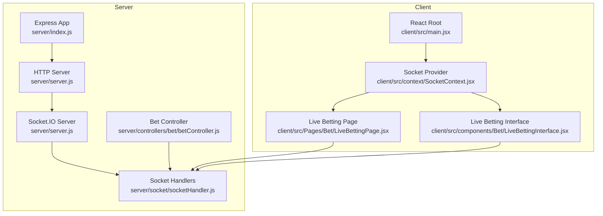
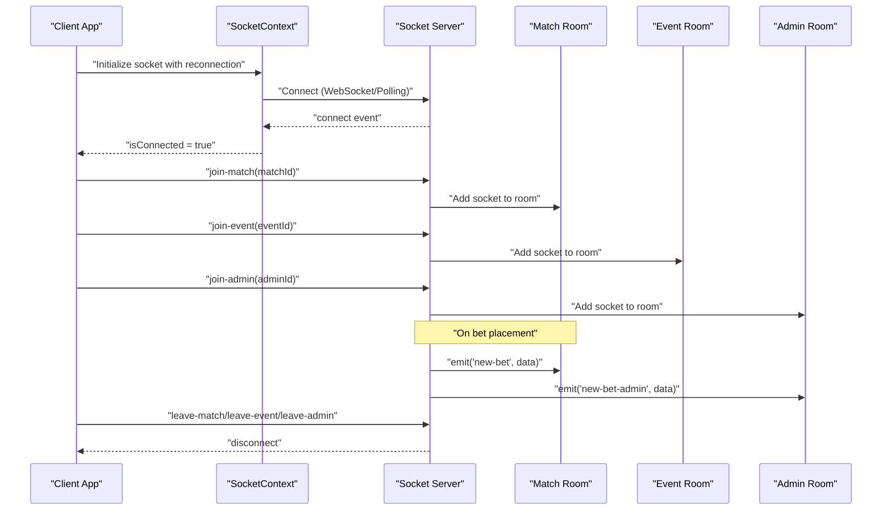
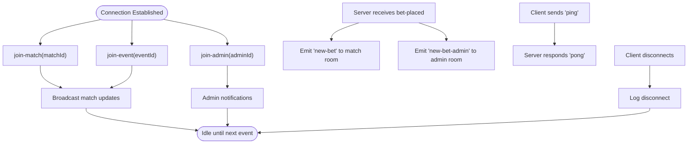
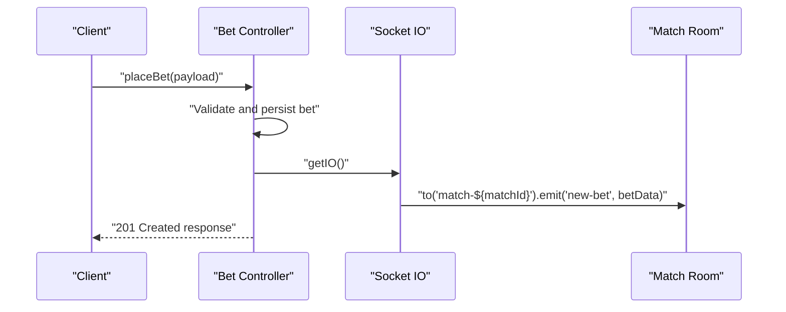
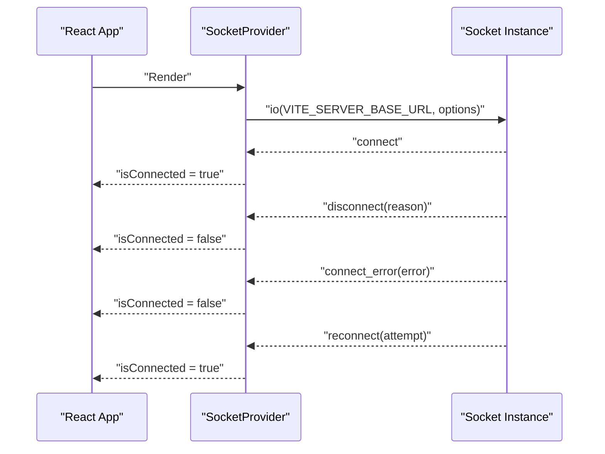
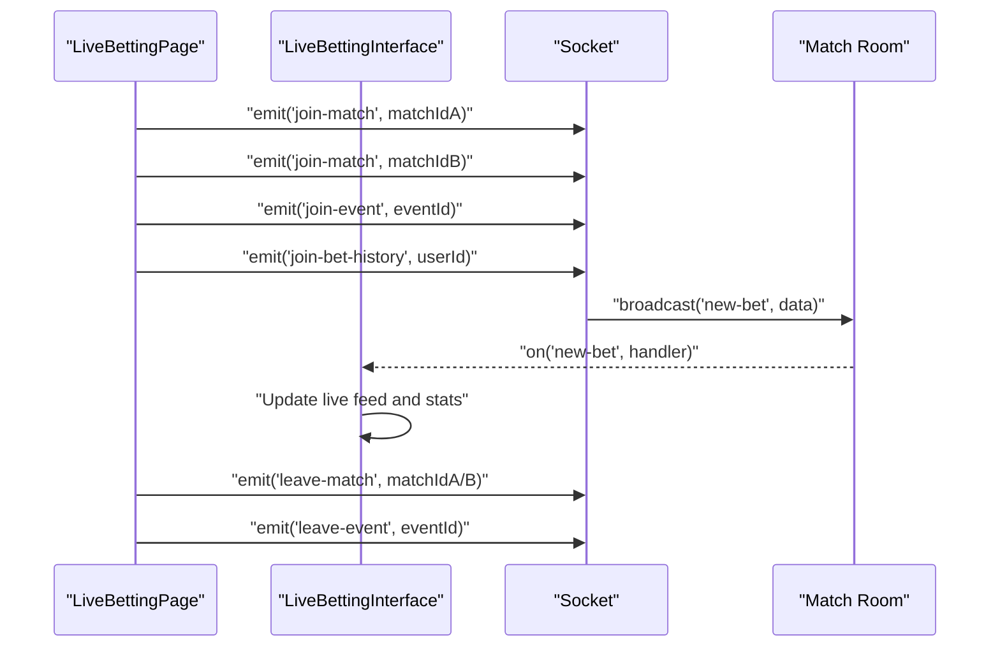
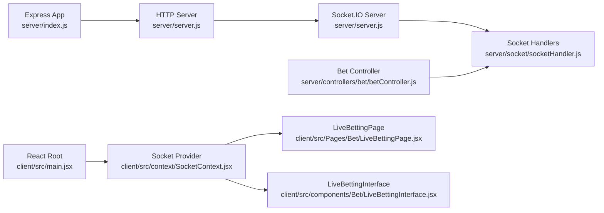

# Socket.IO Implementation

<cite>
**Referenced Files in This Document**
- [server.js](file://server/server.js)
- [socketHandler.js](file://server/socket/socketHandler.js)
- [betController.js](file://server/controllers/bet/betController.js)
- [index.js](file://server/index.js)
- [main.jsx](file://client/src/main.jsx)
- [SocketContext.jsx](file://client/src/context/SocketContext.jsx)
- [LiveBettingPage.jsx](file://client/src/Pages/Bet/LiveBettingPage.jsx)
- [LiveBettingInterface.jsx](file://client/src/components/Bet/LiveBettingInterface.jsx)
- [.env (client)](file://client/.env)
- [.env (server)](file://server/.env)
</cite>

## Table of Contents
1. [Introduction](#introduction)
2. [Project Structure](#project-structure)
3. [Core Components](#core-components)
4. [Architecture Overview](#architecture-overview)
5. [Detailed Component Analysis](#detailed-component-analysis)
6. [Dependency Analysis](#dependency-analysis)
7. [Performance Considerations](#performance-considerations)
8. [Troubleshooting Guide](#troubleshooting-guide)
9. [Conclusion](#conclusion)

## Introduction
This document explains the Socket.IO implementation powering real-time betting updates in the system. It covers server-side socket handler configuration, connection establishment, room-based architecture for match-specific communications, and client-side SocketContext provider setup. It also documents room joining/leaving mechanisms, message broadcasting strategies, connection state management, error handling, reconnection logic, heartbeat mechanisms, and practical examples of socket events such as new-bet, match-update, and custom event handling. Finally, it includes performance optimization techniques for managing multiple concurrent connections and efficient message routing.

## Project Structure
The Socket.IO integration spans both server and client sides:
- Server initializes Socket.IO with transport and heartbeat settings, defines rooms for matches, events, and admins, and emits real-time events.
- Client establishes a persistent connection with automatic reconnection, exposes a provider for socket access, and listens to room-specific events.

**Diagram sources**
- [server.js](file://server/server.js#L1-L92)
- [socketHandler.js](file://server/socket/socketHandler.js#L1-L101)
- [betController.js](file://server/controllers/bet/betController.js#L1-L125)
- [index.js](file://server/index.js#L1-L150)
- [main.jsx](file://client/src/main.jsx#L1-L20)
- [SocketContext.jsx](file://client/src/context/SocketContext.jsx#L1-L62)
- [LiveBettingPage.jsx](file://client/src/Pages/Bet/LiveBettingPage.jsx#L1-L943)
- [LiveBettingInterface.jsx](file://client/src/components/Bet/LiveBettingInterface.jsx#L1-L439)

**Section sources**
- [server.js](file://server/server.js#L1-L92)
- [socketHandler.js](file://server/socket/socketHandler.js#L1-L101)
- [index.js](file://server/index.js#L1-L150)
- [main.jsx](file://client/src/main.jsx#L1-L20)
- [SocketContext.jsx](file://client/src/context/SocketContext.jsx#L1-L62)
- [LiveBettingPage.jsx](file://client/src/Pages/Bet/LiveBettingPage.jsx#L1-L943)
- [LiveBettingInterface.jsx](file://client/src/components/Bet/LiveBettingInterface.jsx#L1-L439)

## Core Components
- Server-side Socket.IO initialization and room management:
  - Initializes Socket.IO with CORS, ping intervals, transports, and buffer sizes.
  - Defines room-based channels for match-specific updates, event-wide updates, and admin notifications.
  - Emits heartbeat responses and handles disconnects and errors.
- Client-side SocketContext provider:
  - Creates a persistent socket connection with automatic reconnection and polling fallback.
  - Tracks connection state and exposes socket and isConnected to components.
- Room-based communication:
  - Clients join match rooms and event rooms upon navigation.
  - Server broadcasts match-specific and global updates to respective rooms.

**Section sources**
- [server.js](file://server/server.js#L25-L40)
- [socketHandler.js](file://server/socket/socketHandler.js#L3-L91)
- [SocketContext.jsx](file://client/src/context/SocketContext.jsx#L14-L61)
- [LiveBettingPage.jsx](file://client/src/Pages/Bet/LiveBettingPage.jsx#L208-L408)

## Architecture Overview
The system uses a room-based publish-subscribe model:
- Clients join match and event rooms and listen for updates.
- Server emits match-specific events to the appropriate rooms.
- Admin room receives administrative notifications.

**Diagram sources**
- [server.js](file://server/server.js#L25-L40)
- [socketHandler.js](file://server/socket/socketHandler.js#L6-L87)
- [LiveBettingPage.jsx](file://client/src/Pages/Bet/LiveBettingPage.jsx#L211-L224)
- [LiveBettingInterface.jsx](file://client/src/components/Bet/LiveBettingInterface.jsx#L110-L169)

## Detailed Component Analysis

### Server-Side Socket Handler
- Initialization and connection lifecycle:
  - Stores the Socket.IO instance and logs connection/disconnect events.
  - Provides heartbeat via ping/pong messages.
- Room management:
  - join-match: Joins a room keyed by matchId.
  - leave-match: Leaves a room keyed by matchId.
  - join-event: Joins a room keyed by eventId and confirms with joined-event.
  - leave-event: Leaves an event room.
  - join-admin: Joins admin room and emits joined-admin.
  - leave-admin: Leaves admin room.
- Broadcasting:
  - bet-placed: Broadcasts new-bet to match room and new-bet-admin to admin room.
- Error handling:
  - Logs socket errors and disconnect reasons.

**Diagram sources**
- [socketHandler.js](file://server/socket/socketHandler.js#L6-L87)

**Section sources**
- [socketHandler.js](file://server/socket/socketHandler.js#L1-L101)

### Server-Side Bet Controller Integration
- On successful bet placement, the controller populates user data and emits a single new-bet event to the match-specific room.
- This ensures efficient routing and avoids redundant emissions.

**Diagram sources**
- [betController.js](file://server/controllers/bet/betController.js#L79-L96)

**Section sources**
- [betController.js](file://server/controllers/bet/betController.js#L43-L106)

### Client-Side SocketContext Provider
- Establishes a socket connection with:
  - Automatic reconnection enabled.
  - Up to 5 attempts with exponential backoff up to 5 seconds.
  - Transport fallback to polling.
- Tracks connection state via connect, disconnect, connect_error, and reconnect events.
- Exposes socket and isConnected to child components.

**Diagram sources**
- [SocketContext.jsx](file://client/src/context/SocketContext.jsx#L18-L54)

**Section sources**
- [SocketContext.jsx](file://client/src/context/SocketContext.jsx#L1-L62)
- [.env (client)](file://client/.env#L1-L2)

### Room-Based Communication in Live Betting
- Room joining and leaving:
  - LiveBettingPage joins match rooms for both sections and the event room upon mount.
  - Listens for match-update, event-update, bet-history-update, and bet-close-update.
  - Leaves rooms and removes listeners on unmount.
- Event handling:
  - new-bet: Updates live betting feed and recalculates statistics.
  - match-update: Refreshes match data and triggers notifications.
  - event-update: Handles dynamic creation of new matches and room transitions.
  - bet-history-update: Updates user bet history locally.
  - bet-close-update: Updates user summary of unmatched bets and refunds.

**Diagram sources**
- [LiveBettingPage.jsx](file://client/src/Pages/Bet/LiveBettingPage.jsx#L211-L224)
- [LiveBettingPage.jsx](file://client/src/Pages/Bet/LiveBettingPage.jsx#L387-L408)
- [LiveBettingInterface.jsx](file://client/src/components/Bet/LiveBettingInterface.jsx#L110-L169)

**Section sources**
- [LiveBettingPage.jsx](file://client/src/Pages/Bet/LiveBettingPage.jsx#L208-L408)
- [LiveBettingInterface.jsx](file://client/src/components/Bet/LiveBettingInterface.jsx#L110-L169)

### Heartbeat and Connection State Management
- Server heartbeat:
  - Client sends ping; server responds with pong containing a timestamp.
- Client reconnection:
  - Automatic retries with capped delay; transports include WebSocket and polling.
- Disconnection handling:
  - Client sets isConnected to false and logs disconnect reasons.

**Section sources**
- [socketHandler.js](file://server/socket/socketHandler.js#L74-L77)
- [SocketContext.jsx](file://client/src/context/SocketContext.jsx#L21-L27)
- [SocketContext.jsx](file://client/src/context/SocketContext.jsx#L34-L47)

### Practical Examples of Socket Events
- new-bet:
  - Emitted by server to match room after successful bet placement.
  - Client updates live feed and recalculates totals.
- match-update:
  - Emitted by server for match status changes and settlement.
  - Client refreshes match data and shows notifications.
- event-update:
  - Emitted when new matches are created; client switches rooms dynamically.
- bet-history-update and bet-close-update:
  - Client updates user bet history and refund summaries.

**Section sources**
- [betController.js](file://server/controllers/bet/betController.js#L79-L96)
- [LiveBettingPage.jsx](file://client/src/Pages/Bet/LiveBettingPage.jsx#L286-L395)
- [LiveBettingInterface.jsx](file://client/src/components/Bet/LiveBettingInterface.jsx#L155-L160)

## Dependency Analysis
- Server dependencies:
  - Express app and HTTP server configured with timeouts and CORS.
  - Socket.IO configured with ping/pong intervals, transports, and buffer sizes.
  - Socket handlers manage rooms and event broadcasting.
- Client dependencies:
  - SocketContext wraps the app and provides socket to pages/components.
  - LiveBettingPage and LiveBettingInterface consume socket events and manage rooms.

**Diagram sources**
- [index.js](file://server/index.js#L1-L150)
- [server.js](file://server/server.js#L1-L92)
- [socketHandler.js](file://server/socket/socketHandler.js#L1-L101)
- [betController.js](file://server/controllers/bet/betController.js#L1-L125)
- [main.jsx](file://client/src/main.jsx#L1-L20)
- [SocketContext.jsx](file://client/src/context/SocketContext.jsx#L1-L62)
- [LiveBettingPage.jsx](file://client/src/Pages/Bet/LiveBettingPage.jsx#L1-L943)
- [LiveBettingInterface.jsx](file://client/src/components/Bet/LiveBettingInterface.jsx#L1-L439)

**Section sources**
- [index.js](file://server/index.js#L1-L150)
- [server.js](file://server/server.js#L1-L92)
- [socketHandler.js](file://server/socket/socketHandler.js#L1-L101)
- [betController.js](file://server/controllers/bet/betController.js#L1-L125)
- [main.jsx](file://client/src/main.jsx#L1-L20)
- [SocketContext.jsx](file://client/src/context/SocketContext.jsx#L1-L62)
- [LiveBettingPage.jsx](file://client/src/Pages/Bet/LiveBettingPage.jsx#L1-L943)
- [LiveBettingInterface.jsx](file://client/src/components/Bet/LiveBettingInterface.jsx#L1-L439)

## Performance Considerations
- Efficient room targeting:
  - Emit only to match-specific rooms to minimize broadcast overhead.
- Minimal listeners:
  - Use a single listener per event per component to avoid duplication.
- Debounced or batched updates:
  - Coalesce frequent updates (e.g., live bet feed) to reduce render churn.
- Connection optimization:
  - Enable WebSocket with polling fallback for reliability.
  - Tune ping/pong intervals to detect dead connections quickly without excessive traffic.
- Memory hygiene:
  - Remove listeners on unmount and clear temporary state to prevent leaks.

[No sources needed since this section provides general guidance]

## Troubleshooting Guide
- Connection fails or reconnects repeatedly:
  - Verify VITE_SERVER_BASE_URL and server PORT alignment.
  - Check CORS configuration on both server and client.
- No real-time updates:
  - Confirm clients emit join-match and join-event with correct IDs.
  - Ensure server emits to the intended rooms.
- Duplicate or stale events:
  - Implement deduplication using a Set of processed IDs in components.
  - Validate event payload integrity and matchId matching.
- Admin notifications not received:
  - Verify join-admin emission and room membership.

**Section sources**
- [SocketContext.jsx](file://client/src/context/SocketContext.jsx#L18-L54)
- [LiveBettingPage.jsx](file://client/src/Pages/Bet/LiveBettingPage.jsx#L211-L224)
- [LiveBettingPage.jsx](file://client/src/Pages/Bet/LiveBettingPage.jsx#L387-L408)
- [LiveBettingInterface.jsx](file://client/src/components/Bet/LiveBettingInterface.jsx#L110-L169)
- [.env (client)](file://client/.env#L1-L2)
- [.env (server)](file://server/.env#L1-L4)

## Conclusion
The Socket.IO implementation leverages a room-based architecture to deliver scalable, real-time betting updates. The server efficiently targets match rooms and admin channels, while the client maintains robust connection state and minimal listeners. With proper room management, heartbeat handling, and reconnection logic, the system supports smooth live betting experiences across multiple concurrent connections.