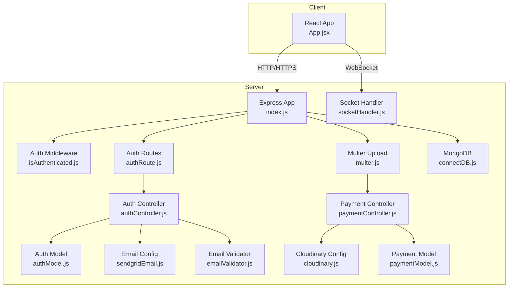
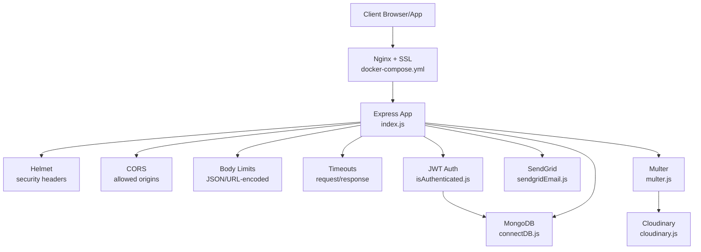
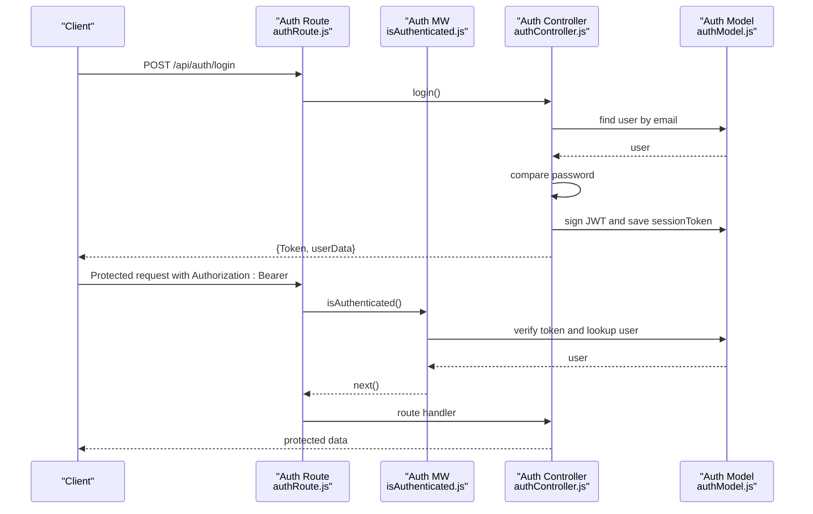
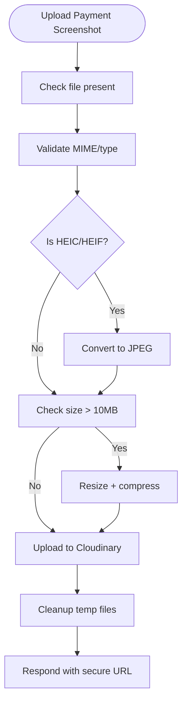
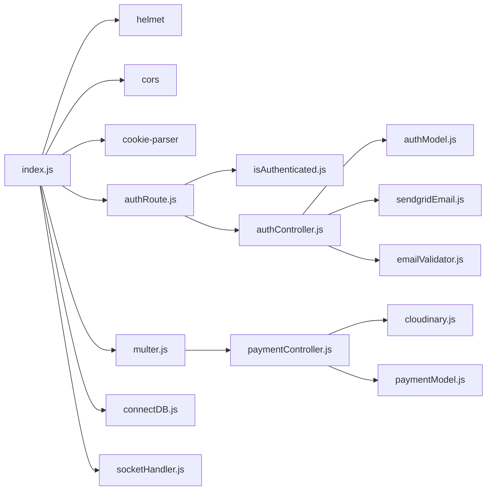

# Security Considerations

<cite>
**Referenced Files in This Document**
- [index.js](file://server/index.js)
- [isAuthenticated.js](file://server/middleware/isAuthenticated.js)
- [authRoute.js](file://server/routes/auth/authRoute.js)
- [authController.js](file://server/controllers/auth/authController.js)
- [authModel.js](file://server/models/authModel.js)
- [emailValidator.js](file://server/config/emailValidator.js)
- [sendgridEmail.js](file://server/config/sendgridEmail.js)
- [cloudinary.js](file://server/config/cloudinary.js)
- [multer.js](file://server/middleware/multer.js)
- [paymentController.js](file://server/controllers/payment/paymentController.js)
- [paymentModel.js](file://server/models/paymentModel.js)
- [connectDB.js](file://server/config/connectDB.js)
- [socketHandler.js](file://server/socket/socketHandler.js)
- [docker-compose.yml](file://docker-compose.yml)
- [App.jsx](file://client/src/App.jsx)
</cite>

## Table of Contents
1. [Introduction](#introduction)
2. [Project Structure](#project-structure)
3. [Core Components](#core-components)
4. [Architecture Overview](#architecture-overview)
5. [Detailed Component Analysis](#detailed-component-analysis)
6. [Dependency Analysis](#dependency-analysis)
7. [Performance Considerations](#performance-considerations)
8. [Troubleshooting Guide](#troubleshooting-guide)
9. [Conclusion](#conclusion)
10. [Appendices](#appendices)

## Introduction
This document provides comprehensive security documentation for the betting platform. It focuses on authentication and session security, input validation and sanitization, rate limiting and DDoS mitigation, XSS and CSRF protections, secure headers, payment security, email security, file upload security, database security, encryption at rest, data privacy, and security audit procedures. The goal is to help operators and developers understand current protections, identify gaps, and implement best practices aligned with industry standards.

## Project Structure
The platform consists of:
- A Node.js/Express backend with MongoDB via Mongoose
- A React client with Redux for state
- Socket.IO for real-time updates
- External integrations for email (SendGrid) and image storage (Cloudinary)
- Docker Compose for deployment with Nginx and SSL

**Diagram sources**
- [index.js](file://server/index.js#L1-L150)
- [isAuthenticated.js](file://server/middleware/isAuthenticated.js#L1-L62)
- [authRoute.js](file://server/routes/auth/authRoute.js#L1-L34)
- [authController.js](file://server/controllers/auth/authController.js#L1-L457)
- [authModel.js](file://server/models/authModel.js#L1-L40)
- [sendgridEmail.js](file://server/config/sendgridEmail.js#L1-L58)
- [emailValidator.js](file://server/config/emailValidator.js#L1-L127)
- [cloudinary.js](file://server/config/cloudinary.js#L1-L10)
- [multer.js](file://server/middleware/multer.js#L1-L88)
- [paymentController.js](file://server/controllers/payment/paymentController.js#L1-L868)
- [paymentModel.js](file://server/models/paymentModel.js#L1-L160)
- [connectDB.js](file://server/config/connectDB.js#L1-L17)
- [socketHandler.js](file://server/socket/socketHandler.js#L1-L101)

**Section sources**
- [index.js](file://server/index.js#L1-L150)
- [docker-compose.yml](file://docker-compose.yml#L1-L50)

## Core Components
- Authentication and session management with JWT and token invalidation
- Email delivery via SendGrid with bounce/error handling
- Image upload pipeline with validation, conversion, compression, and Cloudinary
- Payment lifecycle with transaction records and admin approvals
- Real-time notifications via Socket.IO
- Database connectivity and indexing

**Section sources**
- [isAuthenticated.js](file://server/middleware/isAuthenticated.js#L1-L62)
- [authController.js](file://server/controllers/auth/authController.js#L1-L457)
- [sendgridEmail.js](file://server/config/sendgridEmail.js#L1-L58)
- [emailValidator.js](file://server/config/emailValidator.js#L1-L127)
- [multer.js](file://server/middleware/multer.js#L1-L88)
- [cloudinary.js](file://server/config/cloudinary.js#L1-L10)
- [paymentController.js](file://server/controllers/payment/paymentController.js#L1-L868)
- [paymentModel.js](file://server/models/paymentModel.js#L1-L160)
- [socketHandler.js](file://server/socket/socketHandler.js#L1-L101)
- [connectDB.js](file://server/config/connectDB.js#L1-L17)

## Architecture Overview
High-level security architecture highlights:
- Transport security via HTTPS termination at the edge (Nginx/SSL)
- Application-layer protections: Helmet, CORS, body limits, timeouts
- Authentication via JWT with server-side token invalidation
- Email and file upload security through validated integrations
- Payment data integrity with database constraints and transactions

**Diagram sources**
- [index.js](file://server/index.js#L27-L65)
- [docker-compose.yml](file://docker-compose.yml#L36-L46)
- [isAuthenticated.js](file://server/middleware/isAuthenticated.js#L1-L62)
- [connectDB.js](file://server/config/connectDB.js#L1-L17)
- [sendgridEmail.js](file://server/config/sendgridEmail.js#L1-L58)
- [cloudinary.js](file://server/config/cloudinary.js#L1-L10)
- [multer.js](file://server/middleware/multer.js#L1-L88)

## Detailed Component Analysis

### Authentication and Session Security
- JWT-based authentication with secret key stored in environment variables
- Token verification and expiration handling
- Session token invalidation on logout and forced logout
- Role-based authorization middleware
- Frontend stores JWT in local storage; consider moving to HttpOnly cookies for stronger CSRF/XSS protection

**Diagram sources**
- [authRoute.js](file://server/routes/auth/authRoute.js#L18-L31)
- [isAuthenticated.js](file://server/middleware/isAuthenticated.js#L3-L49)
- [authController.js](file://server/controllers/auth/authController.js#L195-L250)
- [authModel.js](file://server/models/authModel.js#L21-L21)

Key observations and recommendations:
- Token invalidation: logout and forced logout clear the stored sessionToken; middleware checks against the stored token to detect forced logout.
- Role-based access: authorize middleware restricts routes by role.
- Cookie handling: JWT is currently stored in browser local storage. For CSRF/XSS hardening, store the JWT in an HttpOnly, SameSite cookie and expose a dedicated endpoint to refresh tokens.

**Section sources**
- [isAuthenticated.js](file://server/middleware/isAuthenticated.js#L1-L62)
- [authController.js](file://server/controllers/auth/authController.js#L252-L337)
- [authModel.js](file://server/models/authModel.js#L21-L21)
- [authRoute.js](file://server/routes/auth/authRoute.js#L30-L31)
- [App.jsx](file://client/src/App.jsx#L30-L31)

### Input Validation, Sanitization, and SQL Injection Prevention
- Email validation uses a multi-layer approach: validator library, DNS MX record check, and ZeroBounce API
- Phone number validation uses a strict regex pattern
- File upload filtering allows only image MIME types and safe extensions
- Payment creation validates required fields and enforces minimum amounts
- MongoDB ODM (Mongoose) prevents NoSQL injection by construction; schema-level required fields and enums reduce risk

Recommendations:
- Apply input sanitization libraries (e.g., DOMPurify for HTML, sanitize-html) for any user-generated content rendered in the UI
- Enforce strict Content-Type checks and size limits for all uploads
- Normalize and truncate inputs at the boundaries (Express middleware) before reaching controllers

**Section sources**
- [emailValidator.js](file://server/config/emailValidator.js#L10-L127)
- [authController.js](file://server/controllers/auth/authController.js#L22-L25)
- [multer.js](file://server/middleware/multer.js#L31-L49)
- [paymentController.js](file://server/controllers/payment/paymentController.js#L341-L396)
- [paymentModel.js](file://server/models/paymentModel.js#L24-L28)

### Rate Limiting and DDoS Mitigation
- The server sets generous request/response timeouts and increases body size limits
- Helmet is enabled for standard security headers
- No explicit rate limiter middleware is configured in the server entrypoint

Recommendations:
- Introduce express-rate-limit for per-IP rate limiting on sensitive endpoints (login, OTP resend, password reset)
- Use Redis-backed rate limiting for horizontal scaling
- Consider WAF/DDoS protection at the edge (Nginx or cloud provider) for SYN flood and layer 7 attacks

**Section sources**
- [index.js](file://server/index.js#L27-L65)

### XSS Protection and CSRF Prevention
- Helmet is enabled; configure CSP appropriately for your asset domains
- CSRF protection is not implemented; consider adding CSRF tokens for state-changing forms and SameSite cookies for stateless APIs

Recommendations:
- Add Helmet CSP directives to restrict script sources
- For form-based flows, implement CSRF tokens and validate them server-side
- Move JWT to HttpOnly cookies with SameSite=Lax/Strict and Secure flag

**Section sources**
- [index.js](file://server/index.js#L27-L31)

### Secure Header Configuration
- Helmet is imported and applied; cross-origin resource policy is set
- Consider tightening CSP, X-Frame-Options, X-Content-Type-Options, Referrer-Policy, and HSTS

Recommendations:
- Define a strict CSP for scripts/styles/fonts
- Enable HSTS in production behind TLS termination
- Set X-Content-Type-Options and Referrer-Policy as appropriate

**Section sources**
- [index.js](file://server/index.js#L27-L31)

### Payment Security
- Payment requests are validated for required fields and minimum amounts
- Transactions are persisted with schema constraints and enums
- Admin actions use MongoDB transactions to maintain consistency
- Screenshot uploads are validated, optionally converted from HEIC, compressed, and uploaded to Cloudinary

Recommendations:
- Encrypt sensitive fields at rest (e.g., bank account numbers) using a KMS-backed encryption library
- Implement fraud detection hooks (IP geolocation, velocity checks, device fingerprinting)
- Add audit logs for admin actions (approve/reject) with timestamps and admin IDs
- Enforce two-factor authentication for admin operations

**Diagram sources**
- [paymentController.js](file://server/controllers/payment/paymentController.js#L11-L200)
- [cloudinary.js](file://server/config/cloudinary.js#L1-L10)
- [multer.js](file://server/middleware/multer.js#L31-L58)

**Section sources**
- [paymentController.js](file://server/controllers/payment/paymentController.js#L341-L464)
- [paymentModel.js](file://server/models/paymentModel.js#L1-L160)

### Email Security with SendGrid Integration
- SendGrid SDK is initialized with API key
- Email templates are generated; plain-text fallback is derived from HTML
- Error handling distinguishes bounce-related errors and returns structured error objects
- Email validation integrates ZeroBounce and DNS MX checks before sending

Recommendations:
- Verify sender domain and SPF/DKIM alignment in SendGrid
- Implement link shortening and tracking with privacy controls
- Add retry/backoff for transient SendGrid errors

**Section sources**
- [sendgridEmail.js](file://server/config/sendgridEmail.js#L1-L58)
- [emailValidator.js](file://server/config/emailValidator.js#L1-L127)
- [authController.js](file://server/controllers/auth/authController.js#L107-L119)

### File Upload Security with Cloudinary
- Multer filters by allowed MIME types and extensions
- Unique filenames are generated; upload directory is created with proper permissions
- HEIC/HEIF conversion to JPEG is handled; large files are resized and compressed
- Cloudinary upload uses optimized transformations and chunked uploads for large files

Recommendations:
- Scan uploaded images for malicious content (e.g., exiftool-based checks)
- Store Cloudinary URLs securely; avoid exposing raw Cloudinary identifiers
- Implement quotas and retention policies for uploaded screenshots

**Section sources**
- [multer.js](file://server/middleware/multer.js#L1-L88)
- [paymentController.js](file://server/controllers/payment/paymentController.js#L11-L200)
- [cloudinary.js](file://server/config/cloudinary.js#L1-L10)

### Database Security, Encryption at Rest, and Privacy
- MongoDB connection uses pool sizing and timeouts
- Auth and Payment models define required fields, enums, and indexes
- Consider encrypting sensitive fields (bank account numbers) at rest using MongoDB encryption or application-level encryption

Recommendations:
- Enable Transparent Data Encryption (TDE) at the database level
- Use field-level encryption for PII and financial data
- Regularly review and prune old data per privacy regulations

**Section sources**
- [connectDB.js](file://server/config/connectDB.js#L1-L17)
- [authModel.js](file://server/models/authModel.js#L1-L40)
- [paymentModel.js](file://server/models/paymentModel.js#L1-L160)

### Real-Time Security Considerations
- Socket.IO rooms are used for match and admin updates
- No authentication is enforced at the socket layer; consider verifying JWT before allowing join events

Recommendations:
- Authenticate socket connections and restrict room access by user/admin roles
- Monitor and throttle socket events to prevent abuse

**Section sources**
- [socketHandler.js](file://server/socket/socketHandler.js#L1-L101)

### Transport Security and Deployment
- Nginx terminates TLS and forwards to backend
- Health checks are configured for containers

Recommendations:
- Enforce TLS 1.2+/1.3, modern cipher suites, and OCSP stapling
- Restrict allowed origins in CORS and enable credentials carefully
- Rotate secrets regularly and use secrets management

**Section sources**
- [docker-compose.yml](file://docker-compose.yml#L36-L46)

## Dependency Analysis

**Diagram sources**
- [index.js](file://server/index.js#L1-L150)
- [authRoute.js](file://server/routes/auth/authRoute.js#L1-L34)
- [isAuthenticated.js](file://server/middleware/isAuthenticated.js#L1-L62)
- [authController.js](file://server/controllers/auth/authController.js#L1-L457)
- [authModel.js](file://server/models/authModel.js#L1-L40)
- [sendgridEmail.js](file://server/config/sendgridEmail.js#L1-L58)
- [emailValidator.js](file://server/config/emailValidator.js#L1-L127)
- [multer.js](file://server/middleware/multer.js#L1-L88)
- [paymentController.js](file://server/controllers/payment/paymentController.js#L1-L868)
- [cloudinary.js](file://server/config/cloudinary.js#L1-L10)
- [paymentModel.js](file://server/models/paymentModel.js#L1-L160)
- [connectDB.js](file://server/config/connectDB.js#L1-L17)
- [socketHandler.js](file://server/socket/socketHandler.js#L1-L101)

**Section sources**
- [index.js](file://server/index.js#L1-L150)

## Performance Considerations
- Large file handling: HEIC conversion and server-side compression reduce payload sizes
- Chunked uploads support very large files
- Body size limits increased to accommodate large payloads

Recommendations:
- Offload heavy image processing to CDN or external workers
- Implement caching for static resources and non-sensitive data
- Use connection pooling and monitor DB performance

**Section sources**
- [paymentController.js](file://server/controllers/payment/paymentController.js#L52-L107)
- [multer.js](file://server/middleware/multer.js#L54-L57)

## Troubleshooting Guide
Common issues and resolutions:
- Authentication failures: expired tokens, invalid tokens, user not found, session invalidated
- Email send failures: SendGrid bounce/invalid address errors surfaced with structured messages
- Upload failures: file too large, conversion/compression errors, cleanup on failure
- CORS violations: blocked by CORS policy; verify allowed origins and credentials
- Payment approval/rejection errors: transaction conflicts, insufficient balance, wrong statuses

**Section sources**
- [isAuthenticated.js](file://server/middleware/isAuthenticated.js#L12-L48)
- [sendgridEmail.js](file://server/config/sendgridEmail.js#L31-L57)
- [paymentController.js](file://server/controllers/payment/paymentController.js#L163-L199)
- [index.js](file://server/index.js#L114-L139)

## Conclusion
The platform implements several strong security foundations: JWT-based authentication with token invalidation, email validation and secure delivery, robust file upload pipeline with conversion and compression, and payment lifecycle with admin approvals. Areas for improvement include CSRF/XSS hardening (HttpOnly cookies, CSP), explicit rate limiting, stricter transport security, encryption at rest for sensitive data, and comprehensive audit/logging for admin actions.

## Appendices

### Security Audit Procedures
- Penetration testing: schedule quarterly assessments targeting authentication, uploads, and admin panels
- Dependency scanning: audit npm packages for vulnerabilities and update regularly
- Secrets rotation: rotate JWT secret, SendGrid API key, Cloudinary credentials, and database credentials periodically
- Access reviews: audit admin privileges and session invalidation logs

### Vulnerability Assessment Guidelines
- Use automated scanners (OWASP ZAP, SAST tools) for common issues (XSS, CSRF, insecure headers)
- Manual testing for authentication flows, session management, and privilege escalation
- Validate CORS and content-type enforcement for uploads
- Review error messages to avoid information disclosure