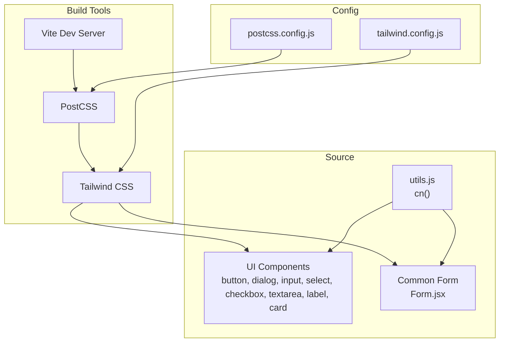
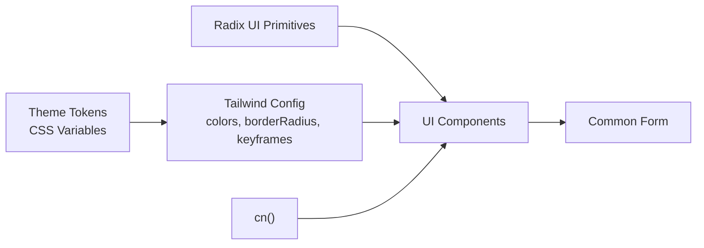
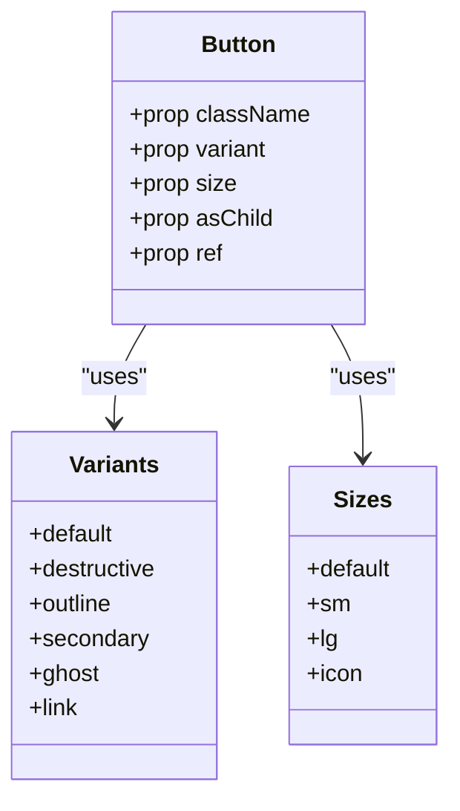
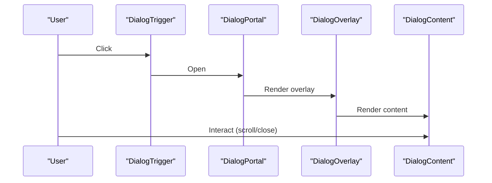
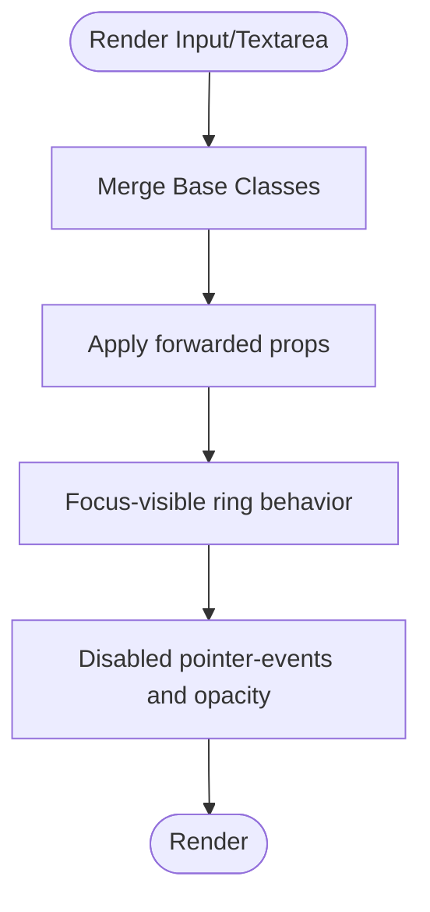
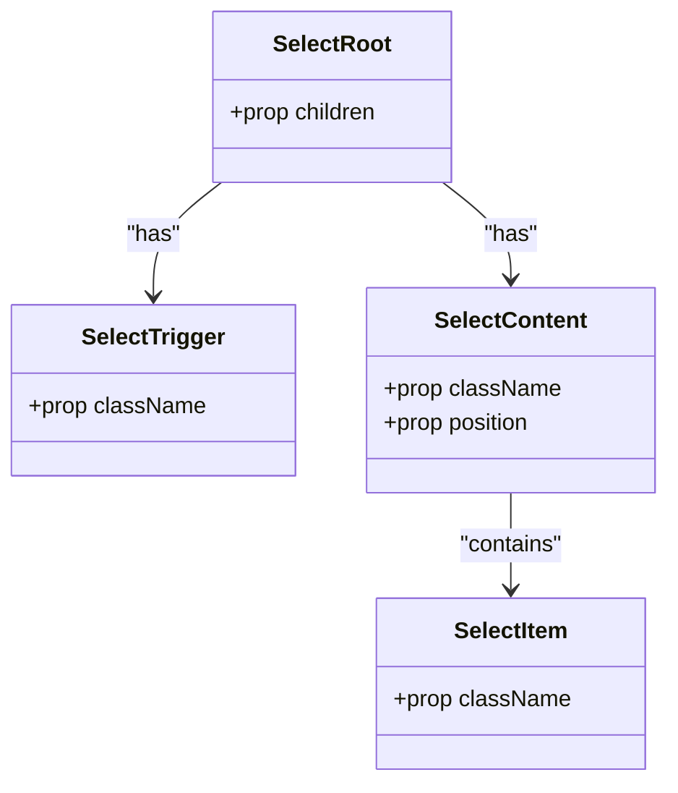
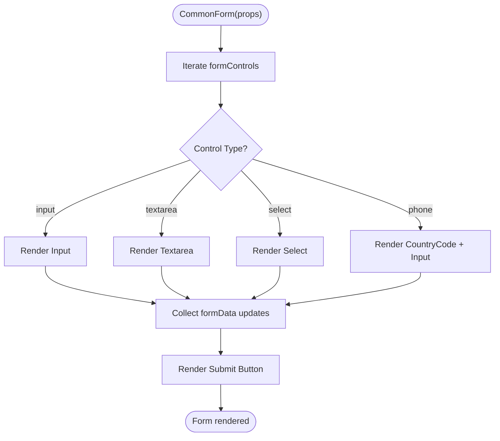
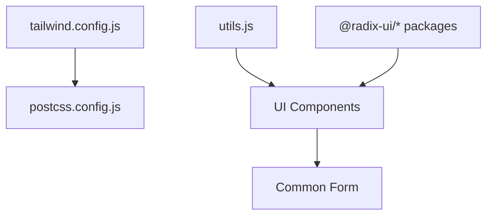

# Styling and UI Components

<cite>
**Referenced Files in This Document**
- [tailwind.config.js](file://client/tailwind.config.js)
- [postcss.config.js](file://client/postcss.config.js)
- [utils.js](file://client/src/lib/utils.js)
- [package.json](file://client/package.json)
- [button.jsx](file://client/src/components/ui/button.jsx)
- [dialog.jsx](file://client/src/components/ui/dialog.jsx)
- [input.jsx](file://client/src/components/ui/input.jsx)
- [textarea.jsx](file://client/src/components/ui/textarea.jsx)
- [label.jsx](file://client/src/components/ui/label.jsx)
- [select.jsx](file://client/src/components/ui/select.jsx)
- [checkbox.jsx](file://client/src/components/ui/checkbox.jsx)
- [card.jsx](file://client/src/components/ui/card.jsx)
- [Form.jsx](file://client/src/components/common/Form.jsx)
</cite>

## Table of Contents
1. [Introduction](#introduction)
2. [Project Structure](#project-structure)
3. [Core Components](#core-components)
4. [Architecture Overview](#architecture-overview)
5. [Detailed Component Analysis](#detailed-component-analysis)
6. [Dependency Analysis](#dependency-analysis)
7. [Performance Considerations](#performance-considerations)
8. [Troubleshooting Guide](#troubleshooting-guide)
9. [Conclusion](#conclusion)
10. [Appendices](#appendices)

## Introduction
This document explains the styling and UI component system used in the client application. It covers the Tailwind CSS configuration, the design system built on CSS custom properties and Radix UI primitives, the reusable component library (buttons, dialogs, inputs, forms), and the patterns for composition, variants, and customization. It also documents responsive design approaches, theme configuration, color and typography systems, accessibility features, testing strategies, and performance optimizations including dark mode support.

## Project Structure
The styling pipeline is powered by Tailwind CSS and PostCSS, with a small utility for merging class names and a design system based on CSS variables. UI components are implemented as wrappers around Radix UI primitives to ensure accessibility and consistent behavior.

**Diagram sources**
- [tailwind.config.js](file://client/tailwind.config.js#L1-L85)
- [postcss.config.js](file://client/postcss.config.js#L1-L7)
- [utils.js](file://client/src/lib/utils.js#L1-L7)
- [button.jsx](file://client/src/components/ui/button.jsx#L1-L48)
- [dialog.jsx](file://client/src/components/ui/dialog.jsx#L1-L95)
- [input.jsx](file://client/src/components/ui/input.jsx#L1-L20)
- [textarea.jsx](file://client/src/components/ui/textarea.jsx#L1-L19)
- [label.jsx](file://client/src/components/ui/label.jsx#L1-L17)
- [select.jsx](file://client/src/components/ui/select.jsx#L1-L121)
- [checkbox.jsx](file://client/src/components/ui/checkbox.jsx#L1-L23)
- [card.jsx](file://client/src/components/ui/card.jsx#L1-L51)
- [Form.jsx](file://client/src/components/common/Form.jsx#L1-L170)

**Section sources**
- [tailwind.config.js](file://client/tailwind.config.js#L1-L85)
- [postcss.config.js](file://client/postcss.config.js#L1-L7)
- [utils.js](file://client/src/lib/utils.js#L1-L7)
- [package.json](file://client/package.json#L1-L70)

## Core Components
This section documents the core UI components and their props, variants, and customization options.

- Button
  - Purpose: Base interactive element with multiple variants and sizes.
  - Props:
    - className: Additional classes.
    - variant: Variant selection (default, destructive, outline, secondary, ghost, link).
    - size: Size selection (default, sm, lg, icon).
    - asChild: Render as a radix slot to compose with other elements.
    - ...rest: Forwarded to the underlying element or slot.
  - Variants and defaults:
    - Defaults defined via component-level configuration.
  - Accessibility:
    - Inherits focus-visible styles and maintains pointer event behavior.
  - Customization:
    - Extendable via the variant system and className overrides.

- Dialog
  - Purpose: Modal overlay with content area, header, footer, title, and description.
  - Props:
    - Root, Trigger, Portal, Close, Overlay, Content, Header, Footer, Title, Description.
    - Content accepts className and children.
  - Accessibility:
    - Uses Radix UI primitives for focus trapping and ARIA roles.
  - Animations:
    - Fade, zoom, and slide transitions driven by data-state attributes.

- Input
  - Purpose: Text input field with consistent focus and disabled states.
  - Props:
    - type: HTML input type.
    - className: Additional classes.
    - ...rest: Forwarded to the native input.

- Textarea
  - Purpose: Multi-line text input with consistent focus and disabled states.
  - Props:
    - className: Additional classes.
    - ...rest: Forwarded to the native textarea.

- Label
  - Purpose: Associated label for form controls.
  - Props:
    - className: Additional classes.
    - ...rest: Forwarded to the primitive label.

- Select
  - Purpose: Dropdown selection with trigger, content, viewport, items, and scroll controls.
  - Props:
    - Root, Group, Value, Trigger, Content, Label, Item, Separator, ScrollUpButton, ScrollDownButton.
    - Trigger and Item accept className and children.
  - Accessibility:
    - Keyboard navigation and focus management via Radix UI.

- Checkbox
  - Purpose: Checkbox primitive with indicator.
  - Props:
    - className: Additional classes.
    - ...rest: Forwarded to the primitive.

- Card
  - Purpose: Container with header, title, description, content, and footer.
  - Props:
    - className: Additional classes.
    - ...rest: Forwarded to the respective container.

- Common Form
  - Purpose: Declarative form renderer supporting input, textarea, select, phone (country code + number), and submit button.
  - Props:
    - formControls: Array of control descriptors (name, label, componentType, placeholder, type, options, countryCodes).
    - formData: Controlled state object.
    - setFormData: Setter for formData.
    - onSubmit: Handler for form submission.
    - buttonText: Label for submit button.
    - isLoading: Disables inputs and submit while true.
  - Behavior:
    - Renders inputs based on componentType.
    - Supports internationalized labels via translation context.
    - Provides a single styled submit button.

**Section sources**
- [button.jsx](file://client/src/components/ui/button.jsx#L1-L48)
- [dialog.jsx](file://client/src/components/ui/dialog.jsx#L1-L95)
- [input.jsx](file://client/src/components/ui/input.jsx#L1-L20)
- [textarea.jsx](file://client/src/components/ui/textarea.jsx#L1-L19)
- [label.jsx](file://client/src/components/ui/label.jsx#L1-L17)
- [select.jsx](file://client/src/components/ui/select.jsx#L1-L121)
- [checkbox.jsx](file://client/src/components/ui/checkbox.jsx#L1-L23)
- [card.jsx](file://client/src/components/ui/card.jsx#L1-L51)
- [Form.jsx](file://client/src/components/common/Form.jsx#L1-L170)

## Architecture Overview
The styling architecture centers on:
- Tailwind CSS for utility-first styling and design tokens.
- CSS custom properties for theme values (e.g., background, foreground, primary, secondary).
- Radix UI primitives for accessible, composable components.
- A small utility function to merge and deduplicate Tailwind classes.

**Diagram sources**
- [tailwind.config.js](file://client/tailwind.config.js#L9-L82)
- [utils.js](file://client/src/lib/utils.js#L4-L6)
- [button.jsx](file://client/src/components/ui/button.jsx#L7-L34)
- [dialog.jsx](file://client/src/components/ui/dialog.jsx#L15-L44)
- [input.jsx](file://client/src/components/ui/input.jsx#L5-L16)
- [select.jsx](file://client/src/components/ui/select.jsx#L13-L71)
- [checkbox.jsx](file://client/src/components/ui/checkbox.jsx#L7-L19)
- [card.jsx](file://client/src/components/ui/card.jsx#L5-L50)
- [Form.jsx](file://client/src/components/common/Form.jsx#L14-L167)

## Detailed Component Analysis

### Button Component
- Composition pattern:
  - Uses class variance authority (CVA) to define variants and sizes.
  - Uses a slot component to optionally render as a child element.
  - Merges base classes with variant classes via a utility function.
- Props interface:
  - className, variant, size, asChild, and forwarded props.
- Accessibility:
  - Focus-visible ring and outline utilities included in base classes.
- Customization:
  - Add new variants/sizes in the CVA definition; override via className.

**Diagram sources**
- [button.jsx](file://client/src/components/ui/button.jsx#L7-L34)

**Section sources**
- [button.jsx](file://client/src/components/ui/button.jsx#L1-L48)

### Dialog Component
- Composition pattern:
  - Exposes root, trigger, portal, overlay, content, header, footer, title, and description.
  - Overlay and content animate based on open/closed state.
- Accessibility:
  - Focus trapping and ARIA roles managed by Radix UI.
- Customization:
  - Adjust animations and layout via className overrides.

**Diagram sources**
- [dialog.jsx](file://client/src/components/ui/dialog.jsx#L7-L44)

**Section sources**
- [dialog.jsx](file://client/src/components/ui/dialog.jsx#L1-L95)

### Input and Textarea Components
- Composition pattern:
  - Forward refs to native inputs.
  - Consistent focus, disabled, and placeholder styling via shared base classes.
- Accessibility:
  - Inherits focus-visible outlines and disabled pointer events.

**Diagram sources**
- [input.jsx](file://client/src/components/ui/input.jsx#L5-L16)
- [textarea.jsx](file://client/src/components/ui/textarea.jsx#L5-L15)

**Section sources**
- [input.jsx](file://client/src/components/ui/input.jsx#L1-L20)
- [textarea.jsx](file://client/src/components/ui/textarea.jsx#L1-L19)

### Select Component
- Composition pattern:
  - Root, Trigger, Content, Viewport, Items, and scroll controls.
  - Positioning logic adapts to side and popper behavior.
- Accessibility:
  - Keyboard navigation and focus management via Radix UI.
- Customization:
  - Override trigger/content classes; adjust item styles.

**Diagram sources**
- [select.jsx](file://client/src/components/ui/select.jsx#L7-L72)

**Section sources**
- [select.jsx](file://client/src/components/ui/select.jsx#L1-L121)

### Checkbox Component
- Composition pattern:
  - Primitive with indicator and checked state styling.
- Accessibility:
  - Inherits focus-visible styles and maintains pointer events.

**Section sources**
- [checkbox.jsx](file://client/src/components/ui/checkbox.jsx#L1-L23)

### Card Component
- Composition pattern:
  - Container with header, title, description, content, and footer.
- Accessibility:
  - No special ARIA attributes; relies on semantic HTML.

**Section sources**
- [card.jsx](file://client/src/components/ui/card.jsx#L1-L51)

### Common Form Component
- Composition pattern:
  - Declarative rendering of inputs based on control descriptors.
  - Supports input, textarea, select, and phone (country code + number).
  - Single submit button with loading state.
- Internationalization:
  - Uses translation context to display labels conditionally.

**Diagram sources**
- [Form.jsx](file://client/src/components/common/Form.jsx#L27-L145)

**Section sources**
- [Form.jsx](file://client/src/components/common/Form.jsx#L1-L170)

## Dependency Analysis
- Tailwind CSS and PostCSS:
  - Tailwind is configured to scan HTML and JS/TSX sources and to enable dark mode via class strategy.
  - PostCSS applies Tailwind and Autoprefixer during build.
- Utility function:
  - cn() merges and deduplicates Tailwind classes using clsx and tailwind-merge.
- Component dependencies:
  - UI components depend on Radix UI primitives for accessibility and behavior.
  - Common Form composes UI components and integrates with translation.

**Diagram sources**
- [tailwind.config.js](file://client/tailwind.config.js#L1-L85)
- [postcss.config.js](file://client/postcss.config.js#L1-L7)
- [utils.js](file://client/src/lib/utils.js#L1-L7)
- [button.jsx](file://client/src/components/ui/button.jsx#L1-L48)
- [dialog.jsx](file://client/src/components/ui/dialog.jsx#L1-L95)
- [input.jsx](file://client/src/components/ui/input.jsx#L1-L20)
- [textarea.jsx](file://client/src/components/ui/textarea.jsx#L1-L19)
- [label.jsx](file://client/src/components/ui/label.jsx#L1-L17)
- [select.jsx](file://client/src/components/ui/select.jsx#L1-L121)
- [checkbox.jsx](file://client/src/components/ui/checkbox.jsx#L1-L23)
- [card.jsx](file://client/src/components/ui/card.jsx#L1-L51)
- [Form.jsx](file://client/src/components/common/Form.jsx#L1-L170)
- [package.json](file://client/package.json#L14-L51)

**Section sources**
- [tailwind.config.js](file://client/tailwind.config.js#L1-L85)
- [postcss.config.js](file://client/postcss.config.js#L1-L7)
- [utils.js](file://client/src/lib/utils.js#L1-L7)
- [package.json](file://client/package.json#L14-L51)

## Performance Considerations
- Class merging:
  - Using a dedicated utility reduces redundant classes and improves runtime performance.
- CSS custom properties:
  - Centralized theme tokens reduce duplication and improve maintainability.
- Animations:
  - Lightweight CSS animations via Tailwind and Radix UI minimize JavaScript overhead.
- Bundle size:
  - Keep component-specific styles scoped to avoid unused CSS bloat.

[No sources needed since this section provides general guidance]

## Troubleshooting Guide
- Dark mode not applying:
  - Ensure the dark mode strategy is set to class and that the class is toggled on the root element.
- Focus rings not visible:
  - Verify focus-visible utilities are present in base classes.
- Dialog not closing:
  - Confirm the close trigger is placed inside the content and that portals are rendered.
- Select items not visible:
  - Check viewport sizing and ensure the content portal is rendered.

**Section sources**
- [tailwind.config.js](file://client/tailwind.config.js#L4-L4)
- [dialog.jsx](file://client/src/components/ui/dialog.jsx#L36-L43)
- [select.jsx](file://client/src/components/ui/select.jsx#L63-L67)

## Conclusion
The styling and UI system leverages Tailwind CSS with a design system based on CSS custom properties and Radix UI primitives to deliver accessible, composable components. The common form demonstrates a declarative approach to building forms efficiently. The architecture supports customization, responsive patterns, and performance-conscious practices, including dark mode and animation-friendly implementations.

[No sources needed since this section summarizes without analyzing specific files]

## Appendices

### Theme Configuration and Color Schemes
- Theme tokens:
  - Colors are defined as CSS variables and mapped to Tailwind’s color palette.
  - Includes semantic groups: background, foreground, primary, secondary, muted, accent, destructive, border, input, ring, and chart.
- Dark mode:
  - Enabled via class strategy; toggle the class on the root element to switch modes.
- Typography:
  - Typography scales rely on Tailwind utilities; ensure consistent font weights and sizes across components.

**Section sources**
- [tailwind.config.js](file://client/tailwind.config.js#L16-L56)
- [tailwind.config.js](file://client/tailwind.config.js#L4-L4)

### Responsive Design and Mobile-First Approach
- Utilities:
  - Use responsive prefixes (e.g., sm:, md:, lg:) to adapt layouts across breakpoints.
- Component behavior:
  - Many components include responsive variants (e.g., dialog footer direction, card paddings).
- Guidance:
  - Prefer mobile-first utilities and progressively enhance for larger screens.

**Section sources**
- [dialog.jsx](file://client/src/components/ui/dialog.jsx#L62-L63)
- [card.jsx](file://client/src/components/ui/card.jsx#L13-L47)

### Accessibility Features and ARIA Attributes
- Radix UI primitives:
  - Provide built-in ARIA roles and keyboard navigation.
- Focus management:
  - Components include focus-visible rings and outline utilities.
- Labels:
  - Use associated labels for form controls to improve screen reader support.

**Section sources**
- [label.jsx](file://client/src/components/ui/label.jsx#L11-L13)
- [select.jsx](file://client/src/components/ui/select.jsx#L82-L98)
- [checkbox.jsx](file://client/src/components/ui/checkbox.jsx#L7-L19)

### Component Testing Strategies and Storybook Integration
- Testing approaches:
  - Unit test component rendering with different variants and sizes.
  - Simulate user interactions (open/close, select, submit) and assert DOM state.
  - Verify accessibility attributes and keyboard behavior.
- Storybook:
  - Export component stories with controls for variant, size, and state.
  - Include stories for edge cases (disabled, loading, invalid states).

[No sources needed since this section provides general guidance]

### Styling Workflow, CSS-in-JS Alternatives, and Performance Optimization
- Styling workflow:
  - Define tokens in Tailwind config; use utilities in components; keep overrides minimal.
- CSS-in-JS alternatives:
  - Consider emotion or styled-components if dynamic themes or component-scoped styles are required; evaluate trade-offs against Tailwind’s performance and DX.
- Performance optimization:
  - Minimize inline styles; leverage CSS variables; avoid excessive nesting; use animation-friendly properties.

[No sources needed since this section provides general guidance]