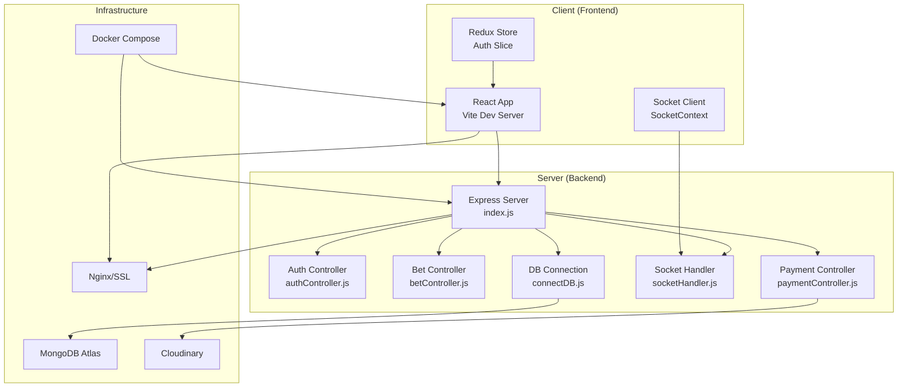
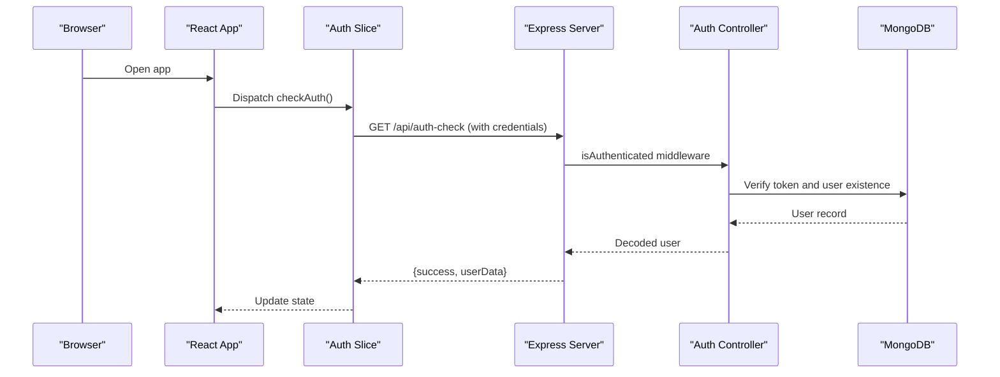
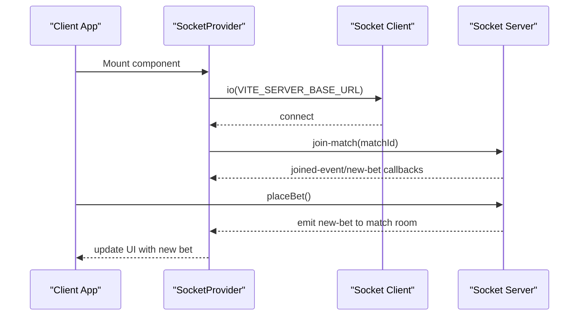

# Troubleshooting and FAQ

<cite>
**Referenced Files in This Document**
- [README.md](file://README.md)
- [docker-compose.yml](file://docker-compose.yml)
- [client/package.json](file://client/package.json)
- [server/package.json](file://server/package.json)
- [client/.env](file://client/.env)
- [server/.env](file://server/.env)
- [server/index.js](file://server/index.js)
- [server/config/connectDB.js](file://server/config/connectDB.js)
- [server/socket/socketHandler.js](file://server/socket/socketHandler.js)
- [client/src/context/SocketContext.jsx](file://client/src/context/SocketContext.jsx)
- [server/controllers/auth/authController.js](file://server/controllers/auth/authController.js)
- [server/controllers/bet/betController.js](file://server/controllers/bet/betController.js)
- [server/controllers/payment/paymentController.js](file://server/controllers/payment/paymentController.js)
- [server/middleware/isAuthenticated.js](file://server/middleware/isAuthenticated.js)
- [client/src/store/auth-slice/index.js](file://client/src/store/auth-slice/index.js)
- [client/src/utils/i18next.js](file://client/src/utils/i18next.js)
</cite>

## Table of Contents
1. [Introduction](#introduction)
2. [Project Structure](#project-structure)
3. [Core Components](#core-components)
4. [Architecture Overview](#architecture-overview)
5. [Installation and Environment Setup](#installation-and-environment-setup)
6. [Runtime Issues](#runtime-issues)
7. [Debugging Strategies](#debugging-strategies)
8. [Performance Troubleshooting](#performance-troubleshooting)
9. [Socket.IO and Real-Time Communication](#socket-io-and-real-time-communication)
10. [Browser Compatibility and Mobile Responsiveness](#browser-compatibility-and-mobile-responsiveness)
11. [Error Log Analysis and Diagnostics](#error-log-analysis-and-diagnostics)
12. [Docker and Deployment](#docker-and-deployment)
13. [Frequently Asked Questions (FAQ)](#frequently-asked-questions-faq)
14. [Conclusion](#conclusion)

## Introduction
This document provides comprehensive troubleshooting and FAQ guidance for the betting platform. It covers installation issues, environment setup, database connectivity, runtime problems (authentication, payments, real-time updates), debugging strategies for frontend and backend, performance tuning, Socket.IO issues, browser/mobile concerns, error log diagnostics, and Docker/deployment pitfalls. The goal is to help both developers and operators quickly diagnose and resolve issues across the stack.

## Project Structure
The platform follows a modern full-stack architecture:
- Frontend: React + Vite, Redux Toolkit for state, Tailwind CSS for styling, Socket.IO client for real-time updates.
- Backend: Node.js + Express with MongoDB via Mongoose, JWT-based authentication, Socket.IO for real-time notifications, Cloudinary for payment screenshots.
- DevOps: Docker Compose orchestrates frontend, backend, and SSL termination.

**Diagram sources**
- [docker-compose.yml](file://docker-compose.yml#L1-L50)
- [client/package.json](file://client/package.json#L1-L70)
- [server/package.json](file://server/package.json#L1-L43)
- [server/index.js](file://server/index.js#L1-L150)
- [server/config/connectDB.js](file://server/config/connectDB.js#L1-L17)
- [server/socket/socketHandler.js](file://server/socket/socketHandler.js#L1-L101)
- [server/controllers/auth/authController.js](file://server/controllers/auth/authController.js#L1-L457)
- [server/controllers/bet/betController.js](file://server/controllers/bet/betController.js#L1-L125)
- [server/controllers/payment/paymentController.js](file://server/controllers/payment/paymentController.js#L1-L868)

**Section sources**
- [docker-compose.yml](file://docker-compose.yml#L1-L50)
- [client/package.json](file://client/package.json#L1-L70)
- [server/package.json](file://server/package.json#L1-L43)

## Core Components
- Authentication and session management with JWT and enforced checks.
- Real-time betting updates via Socket.IO rooms per match/event/admin.
- Payment processing with Cloudinary uploads and transaction lifecycle.
- Health checks and global error handling for robust operations.

**Section sources**
- [server/index.js](file://server/index.js#L1-L150)
- [server/middleware/isAuthenticated.js](file://server/middleware/isAuthenticated.js#L1-L62)
- [server/socket/socketHandler.js](file://server/socket/socketHandler.js#L1-L101)
- [server/controllers/payment/paymentController.js](file://server/controllers/payment/paymentController.js#L1-L868)

## Architecture Overview
High-level API and real-time flows:

**Diagram sources**
- [client/src/store/auth-slice/index.js](file://client/src/store/auth-slice/index.js#L100-L116)
- [server/index.js](file://server/index.js#L94-L100)
- [server/middleware/isAuthenticated.js](file://server/middleware/isAuthenticated.js#L1-L62)
- [server/controllers/auth/authController.js](file://server/controllers/auth/authController.js#L339-L354)

## Installation and Environment Setup
Common installation and environment issues:

- Dependency conflicts
  - Symptoms: npm/yarn install failures, peer dependency warnings, module not found errors.
  - Actions:
    - Ensure Node.js version compatibility as defined by package managers.
    - Clear caches: remove node_modules and reinstall.
    - Align versions across client and server dependencies.
    - Prefer pnpm or Yarn for deterministic installs if available.

- Environment variables missing or incorrect
  - Symptoms: CORS errors, JWT signature mismatches, database connection failures.
  - Actions:
    - Confirm .env values for backend and frontend are present and correct.
    - Validate DB_URI, JWT_SECRET_KEY, CLIENT_BASE_URL, and Cloudinary variables.
    - Ensure environment placeholders are replaced with real values.

- Port conflicts and host binding
  - Symptoms: Cannot start dev servers, ports already in use.
  - Actions:
    - Change VITE_SERVER_BASE_URL and backend PORT if needed.
    - Verify firewall and port availability.

- CORS mismatch
  - Symptoms: Preflight failures, blocked by CORS.
  - Actions:
    - Match CLIENT_BASE_URL with allowed origins in index.js.
    - Ensure credentials are enabled when required.

- Database connection errors
  - Symptoms: MongoDB connection refused, timeouts.
  - Actions:
    - Verify DB_URI and network access.
    - Check server logs for connection errors.
    - Confirm server-side connection timeout settings.

**Section sources**
- [client/.env](file://client/.env#L1-L3)
- [server/.env](file://server/.env#L1-L44)
- [server/index.js](file://server/index.js#L19-L51)
- [server/config/connectDB.js](file://server/config/connectDB.js#L1-L17)

## Runtime Issues
Authentication failures:
- Symptoms: “Invalid Token”, “Session expired”, “User not found”, “Session terminated”.
- Causes: Expired JWT, revoked token, missing Authorization header, mismatched secret.
- Fixes:
  - Regenerate token on expiration.
  - Clear local storage/session and re-authenticate.
  - Verify JWT_SECRET_KEY consistency across environments.

Payment processing errors:
- Symptoms: Upload failures, timeouts, insufficient balance, invalid details.
- Causes: Large/heic files, Cloudinary upload issues, validation errors.
- Fixes:
  - Convert HEIC to JPEG and compress large images server-side.
  - Ensure Cloudinary credentials and quotas are valid.
  - Validate amounts and required fields before submission.

Real-time communication problems:
- Symptoms: No live updates, disconnects, reconnect loops.
- Causes: Incorrect Socket.IO URL, transport issues, rooms not joined.
- Fixes:
  - Confirm VITE_SERVER_BASE_URL matches backend.
  - Enable both websocket and polling transports.
  - Ensure clients join match/user/admin rooms.

**Section sources**
- [server/middleware/isAuthenticated.js](file://server/middleware/isAuthenticated.js#L1-L62)
- [server/controllers/auth/authController.js](file://server/controllers/auth/authController.js#L195-L250)
- [server/controllers/payment/paymentController.js](file://server/controllers/payment/paymentController.js#L11-L200)
- [client/src/context/SocketContext.jsx](file://client/src/context/SocketContext.jsx#L14-L61)
- [server/socket/socketHandler.js](file://server/socket/socketHandler.js#L1-L101)

## Debugging Strategies
Frontend React debugging:
- Use Redux DevTools to inspect auth slice state transitions.
- Inspect network tab for failed API calls and missing cookies.
- Enable React DevTools and check component props/state.
- Verify environment variables are injected at build time.

Backend Node.js debugging:
- Use nodemon for auto-restarts during development.
- Check global error handler logs for uncaught exceptions.
- Enable request logging and track request IDs if added.
- Validate middleware order and ensure CORS/cookies are configured before routes.

Real-time debugging:
- Monitor Socket.IO server logs for connection/disconnection events.
- Verify room joins and emits are happening only for intended rooms.
- Use Socket.IO client debug logs to detect reconnection attempts.

**Section sources**
- [client/src/store/auth-slice/index.js](file://client/src/store/auth-slice/index.js#L1-L342)
- [server/index.js](file://server/index.js#L66-L70)
- [client/src/context/SocketContext.jsx](file://client/src/context/SocketContext.jsx#L18-L54)
- [server/socket/socketHandler.js](file://server/socket/socketHandler.js#L6-L88)

## Performance Troubleshooting
Slow API responses:
- Investigate request timeouts and body parsing limits.
- Optimize database queries with proper indexing and lean population.
- Reduce payload sizes and avoid unnecessary nested populates.

Slow database queries:
- Use aggregation pipelines where appropriate.
- Add indexes on frequent filter fields (e.g., userId, matchId).
- Limit projection and pagination for large collections.

Large file uploads:
- Compress images server-side and convert HEIC to JPEG.
- Use chunked uploads for very large files.
- Ensure Cloudinary upload timeouts and chunk sizes are tuned.

**Section sources**
- [server/index.js](file://server/index.js#L55-L65)
- [server/controllers/payment/paymentController.js](file://server/controllers/payment/paymentController.js#L52-L107)
- [server/controllers/bet/betController.js](file://server/controllers/bet/betController.js#L22-L32)

## Socket.IO and Real-Time Communication
Connection lifecycle and best practices:
- Client connects automatically with reconnection settings.
- Join match/user/admin rooms upon login or navigation.
- Emit only to intended rooms to reduce overhead.
- Handle ping/pong for heartbeat monitoring.

Common issues and fixes:
- Connection refused: verify VITE_SERVER_BASE_URL and backend health.
- No updates: ensure room joins and emits occur after connection.
- Frequent reconnects: adjust retry delays and enable polling fallback.

**Diagram sources**
- [client/src/context/SocketContext.jsx](file://client/src/context/SocketContext.jsx#L18-L54)
- [server/socket/socketHandler.js](file://server/socket/socketHandler.js#L9-L72)
- [server/controllers/bet/betController.js](file://server/controllers/bet/betController.js#L79-L96)

**Section sources**
- [client/src/context/SocketContext.jsx](file://client/src/context/SocketContext.jsx#L1-L62)
- [server/socket/socketHandler.js](file://server/socket/socketHandler.js#L1-L101)
- [server/controllers/bet/betController.js](file://server/controllers/bet/betController.js#L43-L106)

## Browser Compatibility and Mobile Responsiveness
- Ensure polyfills for older browsers if needed.
- Test on multiple devices and orientations.
- Validate Tailwind breakpoints and responsive utilities.
- Confirm HTTPS and mixed-content policies for production.

[No sources needed since this section provides general guidance]

## Error Log Analysis and Diagnostics
Key diagnostics:
- Backend health endpoint: use /api/health to verify uptime and memory.
- Global error handler: inspect logs for CORS, rate limit, and internal server errors.
- Authentication middleware: watch for token expiry and invalidation messages.
- Payment upload logs: review conversion/compression and Cloudinary upload outcomes.

Recommended steps:
- Filter logs by timestamp and correlation IDs.
- Reproduce issues with minimal requests and capture full traces.
- Validate environment variables and secrets at startup.

**Section sources**
- [server/index.js](file://server/index.js#L82-L91)
- [server/index.js](file://server/index.js#L110-L140)
- [server/middleware/isAuthenticated.js](file://server/middleware/isAuthenticated.js#L12-L44)
- [server/controllers/payment/paymentController.js](file://server/controllers/payment/paymentController.js#L163-L199)

## Docker and Deployment
Common Docker issues:
- Container fails health checks: verify backend and frontend ports and readiness.
- SSL not applied: ensure ssl volume mounts and Nginx config are correct.
- Environment propagation: confirm env_file and build args are set.

Deployment checklist:
- Build images with correct context and args.
- Set production variables for DB, JWT, and Cloudinary.
- Use healthchecks to monitor service readiness.
- Persist logs and configure log rotation.

**Section sources**
- [docker-compose.yml](file://docker-compose.yml#L1-L50)
- [server/.env](file://server/.env#L1-L44)
- [client/.env](file://client/.env#L1-L3)

## Frequently Asked Questions (FAQ)
- How do I place a bet?
  - Create an account, deposit funds, and choose a bet type from available events.

- How are winnings calculated?
  - Winnings depend on the bet type and odds applied to your chosen event.

- Is my money safe?
  - Yes, we use secure payment gateways to ensure safe transactions.

- What is the minimum bet?
  - The minimum bet is $50.

- When do bets close?
  - Bets close with an Admin settlement of the match.

- What happens if there's a draw?
  - In case of a draw, all bets are returned 100% of the amount placed.

- How do I withdraw my winnings?
  - You can withdraw your winnings through the withdrawal section in your wallet. Ensure you have set up your withdrawal account.

- Why am I seeing CORS errors?
  - Ensure your CLIENT_BASE_URL matches allowed origins and credentials are enabled.

- Why does authentication fail?
  - Check that JWT_SECRET_KEY is correct, tokens are not expired, and session is not terminated.

- Why are payments failing?
  - Verify Cloudinary credentials, file formats, and sizes. Convert HEIC and compress large images.

- Why are real-time updates not appearing?
  - Confirm VITE_SERVER_BASE_URL, client joins the correct rooms, and server emits to those rooms.

**Section sources**
- [client/src/utils/i18next.js](file://client/src/utils/i18next.js#L42-L56)
- [client/src/utils/i18next.js](file://client/src/utils/i18next.js#L248-L260)
- [server/index.js](file://server/index.js#L34-L51)
- [server/middleware/isAuthenticated.js](file://server/middleware/isAuthenticated.js#L12-L44)
- [server/controllers/payment/paymentController.js](file://server/controllers/payment/paymentController.js#L112-L129)
- [client/src/context/SocketContext.jsx](file://client/src/context/SocketContext.jsx#L18-L27)

## Conclusion
This guide consolidates actionable troubleshooting steps and FAQs for the betting platform. By validating environment variables, understanding authentication and real-time flows, optimizing performance, and leveraging Docker health checks, most issues can be resolved quickly. Use the provided diagrams and references to map problems to their likely causes and apply the recommended fixes.