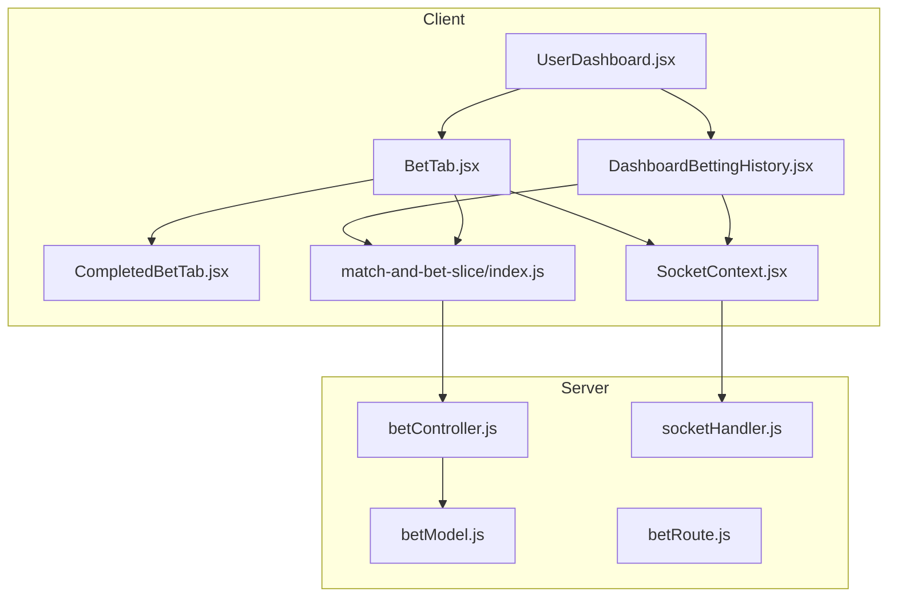
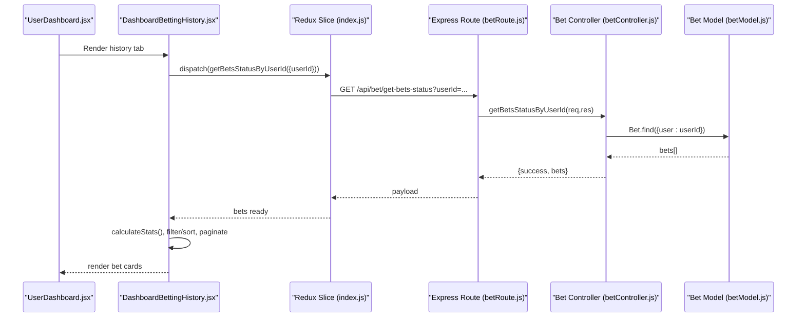
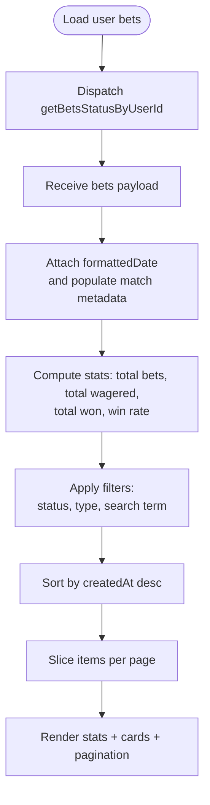
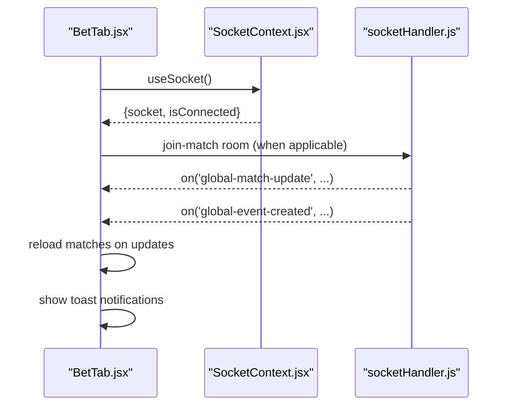
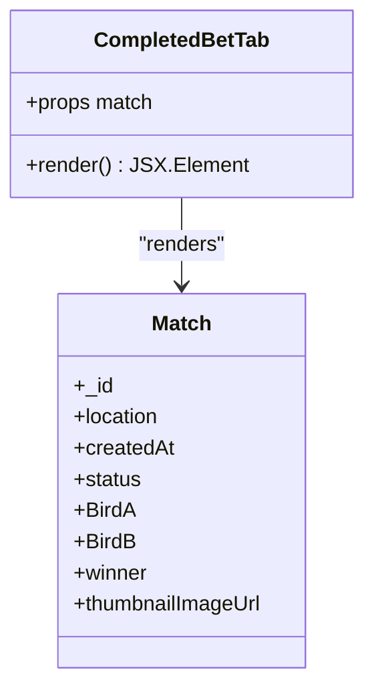
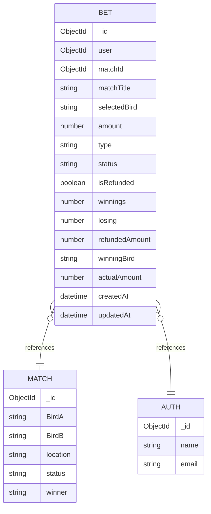
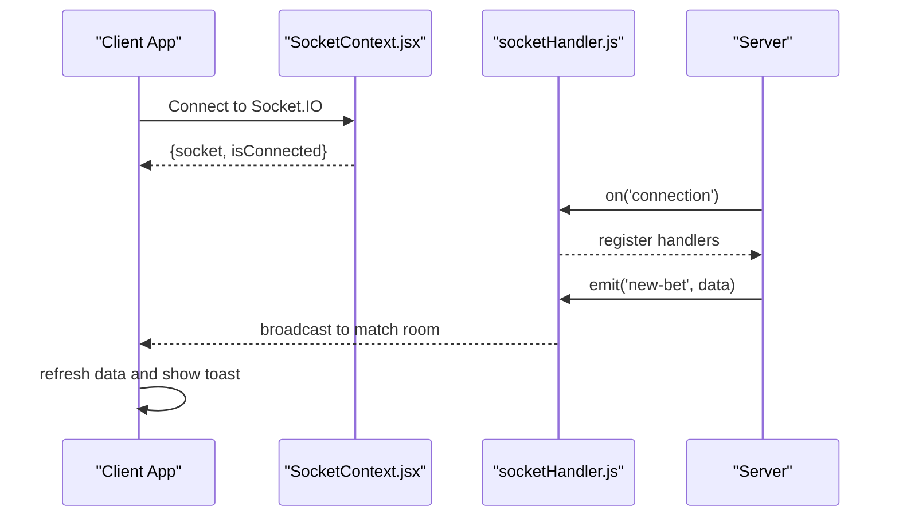
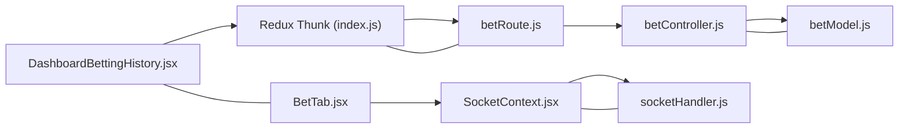

# Betting History

<cite>
**Referenced Files in This Document**
- [DashboardBettingHistory.jsx](file://client/src/components/User/DashboardBettingHistory.jsx)
- [CompletedBetTab.jsx](file://client/src/components/Bet/CompletedBetTab.jsx)
- [BetTab.jsx](file://client/src/components/Bet/BetTab.jsx)
- [betModel.js](file://server/models/betModel.js)
- [betController.js](file://server/controllers/bet/betController.js)
- [betRoute.js](file://server/routes/bet/betRoute.js)
- [index.js](file://client/src/store/user/match-and-bet-slice/index.js)
- [SocketContext.jsx](file://client/src/context/SocketContext.jsx)
- [socketHandler.js](file://server/socket/socketHandler.js)
- [UserDashboard.jsx](file://client/src/Pages/User/UserDashboard.jsx)
- [App.jsx](file://client/src/App.jsx)
</cite>

## Table of Contents
1. [Introduction](#introduction)
2. [Project Structure](#project-structure)
3. [Core Components](#core-components)
4. [Architecture Overview](#architecture-overview)
5. [Detailed Component Analysis](#detailed-component-analysis)
6. [Dependency Analysis](#dependency-analysis)
7. [Performance Considerations](#performance-considerations)
8. [Troubleshooting Guide](#troubleshooting-guide)
9. [Conclusion](#conclusion)

## Introduction
This document describes the betting history tracking system, focusing on how past bets are retrieved, displayed, filtered, sorted, and paginated. It also explains the integration with the betting engine, real-time updates via sockets, and the completed bets tab. The goal is to provide a clear understanding of the data model, UI components, user interactions, and performance strategies for managing large historical datasets.

## Project Structure
The betting history feature spans client-side React components, Redux slices for data fetching, and server-side models and controllers. Real-time updates are handled through Socket.IO connections.

**Diagram sources**
- [UserDashboard.jsx](file://client/src/Pages/User/UserDashboard.jsx#L10-L31)
- [DashboardBettingHistory.jsx](file://client/src/components/User/DashboardBettingHistory.jsx#L38-L74)
- [BetTab.jsx](file://client/src/components/Bet/BetTab.jsx#L13-L86)
- [CompletedBetTab.jsx](file://client/src/components/Bet/CompletedBetTab.jsx#L5-L113)
- [SocketContext.jsx](file://client/src/context/SocketContext.jsx#L14-L61)
- [index.js](file://client/src/store/user/match-and-bet-slice/index.js#L84-L94)
- [betModel.js](file://server/models/betModel.js#L3-L23)
- [betController.js](file://server/controllers/bet/betController.js#L108-L124)
- [betRoute.js](file://server/routes/bet/betRoute.js#L1-L11)
- [socketHandler.js](file://server/socket/socketHandler.js#L1-L101)

**Section sources**
- [UserDashboard.jsx](file://client/src/Pages/User/UserDashboard.jsx#L10-L31)
- [DashboardBettingHistory.jsx](file://client/src/components/User/DashboardBettingHistory.jsx#L38-L74)
- [BetTab.jsx](file://client/src/components/Bet/BetTab.jsx#L13-L86)
- [CompletedBetTab.jsx](file://client/src/components/Bet/CompletedBetTab.jsx#L5-L113)
- [SocketContext.jsx](file://client/src/context/SocketContext.jsx#L14-L61)
- [index.js](file://client/src/store/user/match-and-bet-slice/index.js#L84-L94)
- [betModel.js](file://server/models/betModel.js#L3-L23)
- [betController.js](file://server/controllers/bet/betController.js#L108-L124)
- [betRoute.js](file://server/routes/bet/betRoute.js#L1-L11)
- [socketHandler.js](file://server/socket/socketHandler.js#L1-L101)

## Core Components
- DashboardBettingHistory: Loads user bets, calculates statistics, renders cards, and supports filtering, sorting, and pagination.
- BetTab: Provides live and completed matches tabs, pagination, and real-time notifications via sockets.
- CompletedBetTab: Renders a compact card for completed matches with status and winner information.
- Redux slice: Fetches user bets and top-level matches, exposes async thunks.
- SocketContext and socketHandler: Establish persistent connections and manage rooms for real-time updates.

Key responsibilities:
- Data retrieval: getBetsStatusByUserId (client) and getBetsStatusByUserId (server).
- Filtering and sorting: performed client-side on the loaded dataset.
- Pagination: client-side slicing for bet history; server-side pagination for match lists.
- Real-time updates: socket listeners for match status changes and match settled events.

**Section sources**
- [DashboardBettingHistory.jsx](file://client/src/components/User/DashboardBettingHistory.jsx#L38-L124)
- [BetTab.jsx](file://client/src/components/Bet/BetTab.jsx#L13-L184)
- [CompletedBetTab.jsx](file://client/src/components/Bet/CompletedBetTab.jsx#L5-L113)
- [index.js](file://client/src/store/user/match-and-bet-slice/index.js#L84-L94)
- [socketHandler.js](file://server/socket/socketHandler.js#L1-L101)

## Architecture Overview
The system integrates Redux for state management, Express routes for data retrieval, Mongoose models for persistence, and Socket.IO for real-time updates.

**Diagram sources**
- [UserDashboard.jsx](file://client/src/Pages/User/UserDashboard.jsx#L23-L25)
- [DashboardBettingHistory.jsx](file://client/src/components/User/DashboardBettingHistory.jsx#L38-L74)
- [index.js](file://client/src/store/user/match-and-bet-slice/index.js#L84-L94)
- [betRoute.js](file://server/routes/bet/betRoute.js#L7-L8)
- [betController.js](file://server/controllers/bet/betController.js#L108-L124)
- [betModel.js](file://server/models/betModel.js#L3-L23)

## Detailed Component Analysis

### DashboardBettingHistory: Bet History Interface
Responsibilities:
- Fetch user bets via Redux thunk.
- Compute statistics: total bets, total wagered, total won, win rate.
- Filter by status and bet type; search by match title or selection.
- Sort by creation date (default descending).
- Paginate results (items per page configured).

Display elements:
- Stats cards for totals and win rate.
- Filters: status, bet type, and text search.
- Pagination controls.
- Individual bet cards with:
  - Match metadata (location, date).
  - Bet details (section, round, bet type).
  - Selection and result (winning bird).
  - Financial details (bet amount, winnings/loss/refund).
  - Status badge and colored progress bar.

Real-time integration:
- No direct socket listener here; relies on server-provided historical data.

Performance considerations:
- Client-side filtering/sorting on the entire dataset; consider server-side filtering for very large histories.
- Pagination reduces DOM rendering overhead.

**Diagram sources**
- [DashboardBettingHistory.jsx](file://client/src/components/User/DashboardBettingHistory.jsx#L56-L124)

**Section sources**
- [DashboardBettingHistory.jsx](file://client/src/components/User/DashboardBettingHistory.jsx#L38-L124)
- [DashboardBettingHistory.jsx](file://client/src/components/User/DashboardBettingHistory.jsx#L186-L344)
- [DashboardBettingHistory.jsx](file://client/src/components/User/DashboardBettingHistory.jsx#L386-L562)

### BetTab: Live and Completed Matches Tabs
Responsibilities:
- Switch between “Matches” and “Completed” tabs.
- Load paginated top-level matches via Redux thunks.
- Real-time notifications for match status changes and match settled events.
- Navigate to live betting pages on click.

Real-time updates:
- Socket listeners for global-match-update and global-event-created.
- Toast notifications for match lifecycle events.

**Diagram sources**
- [BetTab.jsx](file://client/src/components/Bet/BetTab.jsx#L110-L184)
- [SocketContext.jsx](file://client/src/context/SocketContext.jsx#L14-L61)
- [socketHandler.js](file://server/socket/socketHandler.js#L6-L88)

**Section sources**
- [BetTab.jsx](file://client/src/components/Bet/BetTab.jsx#L13-L184)
- [SocketContext.jsx](file://client/src/context/SocketContext.jsx#L14-L61)
- [socketHandler.js](file://server/socket/socketHandler.js#L1-L101)

### CompletedBetTab: Completed Matches View
Responsibilities:
- Display thumbnail image with status badge.
- Show match location and creation date.
- Render VS row with participating birds.
- Display winner when match is completed.

**Diagram sources**
- [CompletedBetTab.jsx](file://client/src/components/Bet/CompletedBetTab.jsx#L5-L113)

**Section sources**
- [CompletedBetTab.jsx](file://client/src/components/Bet/CompletedBetTab.jsx#L5-L113)

### Data Model and API Integration
Data model (MongoDB):
- Fields include user reference, match reference, selected bird, amount, bet type, status, refund-related fields, and timestamps.
- Indexes support sorting by creation time and querying by match and status.

Server endpoints:
- GET /api/bet/get-bets-status?userId=... returns user’s bets with nested match metadata.
- GET /api/bet/:matchId returns all bets for a given match.
- POST /api/bet/create places a new bet and emits a socket event to the match room.

**Diagram sources**
- [betModel.js](file://server/models/betModel.js#L3-L23)

**Section sources**
- [betModel.js](file://server/models/betModel.js#L3-L23)
- [betController.js](file://server/controllers/bet/betController.js#L108-L124)
- [betRoute.js](file://server/routes/bet/betRoute.js#L7-L8)

### Real-Time Updates and Socket Events
- Client establishes a Socket.IO connection and tracks connection state.
- Server initializes rooms for matches, events, and admins.
- On bet placement, server emits to the match room and admin room.
- Client listens for global-match-update and global-event-created to refresh and notify.

**Diagram sources**
- [SocketContext.jsx](file://client/src/context/SocketContext.jsx#L18-L54)
- [socketHandler.js](file://server/socket/socketHandler.js#L58-L72)
- [betController.js](file://server/controllers/bet/betController.js#L79-L96)

**Section sources**
- [SocketContext.jsx](file://client/src/context/SocketContext.jsx#L14-L61)
- [socketHandler.js](file://server/socket/socketHandler.js#L1-L101)
- [betController.js](file://server/controllers/bet/betController.js#L79-L96)

## Dependency Analysis
- DashboardBettingHistory depends on Redux thunk getBetsStatusByUserId and date formatting utilities.
- BetTab depends on SocketContext and uses socket events to keep match lists fresh.
- Both components rely on shared UI primitives (cards, selects, inputs, pagination).
- Server-side controllers depend on Mongoose models and expose REST endpoints.

**Diagram sources**
- [DashboardBettingHistory.jsx](file://client/src/components/User/DashboardBettingHistory.jsx#L3-L3)
- [BetTab.jsx](file://client/src/components/Bet/BetTab.jsx#L8-L21)
- [index.js](file://client/src/store/user/match-and-bet-slice/index.js#L84-L94)
- [betRoute.js](file://server/routes/bet/betRoute.js#L1-L11)
- [betController.js](file://server/controllers/bet/betController.js#L108-L124)
- [betModel.js](file://server/models/betModel.js#L3-L23)
- [SocketContext.jsx](file://client/src/context/SocketContext.jsx#L1-L61)
- [socketHandler.js](file://server/socket/socketHandler.js#L1-L101)

**Section sources**
- [DashboardBettingHistory.jsx](file://client/src/components/User/DashboardBettingHistory.jsx#L3-L3)
- [BetTab.jsx](file://client/src/components/Bet/BetTab.jsx#L8-L21)
- [index.js](file://client/src/store/user/match-and-bet-slice/index.js#L84-L94)
- [betRoute.js](file://server/routes/bet/betRoute.js#L1-L11)
- [betController.js](file://server/controllers/bet/betController.js#L108-L124)
- [betModel.js](file://server/models/betModel.js#L3-L23)
- [SocketContext.jsx](file://client/src/context/SocketContext.jsx#L1-L61)
- [socketHandler.js](file://server/socket/socketHandler.js#L1-L101)

## Performance Considerations
Current implementation highlights:
- Client-side filtering/sorting on the entire dataset; for very large histories, consider moving filters and sorting to the server.
- Pagination is applied client-side for bet history; for large datasets, prefer server-side pagination to reduce payload sizes.
- Real-time updates trigger a refresh of the current page; consider debouncing or selective re-rendering to avoid excessive re-renders.

Recommendations:
- Server-side pagination for bet history: add page and limit parameters to getBetsStatusByUserId.
- Server-side filtering/sorting: expose query parameters for status, type, and sort field.
- Virtualized lists for long histories to improve rendering performance.
- Debounce search input to limit frequent re-computations.

[No sources needed since this section provides general guidance]

## Troubleshooting Guide
Common issues and resolutions:
- Empty or stale bet history:
  - Verify getBetsStatusByUserId returns data and user ID is correct.
  - Ensure the Redux thunk is dispatched after authentication.
- Real-time updates not appearing:
  - Confirm socket connection state and that the client joined the correct rooms.
  - Check server logs for socket emit errors.
- Pagination anomalies:
  - Validate pagination state and total pages calculation.
  - Ensure filtered dataset is recalculated before pagination.

**Section sources**
- [DashboardBettingHistory.jsx](file://client/src/components/User/DashboardBettingHistory.jsx#L56-L74)
- [BetTab.jsx](file://client/src/components/Bet/BetTab.jsx#L110-L184)
- [SocketContext.jsx](file://client/src/context/SocketContext.jsx#L18-L54)
- [socketHandler.js](file://server/socket/socketHandler.js#L58-L72)

## Conclusion
The betting history system combines a robust data model, efficient client-side rendering, and real-time updates to deliver a responsive user experience. By leveraging Redux for data fetching and Socket.IO for live events, the system supports both historical insights and up-to-the-minute match activity. For large-scale deployments, prioritize server-side pagination and filtering to maintain performance and scalability.