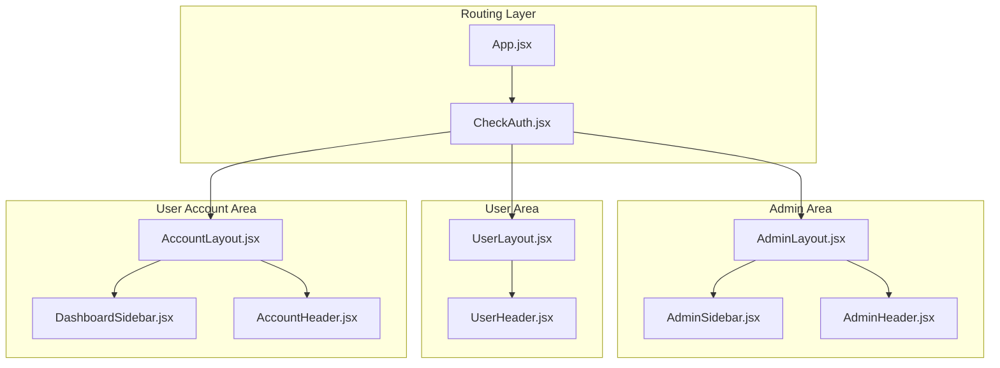
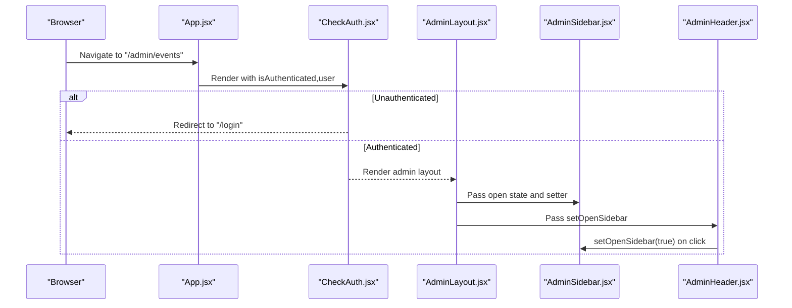
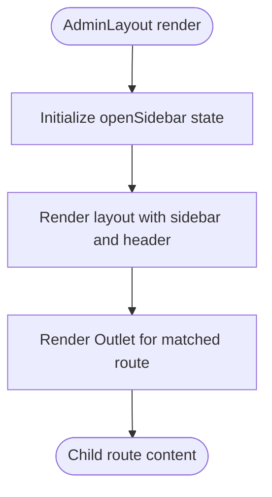
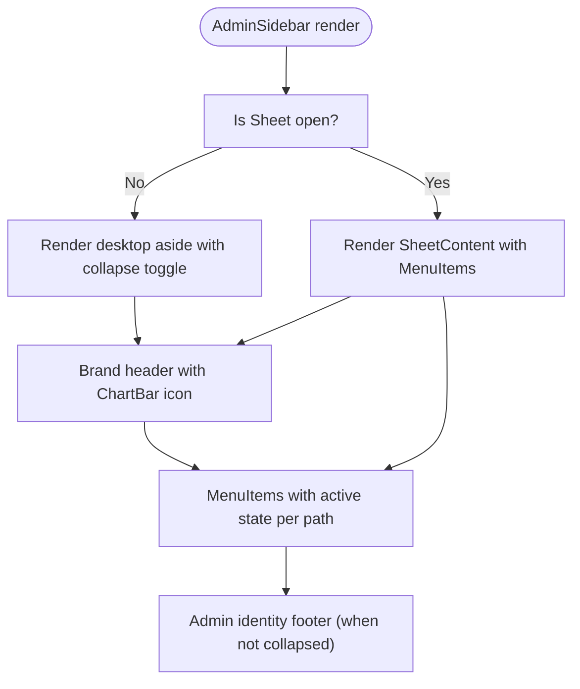
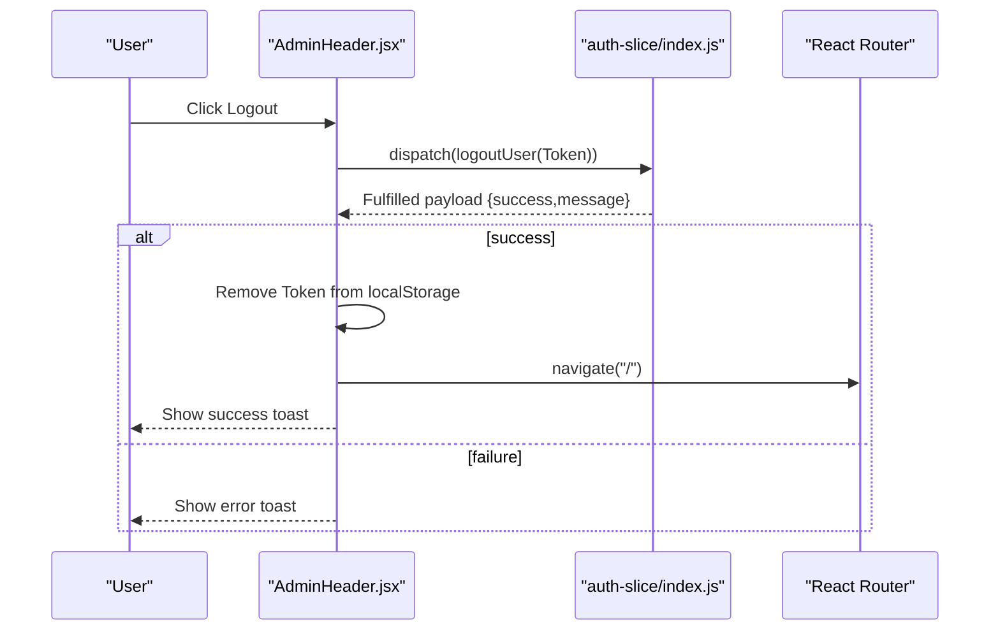
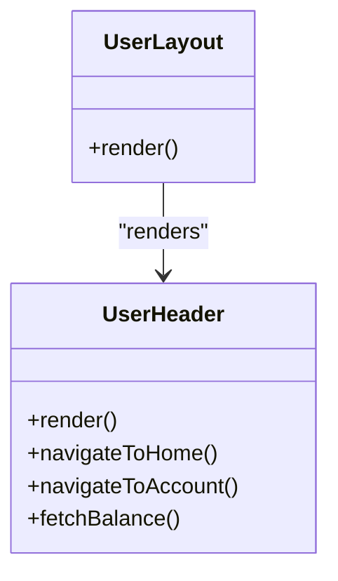
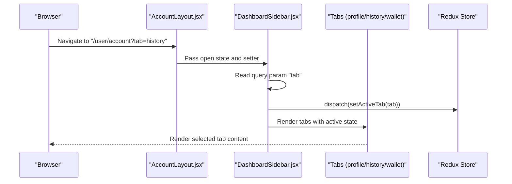
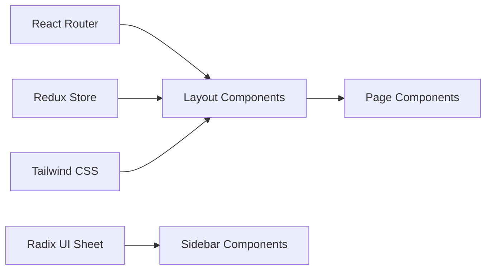

# Dashboard Layout & Navigation

<cite>
**Referenced Files in This Document**
- [App.jsx](file://client/src/App.jsx)
- [CheckAuth.jsx](file://client/src/components/common/CheckAuth.jsx)
- [AdminLayout.jsx](file://client/src/components/Admin/Layout.jsx)
- [AdminHeader.jsx](file://client/src/components/Admin/Header.jsx)
- [AdminSidebar.jsx](file://client/src/components/Admin/Sidebar.jsx)
- [UserLayout.jsx](file://client/src/components/User/Layout.jsx)
- [UserHeader.jsx](file://client/src/components/User/Header.jsx)
- [AccountLayout.jsx](file://client/src/components/User/AccountLayout.jsx)
- [AccountHeader.jsx](file://client/src/components/User/AccountHeader.jsx)
- [DashboardSidebar.jsx](file://client/src/components/User/DashboardSidebar.jsx)
- [sheet.jsx](file://client/src/components/ui/sheet.jsx)
- [utils.js](file://client/src/lib/utils.js)
- [auth-slice/index.js](file://client/src/store/auth-slice/index.js)
- [tailwind.config.js](file://client/tailwind.config.js)
</cite>

## Table of Contents
1. [Introduction](#introduction)
2. [Project Structure](#project-structure)
3. [Core Components](#core-components)
4. [Architecture Overview](#architecture-overview)
5. [Detailed Component Analysis](#detailed-component-analysis)
6. [Dependency Analysis](#dependency-analysis)
7. [Performance Considerations](#performance-considerations)
8. [Troubleshooting Guide](#troubleshooting-guide)
9. [Conclusion](#conclusion)

## Introduction
This document explains the dashboard layout and navigation system for the betting application. It covers the sidebar component with navigation links and responsive behavior, the header component with user controls and branding, the overall layout structure, responsive design implementation, navigation patterns and active state management, route handling, accessibility features, and integration with the routing and authentication systems.

## Project Structure
The layout system is organized around three primary layouts:
- Admin layout for administrative dashboards
- User layout for general user pages
- User account layout for user profile and wallet sections

Routing is configured centrally, with authentication guards ensuring protected routes and role-based redirection.

**Diagram sources**
- [App.jsx](file://client/src/App.jsx#L51-L110)
- [CheckAuth.jsx](file://client/src/components/common/CheckAuth.jsx#L4-L41)
- [AdminLayout.jsx](file://client/src/components/Admin/Layout.jsx#L6-L19)
- [AdminSidebar.jsx](file://client/src/components/Admin/Sidebar.jsx#L77-L174)
- [AdminHeader.jsx](file://client/src/components/Admin/Header.jsx#L10-L51)
- [UserLayout.jsx](file://client/src/components/User/Layout.jsx#L5-L15)
- [UserHeader.jsx](file://client/src/components/User/Header.jsx#L10-L86)
- [AccountLayout.jsx](file://client/src/components/User/AccountLayout.jsx#L6-L19)
- [DashboardSidebar.jsx](file://client/src/components/User/DashboardSidebar.jsx#L22-L244)
- [AccountHeader.jsx](file://client/src/components/User/AccountHeader.jsx#L11-L79)

**Section sources**
- [App.jsx](file://client/src/App.jsx#L51-L110)
- [CheckAuth.jsx](file://client/src/components/common/CheckAuth.jsx#L4-L41)

## Core Components
- AdminLayout: Orchestrates admin area layout with sidebar and outlet rendering.
- AdminSidebar: Collapsible sidebar with navigation items, mobile drawer, and footer.
- AdminHeader: Top bar with mobile menu toggle and logout.
- UserLayout: Minimal layout for user home page.
- UserHeader: Branding, back navigation, balance display, and user profile link.
- AccountLayout: User account layout with sidebar and outlet rendering.
- DashboardSidebar: Collapsible sidebar for account tabs (profile, history, wallet).
- AccountHeader: Top bar with mobile menu toggle, balance display, language selector, and logout.
- Sheet UI: Radix-based drawer component used for mobile sidebars.
- Utilities: Tailwind merging utility and responsive breakpoints.

Key responsibilities:
- Active state management via pathname comparison for admin menu items.
- Active tab management via URL query parameter for user account tabs.
- Responsive behavior using Tailwind’s breakpoint classes and Sheet drawer.
- Accessibility via ARIA labels, keyboard focus, and screen-reader-friendly markup.

**Section sources**
- [AdminLayout.jsx](file://client/src/components/Admin/Layout.jsx#L6-L19)
- [AdminSidebar.jsx](file://client/src/components/Admin/Sidebar.jsx#L37-L75)
- [AdminHeader.jsx](file://client/src/components/Admin/Header.jsx#L10-L51)
- [UserLayout.jsx](file://client/src/components/User/Layout.jsx#L5-L15)
- [UserHeader.jsx](file://client/src/components/User/Header.jsx#L10-L86)
- [AccountLayout.jsx](file://client/src/components/User/AccountLayout.jsx#L6-L19)
- [DashboardSidebar.jsx](file://client/src/components/User/DashboardSidebar.jsx#L74-L119)
- [AccountHeader.jsx](file://client/src/components/User/AccountHeader.jsx#L11-L79)
- [sheet.jsx](file://client/src/components/ui/sheet.jsx#L46-L58)
- [utils.js](file://client/src/lib/utils.js#L4-L6)
- [tailwind.config.js](file://client/tailwind.config.js#L1-L85)

## Architecture Overview
The layout architecture follows a layered pattern:
- Routing layer defines protected routes and redirects based on authentication and roles.
- Authentication guard enforces access control and redirects unauthenticated or unauthorized users.
- Layout components encapsulate sidebar/header composition and pass-through outlets for page content.
- UI primitives (Sheet) provide mobile-first navigation drawers.

**Diagram sources**
- [App.jsx](file://client/src/App.jsx#L65-L79)
- [CheckAuth.jsx](file://client/src/components/common/CheckAuth.jsx#L4-L41)
- [AdminLayout.jsx](file://client/src/components/Admin/Layout.jsx#L6-L19)
- [AdminSidebar.jsx](file://client/src/components/Admin/Sidebar.jsx#L77-L174)
- [AdminHeader.jsx](file://client/src/components/Admin/Header.jsx#L10-L51)

## Detailed Component Analysis

### Admin Layout and Navigation
- Layout structure: Flex container with sidebar and content area; outlet renders child routes.
- Mobile responsiveness: Uses Sheet drawer controlled by a boolean state.
- Desktop responsiveness: Collapsible sidebar with expand/collapse toggle.

**Diagram sources**
- [AdminLayout.jsx](file://client/src/components/Admin/Layout.jsx#L6-L19)

**Section sources**
- [AdminLayout.jsx](file://client/src/components/Admin/Layout.jsx#L6-L19)

### Admin Sidebar
- Menu items: Array of navigation entries with icons, labels, and paths.
- Active state: Derived from current pathname equality with item path.
- Collapsible behavior: Width toggles between expanded and compact; icons scale accordingly.
- Mobile drawer: Sheet drawer with header branding and menu items.
- Footer: Displays admin identity when not collapsed.

**Diagram sources**
- [AdminSidebar.jsx](file://client/src/components/Admin/Sidebar.jsx#L77-L174)
- [AdminSidebar.jsx](file://client/src/components/Admin/Sidebar.jsx#L37-L75)

**Section sources**
- [AdminSidebar.jsx](file://client/src/components/Admin/Sidebar.jsx#L8-L35)
- [AdminSidebar.jsx](file://client/src/components/Admin/Sidebar.jsx#L37-L75)
- [AdminSidebar.jsx](file://client/src/components/Admin/Sidebar.jsx#L77-L174)

### Admin Header
- Controls: Mobile menu toggle button and logout button.
- Logout flow: Dispatches Redux logout thunk, clears local token, navigates to home, shows toast feedback.
- Accessibility: Toggle button includes screen-reader-only label.

**Diagram sources**
- [AdminHeader.jsx](file://client/src/components/Admin/Header.jsx#L17-L27)
- [auth-slice/index.js](file://client/src/store/auth-slice/index.js#L117-L130)

**Section sources**
- [AdminHeader.jsx](file://client/src/components/Admin/Header.jsx#L10-L51)
- [auth-slice/index.js](file://client/src/store/auth-slice/index.js#L117-L130)

### User Layout and Navigation
- UserLayout: Minimal layout with header and outlet for user home page.
- UserHeader: Branding with back navigation, deposit prompt, balance display, language dropdown, and user profile link.

**Diagram sources**
- [UserLayout.jsx](file://client/src/components/User/Layout.jsx#L5-L15)
- [UserHeader.jsx](file://client/src/components/User/Header.jsx#L10-L86)

**Section sources**
- [UserLayout.jsx](file://client/src/components/User/Layout.jsx#L5-L15)
- [UserHeader.jsx](file://client/src/components/User/Header.jsx#L10-L86)

### User Account Layout and Navigation
- AccountLayout: Similar to AdminLayout but for user account area.
- DashboardSidebar: Collapsible sidebar with tabs (profile, history, wallet) driven by URL query parameter.
- Active tab: Determined by query param "tab"; defaults to "profile".
- Logout flow identical to AdminHeader.

**Diagram sources**
- [AccountLayout.jsx](file://client/src/components/User/AccountLayout.jsx#L6-L19)
- [DashboardSidebar.jsx](file://client/src/components/User/DashboardSidebar.jsx#L66-L72)
- [DashboardSidebar.jsx](file://client/src/components/User/DashboardSidebar.jsx#L74-L119)

**Section sources**
- [AccountLayout.jsx](file://client/src/components/User/AccountLayout.jsx#L6-L19)
- [DashboardSidebar.jsx](file://client/src/components/User/DashboardSidebar.jsx#L22-L72)
- [DashboardSidebar.jsx](file://client/src/components/User/DashboardSidebar.jsx#L74-L119)

### Account Header
- Controls: Mobile menu toggle, balance display, language dropdown, and user profile.
- Logout flow mirrors AdminHeader.

**Section sources**
- [AccountHeader.jsx](file://client/src/components/User/AccountHeader.jsx#L11-L79)

### Sheet Drawer Component
- Provides a mobile-friendly drawer overlay with slide-in/out animations.
- Used by both AdminSidebar and DashboardSidebar for mobile navigation.

**Section sources**
- [sheet.jsx](file://client/src/components/ui/sheet.jsx#L46-L58)

### Utility and Styling
- cn utility merges Tailwind classes safely.
- Tailwind configuration extends colors, spacing, and animation utilities; responsive breakpoints are used throughout.

**Section sources**
- [utils.js](file://client/src/lib/utils.js#L4-L6)
- [tailwind.config.js](file://client/tailwind.config.js#L1-L85)

## Dependency Analysis
The layout system depends on:
- React Router for routing and navigation.
- Redux for authentication state and user balance.
- Radix UI Sheet for mobile drawers.
- Tailwind CSS for responsive styles and animations.

**Diagram sources**
- [App.jsx](file://client/src/App.jsx#L51-L110)
- [AdminLayout.jsx](file://client/src/components/Admin/Layout.jsx#L6-L19)
- [UserLayout.jsx](file://client/src/components/User/Layout.jsx#L5-L15)
- [AccountLayout.jsx](file://client/src/components/User/AccountLayout.jsx#L6-L19)
- [AdminSidebar.jsx](file://client/src/components/Admin/Sidebar.jsx#L77-L174)
- [DashboardSidebar.jsx](file://client/src/components/User/DashboardSidebar.jsx#L22-L244)
- [sheet.jsx](file://client/src/components/ui/sheet.jsx#L46-L58)

**Section sources**
- [App.jsx](file://client/src/App.jsx#L51-L110)
- [AdminLayout.jsx](file://client/src/components/Admin/Layout.jsx#L6-L19)
- [UserLayout.jsx](file://client/src/components/User/Layout.jsx#L5-L15)
- [AccountLayout.jsx](file://client/src/components/User/AccountLayout.jsx#L6-L19)
- [AdminSidebar.jsx](file://client/src/components/Admin/Sidebar.jsx#L77-L174)
- [DashboardSidebar.jsx](file://client/src/components/User/DashboardSidebar.jsx#L22-L244)
- [sheet.jsx](file://client/src/components/ui/sheet.jsx#L46-L58)

## Performance Considerations
- Prefer lightweight state updates: open/close drawer state is minimal and does not trigger heavy computations.
- Avoid unnecessary re-renders: MenuItems and DashboardSidebar compute active states based on current location; memoization is not used, but the work is trivial.
- Lazy load page components if routes become numerous; current implementation uses standard route nesting.
- Keep drawer content minimal to reduce paint and layout thrash on small screens.

## Troubleshooting Guide
- Active state not highlighting:
  - Verify pathname matches exactly with configured paths.
  - Confirm MenuItems receives the correct location from React Router.
- Mobile drawer not opening:
  - Ensure Sheet props open/onOpenChange are synchronized with parent state.
  - Check that the toggle button invokes the setter passed down from the layout.
- Logout not redirecting:
  - Confirm the logout thunk resolves and updates authentication state.
  - Ensure the authentication guard redirects based on state changes.
- Role-based access issues:
  - Review the guard logic for authenticated, admin, and user paths.
  - Verify user role is present in the authentication state.

**Section sources**
- [AdminSidebar.jsx](file://client/src/components/Admin/Sidebar.jsx#L37-L75)
- [DashboardSidebar.jsx](file://client/src/components/User/DashboardSidebar.jsx#L74-L119)
- [AdminHeader.jsx](file://client/src/components/Admin/Header.jsx#L17-L27)
- [CheckAuth.jsx](file://client/src/components/common/CheckAuth.jsx#L4-L41)
- [auth-slice/index.js](file://client/src/store/auth-slice/index.js#L117-L130)

## Conclusion
The dashboard layout and navigation system combines modular layouts, responsive sidebars, and robust authentication guards. Active states are managed via routing context, while mobile drawers provide seamless navigation across devices. Accessibility is addressed through ARIA attributes and keyboard-friendly interactions. The architecture supports extensibility for adding new sections and maintaining consistent UX across admin and user areas.