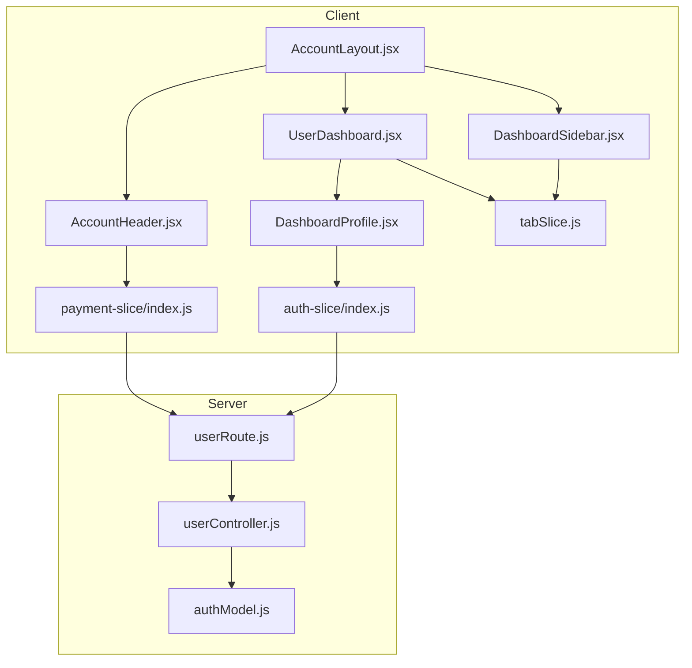
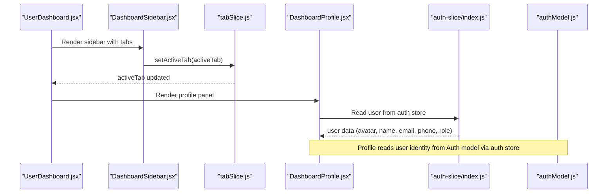
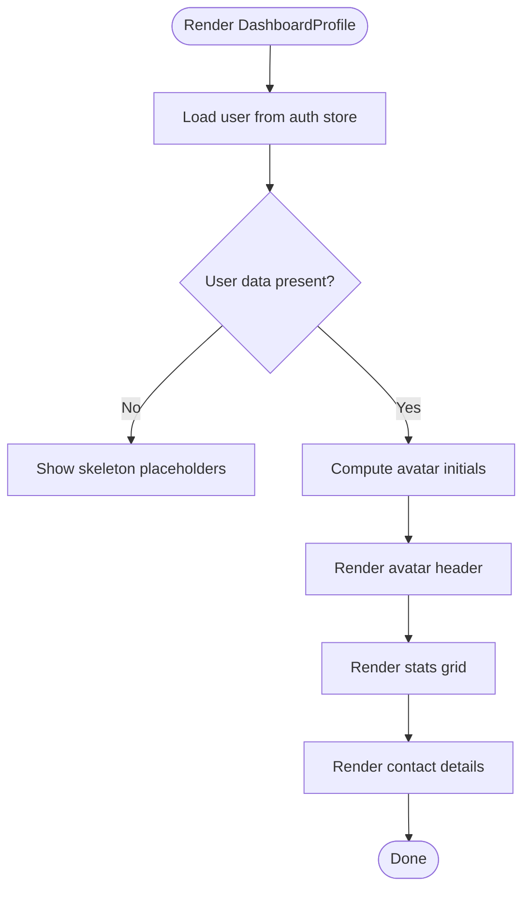
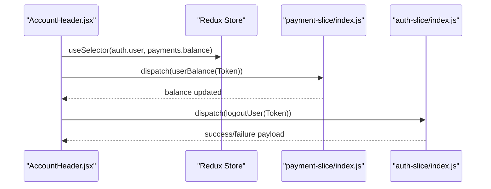
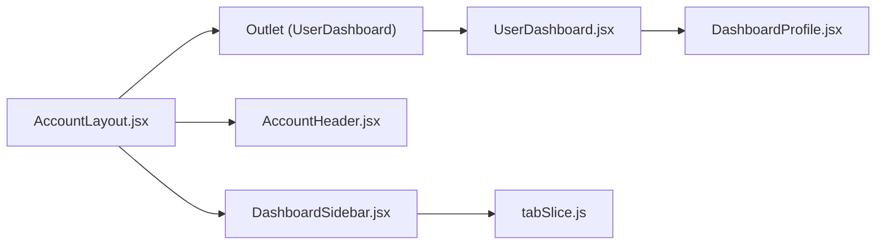
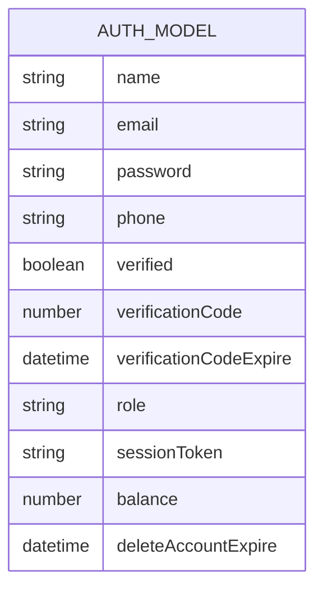
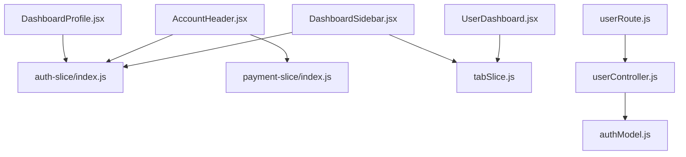

# Profile Management

<cite>
**Referenced Files in This Document**
- [DashboardProfile.jsx](file://client/src/components/User/DashboardProfile.jsx)
- [AccountHeader.jsx](file://client/src/components/User/AccountHeader.jsx)
- [AccountLayout.jsx](file://client/src/components/User/AccountLayout.jsx)
- [DashboardSidebar.jsx](file://client/src/components/User/DashboardSidebar.jsx)
- [UserDashboard.jsx](file://client/src/Pages/User/UserDashboard.jsx)
- [auth-slice/index.js](file://client/src/store/auth-slice/index.js)
- [payment-slice/index.js](file://client/src/store/user/payment-slice/index.js)
- [tabSlice.js](file://client/src/store/features/tabs/tabSlice.js)
- [userRoute.js](file://server/routes/users/userRoute.js)
- [userController.js](file://server/controllers/users/userController.js)
- [authModel.js](file://server/models/authModel.js)
</cite>

## Table of Contents
1. [Introduction](#introduction)
2. [Project Structure](#project-structure)
3. [Core Components](#core-components)
4. [Architecture Overview](#architecture-overview)
5. [Detailed Component Analysis](#detailed-component-analysis)
6. [Dependency Analysis](#dependency-analysis)
7. [Performance Considerations](#performance-considerations)
8. [Troubleshooting Guide](#troubleshooting-guide)
9. [Conclusion](#conclusion)
10. [Appendices](#appendices)

## Introduction
This document describes the user profile management system, focusing on the profile viewing interface, account header, layout, and navigation. It explains how personal information, contact details, and account preferences are presented, how the layout integrates with authentication and payment slices, and how navigation is handled across tabs. It also outlines UX considerations and security measures for profile-related workflows.

## Project Structure
The profile management system spans the client-side React components and Redux stores, and the server-side user routes and controllers. The layout composes a sidebar, header, and content area. The profile page displays user identity, avatar, stats, and contact information.

**Diagram sources**
- [AccountLayout.jsx](file://client/src/components/User/AccountLayout.jsx#L1-L23)
- [AccountHeader.jsx](file://client/src/components/User/AccountHeader.jsx#L1-L82)
- [DashboardSidebar.jsx](file://client/src/components/User/DashboardSidebar.jsx#L1-L248)
- [DashboardProfile.jsx](file://client/src/components/User/DashboardProfile.jsx#L1-L197)
- [UserDashboard.jsx](file://client/src/Pages/User/UserDashboard.jsx#L1-L34)
- [auth-slice/index.js](file://client/src/store/auth-slice/index.js#L1-L342)
- [payment-slice/index.js](file://client/src/store/user/payment-slice/index.js#L1-L344)
- [tabSlice.js](file://client/src/store/features/tabs/tabSlice.js#L1-L17)
- [userRoute.js](file://server/routes/users/userRoute.js#L1-L11)
- [userController.js](file://server/controllers/users/userController.js#L1-L49)
- [authModel.js](file://server/models/authModel.js#L1-L40)

**Section sources**
- [AccountLayout.jsx](file://client/src/components/User/AccountLayout.jsx#L1-L23)
- [AccountHeader.jsx](file://client/src/components/User/AccountHeader.jsx#L1-L82)
- [DashboardSidebar.jsx](file://client/src/components/User/DashboardSidebar.jsx#L1-L248)
- [DashboardProfile.jsx](file://client/src/components/User/DashboardProfile.jsx#L1-L197)
- [UserDashboard.jsx](file://client/src/Pages/User/UserDashboard.jsx#L1-L34)
- [auth-slice/index.js](file://client/src/store/auth-slice/index.js#L1-L342)
- [payment-slice/index.js](file://client/src/store/user/payment-slice/index.js#L1-L344)
- [tabSlice.js](file://client/src/store/features/tabs/tabSlice.js#L1-L17)
- [userRoute.js](file://server/routes/users/userRoute.js#L1-L11)
- [userController.js](file://server/controllers/users/userController.js#L1-L49)
- [authModel.js](file://server/models/authModel.js#L1-L40)

## Core Components
- Profile display: renders user avatar, badges, stats, and contact details.
- Account header: shows wallet balance, language selector, and logout.
- Account layout: orchestrates sidebar, header, and outlet rendering.
- Dashboard sidebar: navigates among profile, history, and wallet tabs.
- User dashboard: selects active tab and renders the appropriate panel.
- Authentication slice: manages user session and JWT lifecycle.
- Payment slice: fetches and exposes user balance.
- Tab slice: tracks active tab state.

**Section sources**
- [DashboardProfile.jsx](file://client/src/components/User/DashboardProfile.jsx#L20-L197)
- [AccountHeader.jsx](file://client/src/components/User/AccountHeader.jsx#L11-L82)
- [AccountLayout.jsx](file://client/src/components/User/AccountLayout.jsx#L6-L23)
- [DashboardSidebar.jsx](file://client/src/components/User/DashboardSidebar.jsx#L22-L248)
- [UserDashboard.jsx](file://client/src/Pages/User/UserDashboard.jsx#L10-L34)
- [auth-slice/index.js](file://client/src/store/auth-slice/index.js#L1-L342)
- [payment-slice/index.js](file://client/src/store/user/payment-slice/index.js#L1-L344)
- [tabSlice.js](file://client/src/store/features/tabs/tabSlice.js#L1-L17)

## Architecture Overview
The profile system is composed of:
- UI components for presentation and navigation.
- Redux stores for authentication, payments, and tab state.
- Server routes and controllers for user-related operations.
- Models defining user data shape.

**Diagram sources**
- [UserDashboard.jsx](file://client/src/Pages/User/UserDashboard.jsx#L10-L34)
- [DashboardSidebar.jsx](file://client/src/components/User/DashboardSidebar.jsx#L66-L72)
- [tabSlice.js](file://client/src/store/features/tabs/tabSlice.js#L10-L12)
- [DashboardProfile.jsx](file://client/src/components/User/DashboardProfile.jsx#L20-L24)
- [auth-slice/index.js](file://client/src/store/auth-slice/index.js#L257-L342)
- [authModel.js](file://server/models/authModel.js#L3-L32)

## Detailed Component Analysis

### Profile Display Component
The profile component presents:
- Avatar with initials fallback.
- Role badge and user name.
- User ID with copy-to-clipboard.
- Stats: total bets, balance, win rate.
- Personal info: full name, email, phone.

**Diagram sources**
- [DashboardProfile.jsx](file://client/src/components/User/DashboardProfile.jsx#L20-L197)

**Section sources**
- [DashboardProfile.jsx](file://client/src/components/User/DashboardProfile.jsx#L20-L197)

### Account Header Component
The account header shows:
- Wallet balance fetched via payment slice.
- Language dropdown.
- Logout action dispatched through auth slice.

**Diagram sources**
- [AccountHeader.jsx](file://client/src/components/User/AccountHeader.jsx#L11-L41)
- [payment-slice/index.js](file://client/src/store/user/payment-slice/index.js#L12-L32)
- [auth-slice/index.js](file://client/src/store/auth-slice/index.js#L117-L130)

**Section sources**
- [AccountHeader.jsx](file://client/src/components/User/AccountHeader.jsx#L11-L82)
- [payment-slice/index.js](file://client/src/store/user/payment-slice/index.js#L1-L344)
- [auth-slice/index.js](file://client/src/store/auth-slice/index.js#L1-L342)

### Account Layout and Navigation
The layout composes:
- Sidebar with collapsible menu and logout.
- Header with balance and language.
- Outlet rendering the active tab content.

**Diagram sources**
- [AccountLayout.jsx](file://client/src/components/User/AccountLayout.jsx#L6-L20)
- [DashboardSidebar.jsx](file://client/src/components/User/DashboardSidebar.jsx#L22-L72)
- [AccountHeader.jsx](file://client/src/components/User/AccountHeader.jsx#L44-L78)
- [UserDashboard.jsx](file://client/src/Pages/User/UserDashboard.jsx#L10-L29)
- [tabSlice.js](file://client/src/store/features/tabs/tabSlice.js#L1-L17)

**Section sources**
- [AccountLayout.jsx](file://client/src/components/User/AccountLayout.jsx#L1-L23)
- [DashboardSidebar.jsx](file://client/src/components/User/DashboardSidebar.jsx#L22-L248)
- [AccountHeader.jsx](file://client/src/components/User/AccountHeader.jsx#L1-L82)
- [UserDashboard.jsx](file://client/src/Pages/User/UserDashboard.jsx#L1-L34)
- [tabSlice.js](file://client/src/store/features/tabs/tabSlice.js#L1-L17)

### Data Models and Backend Integration
- User data model includes name, email, phone, role, balance, and verification fields.
- User route exposes balance retrieval endpoint.
- User controller handles balance queries.

**Diagram sources**
- [authModel.js](file://server/models/authModel.js#L3-L32)

**Section sources**
- [authModel.js](file://server/models/authModel.js#L1-L40)
- [userRoute.js](file://server/routes/users/userRoute.js#L1-L11)
- [userController.js](file://server/controllers/users/userController.js#L29-L46)

## Dependency Analysis
- DashboardProfile depends on auth store for user data and on translation keys for labels.
- AccountHeader depends on payment store for balance and on auth store for logout.
- DashboardSidebar depends on tab store to set active tab and on auth store for logout.
- UserDashboard depends on tab store to render the active panel.
- Server routes depend on user controller and models.

**Diagram sources**
- [DashboardProfile.jsx](file://client/src/components/User/DashboardProfile.jsx#L1-L197)
- [AccountHeader.jsx](file://client/src/components/User/AccountHeader.jsx#L1-L82)
- [DashboardSidebar.jsx](file://client/src/components/User/DashboardSidebar.jsx#L1-L248)
- [UserDashboard.jsx](file://client/src/Pages/User/UserDashboard.jsx#L1-L34)
- [auth-slice/index.js](file://client/src/store/auth-slice/index.js#L1-L342)
- [payment-slice/index.js](file://client/src/store/user/payment-slice/index.js#L1-L344)
- [tabSlice.js](file://client/src/store/features/tabs/tabSlice.js#L1-L17)
- [userRoute.js](file://server/routes/users/userRoute.js#L1-L11)
- [userController.js](file://server/controllers/users/userController.js#L1-L49)
- [authModel.js](file://server/models/authModel.js#L1-L40)

**Section sources**
- [DashboardProfile.jsx](file://client/src/components/User/DashboardProfile.jsx#L1-L197)
- [AccountHeader.jsx](file://client/src/components/User/AccountHeader.jsx#L1-L82)
- [DashboardSidebar.jsx](file://client/src/components/User/DashboardSidebar.jsx#L1-L248)
- [UserDashboard.jsx](file://client/src/Pages/User/UserDashboard.jsx#L1-L34)
- [auth-slice/index.js](file://client/src/store/auth-slice/index.js#L1-L342)
- [payment-slice/index.js](file://client/src/store/user/payment-slice/index.js#L1-L344)
- [tabSlice.js](file://client/src/store/features/tabs/tabSlice.js#L1-L17)
- [userRoute.js](file://server/routes/users/userRoute.js#L1-L11)
- [userController.js](file://server/controllers/users/userController.js#L1-L49)
- [authModel.js](file://server/models/authModel.js#L1-L40)

## Performance Considerations
- Profile rendering uses skeleton placeholders while user or balance data is loading to avoid blank screens.
- Avatar initials are computed client-side to minimize network requests.
- Tab switching is state-driven to avoid unnecessary re-renders.
- Payment balance fetching uses cached headers to prevent stale data.

[No sources needed since this section provides general guidance]

## Troubleshooting Guide
- If user data is missing, the profile shows skeletons; verify authentication store hydration and token validity.
- If balance is not shown, ensure the payment balance thunk is dispatched and the token is present.
- If logout fails, check the auth slice logout thunk response and local token removal.
- If navigation does not update the active tab, confirm tab slice reducer updates and URL query param handling.

**Section sources**
- [DashboardProfile.jsx](file://client/src/components/User/DashboardProfile.jsx#L31-L48)
- [AccountHeader.jsx](file://client/src/components/User/AccountHeader.jsx#L30-L41)
- [auth-slice/index.js](file://client/src/store/auth-slice/index.js#L117-L130)
- [payment-slice/index.js](file://client/src/store/user/payment-slice/index.js#L12-L32)
- [DashboardSidebar.jsx](file://client/src/components/User/DashboardSidebar.jsx#L66-L72)

## Conclusion
The profile management system integrates UI components with Redux stores and server endpoints to present user identity, avatar, stats, and contact details. The layout and navigation are tab-driven, with authentication and payment slices supporting session and balance workflows. Security is enforced via token-based protected routes and controlled access to sensitive endpoints.

[No sources needed since this section summarizes without analyzing specific files]

## Appendices

### Profile Data Model Fields
- Name: string, required
- Email: string, required, unique
- Phone: string, required, unique
- Role: enum [admin, user, superadmin], default user
- Verified: boolean, default false
- Verification code and expiry
- Session token
- Balance: number, default 0
- Registration attempts history

**Section sources**
- [authModel.js](file://server/models/authModel.js#L3-L32)

### Example: Profile Rendering Flow
- Load user from auth store.
- Compute avatar initials.
- Render avatar header, stats grid, and contact details.
- Provide copy-to-clipboard for user ID.

**Section sources**
- [DashboardProfile.jsx](file://client/src/components/User/DashboardProfile.jsx#L20-L197)

### Example: Header and Navigation Flow
- Sidebar sets active tab via tab slice.
- Header shows balance and triggers logout.
- Layout composes sidebar, header, and outlet.

**Section sources**
- [DashboardSidebar.jsx](file://client/src/components/User/DashboardSidebar.jsx#L66-L72)
- [AccountHeader.jsx](file://client/src/components/User/AccountHeader.jsx#L44-L78)
- [AccountLayout.jsx](file://client/src/components/User/AccountLayout.jsx#L6-L20)

### Example: Backend Balance Retrieval
- Route: GET /api/user/balance
- Controller: fetches user balance by ID
- Model: Auth includes balance field

**Section sources**
- [userRoute.js](file://server/routes/users/userRoute.js#L8-L8)
- [userController.js](file://server/controllers/users/userController.js#L29-L46)
- [authModel.js](file://server/models/authModel.js#L22-L22)