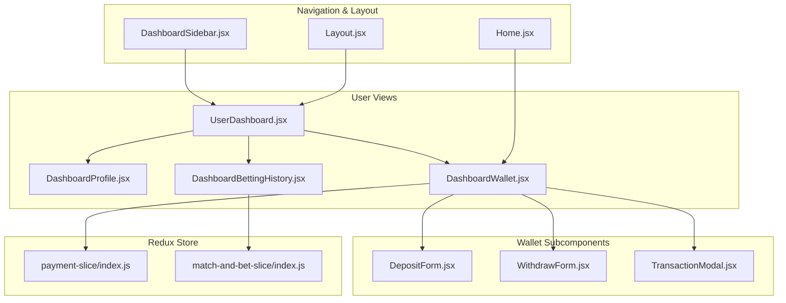
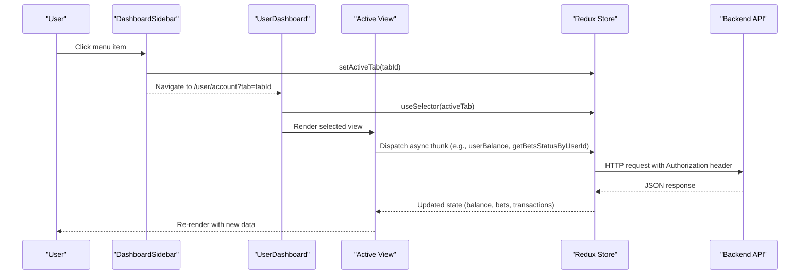
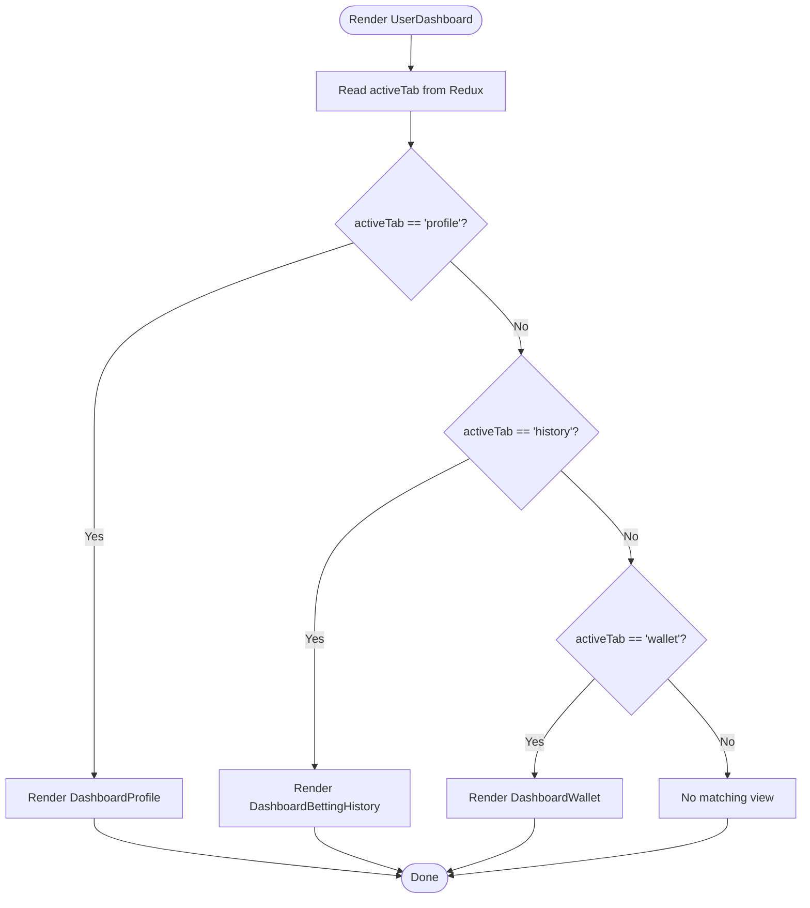
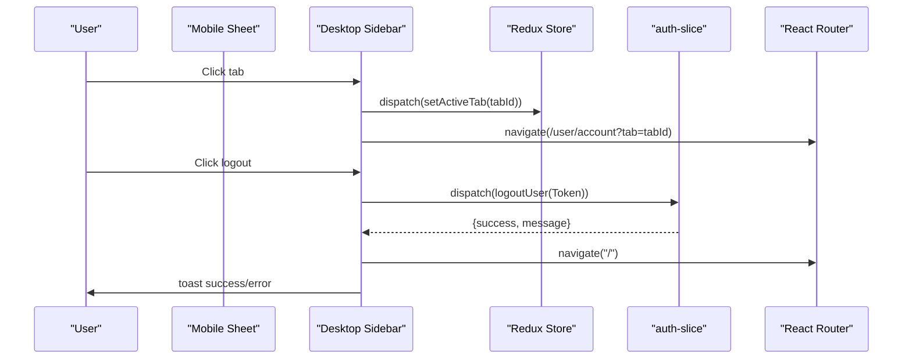
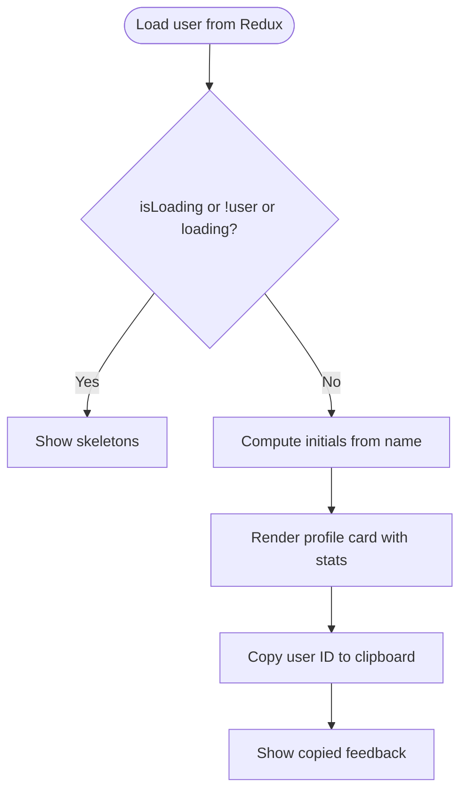
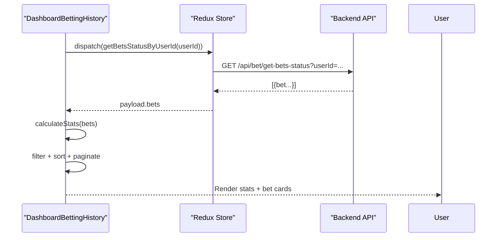
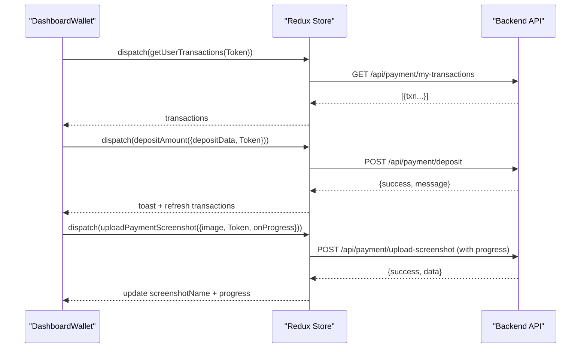
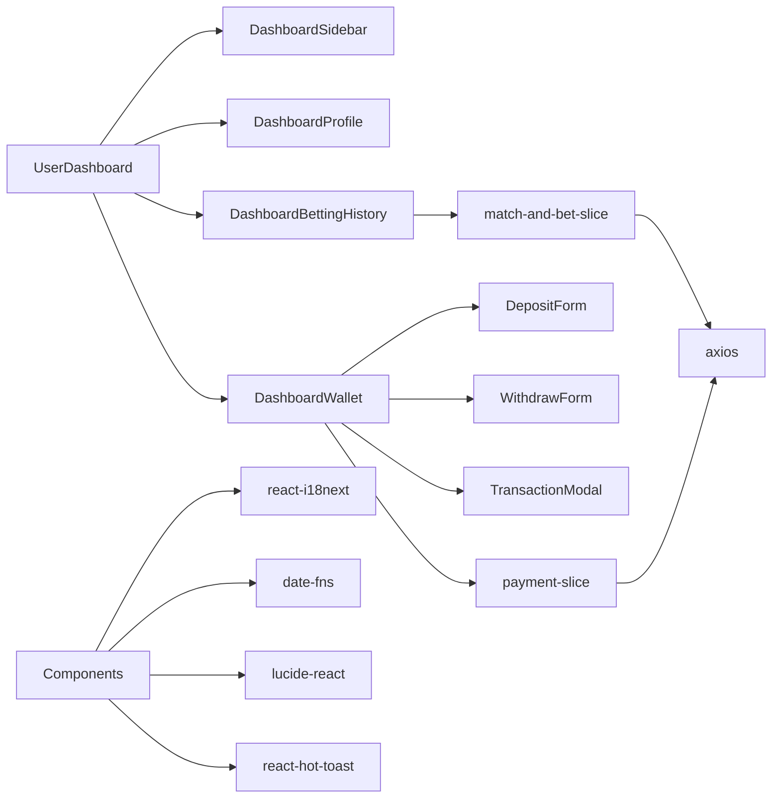

# User Dashboard

<cite>
**Referenced Files in This Document**
- [UserDashboard.jsx](file://client/src/Pages/User/UserDashboard.jsx)
- [Home.jsx](file://client/src/Pages/User/Home.jsx)
- [DashboardSidebar.jsx](file://client/src/components/User/DashboardSidebar.jsx)
- [DashboardProfile.jsx](file://client/src/components/User/DashboardProfile.jsx)
- [DashboardBettingHistory.jsx](file://client/src/components/User/DashboardBettingHistory.jsx)
- [DashboardWallet.jsx](file://client/src/components/User/DashboardWallet.jsx)
- [Layout.jsx](file://client/src/components/User/Layout.jsx)
- [DepositForm.jsx](file://client/src/components/User/walletComponent/DepositForm.jsx)
- [WithdrawForm.jsx](file://client/src/components/User/walletComponent/WithdrawForm.jsx)
- [TransactionModal.jsx](file://client/src/components/User/walletComponent/TransactionModal.jsx)
- [payment-slice/index.js](file://client/src/store/user/payment-slice/index.js)
- [match-and-bet-slice/index.js](file://client/src/store/user/match-and-bet-slice/index.js)
- [i18next.js](file://client/src/utils/i18next.js)
- [language/users/userDashboard/wallet/index.js](file://client/src/utils/language/users/userDashboard/wallet/index.js)
</cite>

## Table of Contents
1. [Introduction](#introduction)
2. [Project Structure](#project-structure)
3. [Core Components](#core-components)
4. [Architecture Overview](#architecture-overview)
5. [Detailed Component Analysis](#detailed-component-analysis)
6. [Dependency Analysis](#dependency-analysis)
7. [Performance Considerations](#performance-considerations)
8. [Troubleshooting Guide](#troubleshooting-guide)
9. [Conclusion](#conclusion)
10. [Appendices](#appendices)

## Introduction
This document describes the user dashboard, focusing on user profile management, betting history tracking, and wallet management. It also covers the dashboard layout, responsive design and mobile optimization, accessibility and internationalization, and the integration between frontend components and backend APIs. The goal is to help developers and stakeholders understand how the dashboard works, how to extend it, and how to maintain a consistent user experience across devices and languages.

## Project Structure
The user dashboard is organized around a central page that renders different views based on the active tab. The sidebar controls navigation and persists the active tab in the Redux store. The three primary views are:
- Profile: displays user details, stats, and contact info
- Betting History: lists past bets, filters, sorting, pagination, and computed stats
- Wallet: manages deposits, withdrawals, transaction history, and supports image upload with progress

**Diagram sources**
- [UserDashboard.jsx](file://client/src/Pages/User/UserDashboard.jsx#L1-L34)
- [DashboardSidebar.jsx](file://client/src/components/User/DashboardSidebar.jsx#L1-L248)
- [DashboardProfile.jsx](file://client/src/components/User/DashboardProfile.jsx#L1-L197)
- [DashboardBettingHistory.jsx](file://client/src/components/User/DashboardBettingHistory.jsx#L1-L565)
- [DashboardWallet.jsx](file://client/src/components/User/DashboardWallet.jsx#L1-L819)
- [DepositForm.jsx](file://client/src/components/User/walletComponent/DepositForm.jsx#L1-L329)
- [WithdrawForm.jsx](file://client/src/components/User/walletComponent/WithdrawForm.jsx#L1-L118)
- [TransactionModal.jsx](file://client/src/components/User/walletComponent/TransactionModal.jsx#L1-L369)
- [payment-slice/index.js](file://client/src/store/user/payment-slice/index.js#L1-L344)
- [match-and-bet-slice/index.js](file://client/src/store/user/match-and-bet-slice/index.js#L1-L127)

**Section sources**
- [UserDashboard.jsx](file://client/src/Pages/User/UserDashboard.jsx#L1-L34)
- [DashboardSidebar.jsx](file://client/src/components/User/DashboardSidebar.jsx#L1-L248)
- [Layout.jsx](file://client/src/components/User/Layout.jsx#L1-L19)

## Core Components
- UserDashboard: orchestrates the active tab selection and renders the appropriate view. It initializes shared stats used across views.
- DashboardSidebar: provides navigation between profile, history, and wallet, handles logout, and integrates with the tab store.
- DashboardProfile: displays user identity, stats, and contact information with skeleton loaders and translation support.
- DashboardBettingHistory: loads user bets, computes stats, applies filters and sorting, paginates results, and renders bet cards with localized labels.
- DashboardWallet: manages wallet balance, deposit/withdraw forms, transaction history, and image upload with progress and compression for large files.
- Wallet subcomponents: DepositForm, WithdrawForm, and TransactionModal encapsulate specific UI concerns and responsiveness.
- Redux slices: payment-slice and match-and-bet-slice define async thunks for API interactions and manage state for balances, transactions, and bet data.

**Section sources**
- [UserDashboard.jsx](file://client/src/Pages/User/UserDashboard.jsx#L1-L34)
- [DashboardSidebar.jsx](file://client/src/components/User/DashboardSidebar.jsx#L1-L248)
- [DashboardProfile.jsx](file://client/src/components/User/DashboardProfile.jsx#L1-L197)
- [DashboardBettingHistory.jsx](file://client/src/components/User/DashboardBettingHistory.jsx#L1-L565)
- [DashboardWallet.jsx](file://client/src/components/User/DashboardWallet.jsx#L1-L819)
- [DepositForm.jsx](file://client/src/components/User/walletComponent/DepositForm.jsx#L1-L329)
- [WithdrawForm.jsx](file://client/src/components/User/walletComponent/WithdrawForm.jsx#L1-L118)
- [TransactionModal.jsx](file://client/src/components/User/walletComponent/TransactionModal.jsx#L1-L369)
- [payment-slice/index.js](file://client/src/store/user/payment-slice/index.js#L1-L344)
- [match-and-bet-slice/index.js](file://client/src/store/user/match-and-bet-slice/index.js#L1-L127)

## Architecture Overview
The dashboard follows a layered architecture:
- Presentation layer: React components render UI and manage local state
- State layer: Redux Toolkit slices manage async operations and global state
- Service layer: Axios-based thunks call backend endpoints
- Internationalization: react-i18next and language utilities provide translations

**Diagram sources**
- [DashboardSidebar.jsx](file://client/src/components/User/DashboardSidebar.jsx#L66-L72)
- [UserDashboard.jsx](file://client/src/Pages/User/UserDashboard.jsx#L11-L25)
- [payment-slice/index.js](file://client/src/store/user/payment-slice/index.js#L12-L32)
- [match-and-bet-slice/index.js](file://client/src/store/user/match-and-bet-slice/index.js#L84-L94)

## Detailed Component Analysis

### UserDashboard
- Responsibilities:
  - Reads active tab from Redux
  - Renders profile/history/wallet based on tab
  - Initializes shared stats object passed down to child components
- UX:
  - Minimal layout with footer appended at the bottom
  - Uses a dark theme background for main content area

**Diagram sources**
- [UserDashboard.jsx](file://client/src/Pages/User/UserDashboard.jsx#L10-L29)

**Section sources**
- [UserDashboard.jsx](file://client/src/Pages/User/UserDashboard.jsx#L1-L34)

### DashboardSidebar
- Responsibilities:
  - Provides navigation between profile, history, and wallet
  - Persists active tab in the Redux store
  - Handles logout by dispatching an async thunk and clearing local storage
  - Supports collapsible desktop layout and a mobile sheet overlay
- Accessibility:
  - Uses semantic buttons and proper ARIA labels
  - Keyboard navigable menu items
- Internationalization:
  - Uses translation keys for labels and actions

**Diagram sources**
- [DashboardSidebar.jsx](file://client/src/components/User/DashboardSidebar.jsx#L66-L72)
- [DashboardSidebar.jsx](file://client/src/components/User/DashboardSidebar.jsx#L53-L64)

**Section sources**
- [DashboardSidebar.jsx](file://client/src/components/User/DashboardSidebar.jsx#L1-L248)

### DashboardProfile
- Responsibilities:
  - Displays user avatar, badges, and basic info
  - Shows stats: total bets, balance, win rate
  - Provides copy-to-clipboard for user ID
  - Uses skeletons during loading
- Internationalization:
  - Uses translation keys for field labels and titles
- Accessibility:
  - Proper heading hierarchy and semantic icons

**Diagram sources**
- [DashboardProfile.jsx](file://client/src/components/User/DashboardProfile.jsx#L31-L48)
- [DashboardProfile.jsx](file://client/src/components/User/DashboardProfile.jsx#L25-L29)

**Section sources**
- [DashboardProfile.jsx](file://client/src/components/User/DashboardProfile.jsx#L1-L197)

### DashboardBettingHistory
- Responsibilities:
  - Loads bets by user ID via async thunk
  - Computes total bets, total wagered, total won, and win rate
  - Applies filters (status, type), search term, and sorting
  - Paginates results and renders bet cards with localized labels
  - Displays stats cards and skeleton loaders during loading
- Internationalization:
  - Dynamic translation function toggles between English and Spanish
  - All UI labels inside bet cards are translated
- UX:
  - Status badges reflect outcome with distinct styles
  - Responsive grid layout for bet cards

**Diagram sources**
- [DashboardBettingHistory.jsx](file://client/src/components/User/DashboardBettingHistory.jsx#L56-L74)
- [match-and-bet-slice/index.js](file://client/src/store/user/match-and-bet-slice/index.js#L84-L94)

**Section sources**
- [DashboardBettingHistory.jsx](file://client/src/components/User/DashboardBettingHistory.jsx#L1-L565)
- [match-and-bet-slice/index.js](file://client/src/store/user/match-and-bet-slice/index.js#L1-L127)

### DashboardWallet
- Responsibilities:
  - Displays current wallet balance
  - Manages deposit and withdrawal requests
  - Shows recent transactions with status indicators
  - Handles image upload with progress and compression for large files
  - Supports cancellation of pending withdrawals
- Forms:
  - DepositForm: collects beneficiary, bank, date/time, amount, transaction ID, and screenshot
  - WithdrawForm: collects amount, account holder, account number, and bank
- Modal:
  - TransactionModal: shows detailed transaction info, timeline, and status
- Async operations:
  - userBalance, depositAmount, withdrawAmount, cancelPayment, getUserTransactions, getTransactionById
  - uploadPaymentScreenshot with progress tracking

**Diagram sources**
- [DashboardWallet.jsx](file://client/src/components/User/DashboardWallet.jsx#L76-L120)
- [DashboardWallet.jsx](file://client/src/components/User/DashboardWallet.jsx#L126-L189)
- [DashboardWallet.jsx](file://client/src/components/User/DashboardWallet.jsx#L301-L347)
- [payment-slice/index.js](file://client/src/store/user/payment-slice/index.js#L105-L148)
- [payment-slice/index.js](file://client/src/store/user/payment-slice/index.js#L34-L102)

**Section sources**
- [DashboardWallet.jsx](file://client/src/components/User/DashboardWallet.jsx#L1-L819)
- [DepositForm.jsx](file://client/src/components/User/walletComponent/DepositForm.jsx#L1-L329)
- [WithdrawForm.jsx](file://client/src/components/User/walletComponent/WithdrawForm.jsx#L1-L118)
- [TransactionModal.jsx](file://client/src/components/User/walletComponent/TransactionModal.jsx#L1-L369)
- [payment-slice/index.js](file://client/src/store/user/payment-slice/index.js#L1-L344)

### Wallet Subcomponents
- DepositForm:
  - Collects beneficiary name, bank name, deposit date/time, amount, transaction ID, and screenshot
  - Integrates date picker with locale-aware formatting
  - Shows upload progress bar and success indicator
- WithdrawForm:
  - Collects withdrawal amount, account holder, account number, and bank
  - Enforces minimum and maximum amounts based on user balance
- TransactionModal:
  - Displays transaction details, status timeline, and downloadable screenshot
  - Localized status labels and messages

**Section sources**
- [DepositForm.jsx](file://client/src/components/User/walletComponent/DepositForm.jsx#L1-L329)
- [WithdrawForm.jsx](file://client/src/components/User/walletComponent/WithdrawForm.jsx#L1-L118)
- [TransactionModal.jsx](file://client/src/components/User/walletComponent/TransactionModal.jsx#L1-L369)

## Dependency Analysis
- Component dependencies:
  - UserDashboard depends on DashboardSidebar and the three view components
  - DashboardWallet depends on DepositForm, WithdrawForm, and TransactionModal
  - DashboardBettingHistory depends on match-and-bet-slice thunks
  - DashboardWallet depends on payment-slice thunks
- State dependencies:
  - Redux slices manage async flows and expose selectors for balance, loading, and data
- External dependencies:
  - Axios for HTTP requests
  - react-i18next for translations
  - date-fns for locale-aware date rendering
  - lucide-react for icons
  - react-hot-toast for notifications

**Diagram sources**
- [UserDashboard.jsx](file://client/src/Pages/User/UserDashboard.jsx#L1-L7)
- [DashboardWallet.jsx](file://client/src/components/User/DashboardWallet.jsx#L1-L31)
- [DashboardBettingHistory.jsx](file://client/src/components/User/DashboardBettingHistory.jsx#L1-L5)
- [payment-slice/index.js](file://client/src/store/user/payment-slice/index.js#L1-L3)
- [match-and-bet-slice/index.js](file://client/src/store/user/match-and-bet-slice/index.js#L1-L3)

**Section sources**
- [UserDashboard.jsx](file://client/src/Pages/User/UserDashboard.jsx#L1-L34)
- [DashboardWallet.jsx](file://client/src/components/User/DashboardWallet.jsx#L1-L819)
- [DashboardBettingHistory.jsx](file://client/src/components/User/DashboardBettingHistory.jsx#L1-L565)
- [payment-slice/index.js](file://client/src/store/user/payment-slice/index.js#L1-L344)
- [match-and-bet-slice/index.js](file://client/src/store/user/match-and-bet-slice/index.js#L1-L127)

## Performance Considerations
- Lazy loading and skeletons:
  - Use skeleton loaders during initial data fetches to avoid blank screens
- Pagination:
  - DashboardBettingHistory paginates results to limit DOM nodes and improve scrolling performance
- Image upload optimization:
  - DashboardWallet compresses large images before upload and provides progress feedback
- Network timeouts:
  - Uploads have a timeout configured to prevent hanging requests
- Caching headers:
  - Requests include cache-control headers to avoid stale data

[No sources needed since this section provides general guidance]

## Troubleshooting Guide
- Common issues and resolutions:
  - Empty or stale data:
    - Verify that the active tab is set and that async thunks are dispatched
    - Check network tab for failed requests and error payloads
  - Upload failures:
    - Confirm file size limits and type restrictions
    - Inspect upload progress and error messages returned by the thunk
  - Transaction details modal:
    - Ensure transaction ID is present and the thunk for fetching details resolves successfully
- Logging and diagnostics:
  - Console logs in upload handlers and async thunks aid in diagnosing errors
  - Toast notifications surface user-facing errors

**Section sources**
- [DashboardWallet.jsx](file://client/src/components/User/DashboardWallet.jsx#L301-L347)
- [payment-slice/index.js](file://client/src/store/user/payment-slice/index.js#L75-L101)
- [DashboardBettingHistory.jsx](file://client/src/components/User/DashboardBettingHistory.jsx#L346-L384)

## Conclusion
The user dashboard provides a cohesive, responsive, and internationally supported interface for managing user profiles, reviewing betting history, and handling wallet operations. Its modular component design, robust Redux integration, and thoughtful UX patterns enable scalability and maintainability. Future enhancements can focus on refining animations, expanding filter options, and adding deeper analytics to betting history.

[No sources needed since this section summarizes without analyzing specific files]

## Appendices

### API Endpoints Used by Wallet and Betting History
- GET /api/user/balance
- POST /api/payment/deposit
- POST /api/payment/withdraw
- PUT /api/payment/cancel/:paymentId
- GET /api/payment/my-transactions
- GET /api/payment/:transactionId
- POST /api/payment/upload-screenshot
- GET /api/bet/get-bets-status?userId=:userId

**Section sources**
- [payment-slice/index.js](file://client/src/store/user/payment-slice/index.js#L12-L34)
- [payment-slice/index.js](file://client/src/store/user/payment-slice/index.js#L105-L148)
- [payment-slice/index.js](file://client/src/store/user/payment-slice/index.js#L151-L170)
- [payment-slice/index.js](file://client/src/store/user/payment-slice/index.js#L172-L192)
- [payment-slice/index.js](file://client/src/store/user/payment-slice/index.js#L215-L234)
- [payment-slice/index.js](file://client/src/store/user/payment-slice/index.js#L34-L102)
- [match-and-bet-slice/index.js](file://client/src/store/user/match-and-bet-slice/index.js#L84-L94)

### Internationalization Support
- Translation keys:
  - DashboardProfile: user.DashboardProfile.*
  - DashboardBettingHistory: user.DashboardBettingHistory.*
  - DashboardWallet: user.DashboardWallet.*
  - Shared: admin.PaymentManagement.viewDetails
- Language utilities:
  - i18next configuration and language packs
  - Per-component translation helpers for dynamic labels

**Section sources**
- [DashboardProfile.jsx](file://client/src/components/User/DashboardProfile.jsx#L18-L126)
- [DashboardBettingHistory.jsx](file://client/src/components/User/DashboardBettingHistory.jsx#L36-L42)
- [DashboardWallet.jsx](file://client/src/components/User/DashboardWallet.jsx#L33-L74)
- [i18next.js](file://client/src/utils/i18next.js)
- [language/users/userDashboard/wallet/index.js](file://client/src/utils/language/users/userDashboard/wallet/index.js)