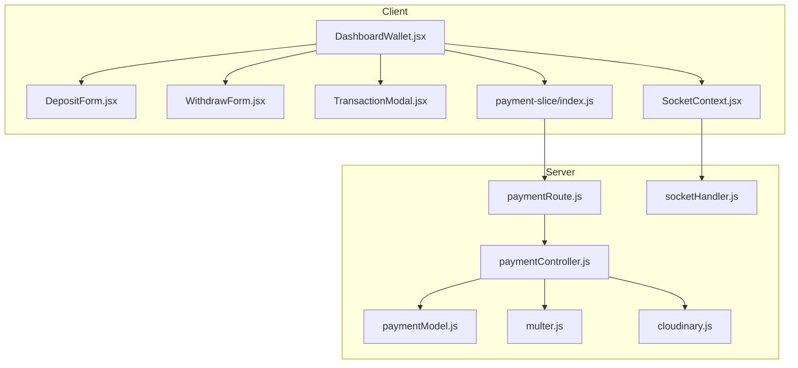
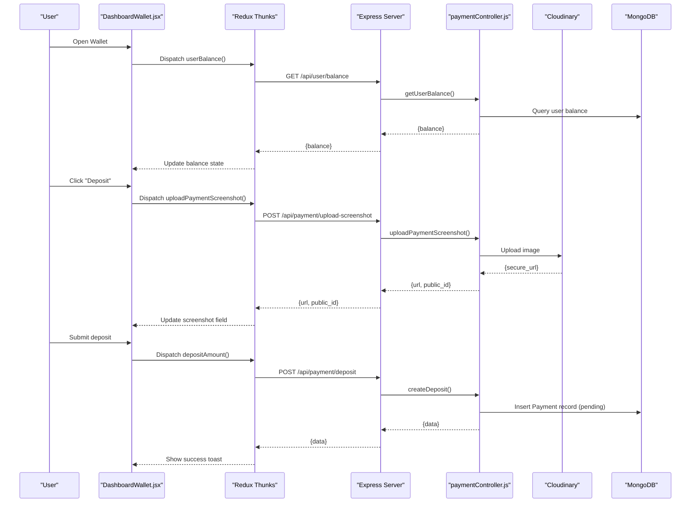
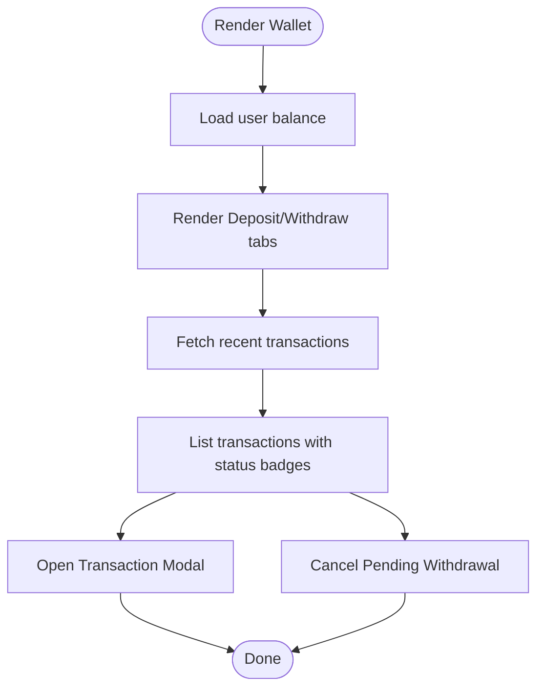
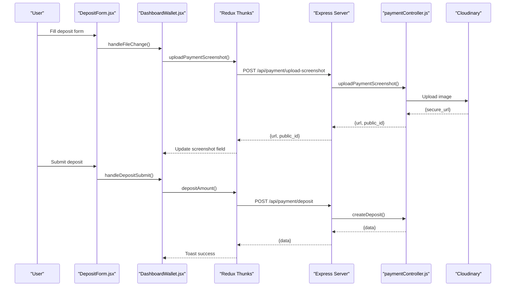
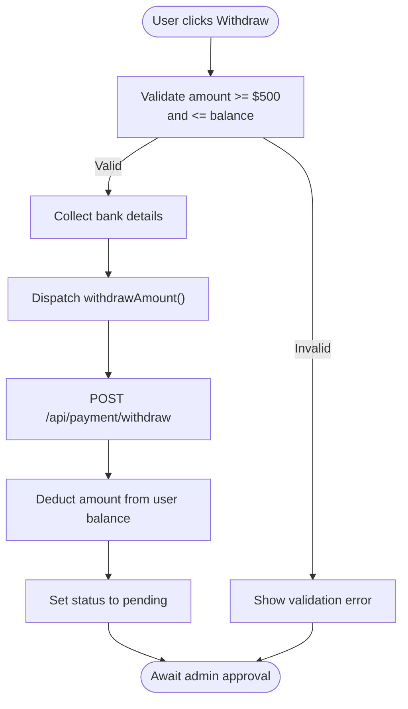
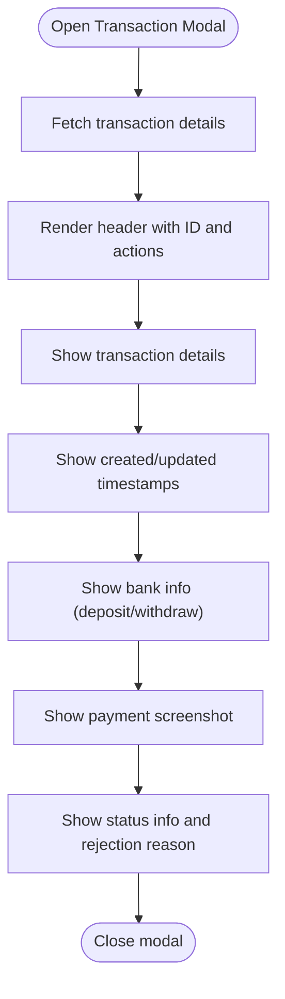
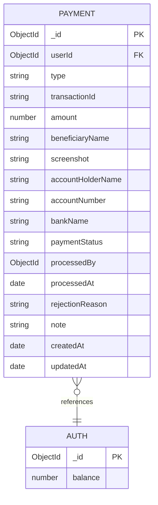
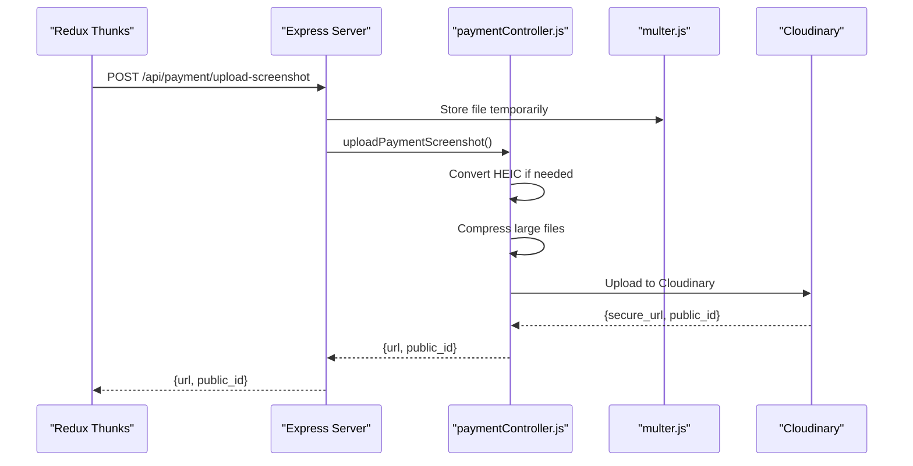
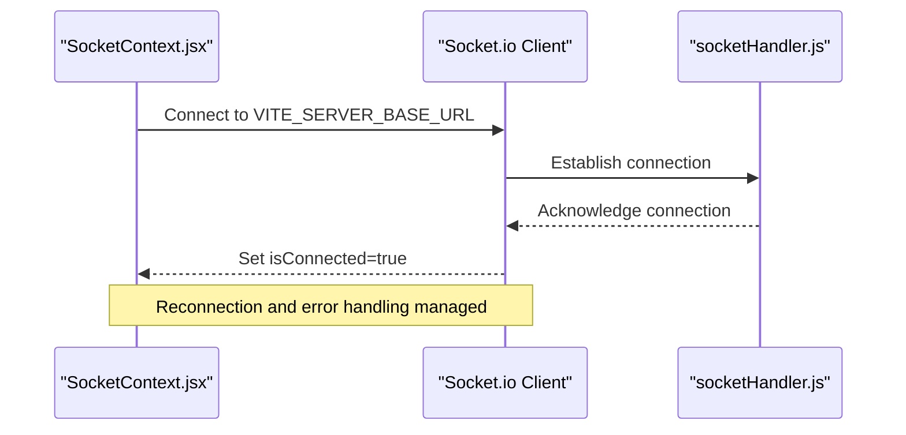
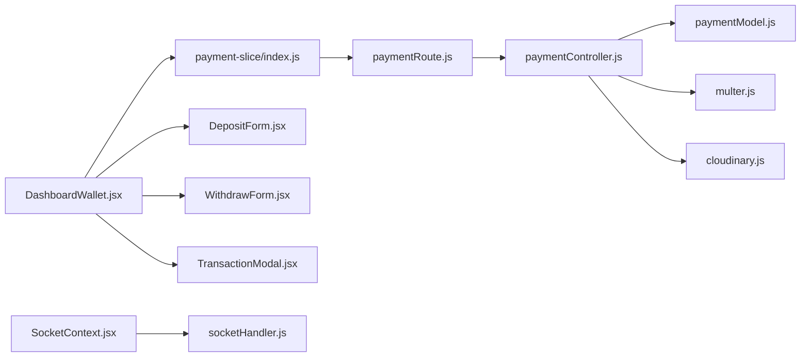

# Wallet Management

<cite>
**Referenced Files in This Document**
- [DashboardWallet.jsx](file://client/src/components/User/DashboardWallet.jsx)
- [DepositForm.jsx](file://client/src/components/User/walletComponent/DepositForm.jsx)
- [WithdrawForm.jsx](file://client/src/components/User/walletComponent/WithdrawForm.jsx)
- [TransactionModal.jsx](file://client/src/components/User/walletComponent/TransactionModal.jsx)
- [payment-slice/index.js](file://client/src/store/user/payment-slice/index.js)
- [SocketContext.jsx](file://client/src/context/SocketContext.jsx)
- [socketHandler.js](file://server/socket/socketHandler.js)
- [paymentController.js](file://server/controllers/payment/paymentController.js)
- [paymentModel.js](file://server/models/paymentModel.js)
- [paymentRoute.js](file://server/routes/payment/paymentRoute.js)
- [cloudinary.js](file://server/config/cloudinary.js)
- [multer.js](file://server/middleware/multer.js)
</cite>

## Table of Contents
1. [Introduction](#introduction)
2. [Project Structure](#project-structure)
3. [Core Components](#core-components)
4. [Architecture Overview](#architecture-overview)
5. [Detailed Component Analysis](#detailed-component-analysis)
6. [Dependency Analysis](#dependency-analysis)
7. [Performance Considerations](#performance-considerations)
8. [Troubleshooting Guide](#troubleshooting-guide)
9. [Security Considerations](#security-considerations)
10. [Conclusion](#conclusion)

## Introduction
This document describes the wallet management system for the betting platform. It covers the wallet interface (current balance display, transaction history, and funding options), the deposit workflow (bank details, screenshot upload, and verification), the withdrawal system (limits, processing times, and approvals), the transaction modal for viewing detailed records, integrations with the payment controller and Cloudinary image storage, and the relationship with socket events for real-time balance updates. It also includes examples of data models, form validation, error handling, and security considerations.

## Project Structure
The wallet system spans the client-side React components and Redux store, and the server-side Express routes, controllers, models, middleware, and socket handlers. The client integrates with the server via REST APIs and optional socket connections for real-time updates.

**Diagram sources**
- [DashboardWallet.jsx](file://client/src/components/User/DashboardWallet.jsx#L1-L819)
- [DepositForm.jsx](file://client/src/components/User/walletComponent/DepositForm.jsx#L1-L329)
- [WithdrawForm.jsx](file://client/src/components/User/walletComponent/WithdrawForm.jsx#L1-L118)
- [TransactionModal.jsx](file://client/src/components/User/walletComponent/TransactionModal.jsx#L1-L369)
- [payment-slice/index.js](file://client/src/store/user/payment-slice/index.js#L1-L344)
- [SocketContext.jsx](file://client/src/context/SocketContext.jsx#L1-L62)
- [paymentRoute.js](file://server/routes/payment/paymentRoute.js#L1-L82)
- [paymentController.js](file://server/controllers/payment/paymentController.js#L1-L868)
- [paymentModel.js](file://server/models/paymentModel.js#L1-L160)
- [multer.js](file://server/middleware/multer.js#L1-L88)
- [cloudinary.js](file://server/config/cloudinary.js#L1-L10)
- [socketHandler.js](file://server/socket/socketHandler.js#L1-L101)

**Section sources**
- [DashboardWallet.jsx](file://client/src/components/User/DashboardWallet.jsx#L1-L819)
- [payment-slice/index.js](file://client/src/store/user/payment-slice/index.js#L1-L344)
- [paymentRoute.js](file://server/routes/payment/paymentRoute.js#L1-L82)

## Core Components
- Wallet interface: displays current balance, recent transactions, and funding options (deposit/withdraw).
- Deposit workflow: collects beneficiary, bank, date/time, amount, reference, and payment screenshot; uploads via Cloudinary; submits request awaiting admin approval.
- Withdrawal workflow: validates amount against user balance, collects bank details, and requests withdrawal processing within 24–48 hours.
- Transaction modal: shows detailed transaction info, status timeline, bank details, and downloadable screenshot.
- Integrations: REST endpoints for uploads and transactions, Cloudinary for image storage, and optional socket rooms for real-time updates.

**Section sources**
- [DashboardWallet.jsx](file://client/src/components/User/DashboardWallet.jsx#L542-L819)
- [DepositForm.jsx](file://client/src/components/User/walletComponent/DepositForm.jsx#L24-L329)
- [WithdrawForm.jsx](file://client/src/components/User/walletComponent/WithdrawForm.jsx#L6-L118)
- [TransactionModal.jsx](file://client/src/components/User/walletComponent/TransactionModal.jsx#L18-L369)
- [payment-slice/index.js](file://client/src/store/user/payment-slice/index.js#L10-L344)

## Architecture Overview
The wallet system follows a layered architecture:
- Client renders UI, manages state, and invokes Redux thunks for async actions.
- Redux thunks call REST endpoints exposed by server routes.
- Controllers validate inputs, interact with models, and integrate with Cloudinary for image storage.
- Optional sockets support real-time notifications for updates.

**Diagram sources**
- [DashboardWallet.jsx](file://client/src/components/User/DashboardWallet.jsx#L126-L189)
- [payment-slice/index.js](file://client/src/store/user/payment-slice/index.js#L34-L127)
- [paymentRoute.js](file://server/routes/payment/paymentRoute.js#L27-L50)
- [paymentController.js](file://server/controllers/payment/paymentController.js#L11-L200)
- [cloudinary.js](file://server/config/cloudinary.js#L1-L10)
- [paymentModel.js](file://server/models/paymentModel.js#L1-L160)

## Detailed Component Analysis

### Wallet Interface
- Displays available balance and recent transactions.
- Provides tabs for Deposit and Withdraw.
- Fetches transaction history and supports viewing details in a modal.
- Handles cancellation of pending withdrawals.

**Diagram sources**
- [DashboardWallet.jsx](file://client/src/components/User/DashboardWallet.jsx#L542-L819)

**Section sources**
- [DashboardWallet.jsx](file://client/src/components/User/DashboardWallet.jsx#L542-L819)

### Deposit Workflow
- Collects beneficiary name, bank name, deposit date/time, amount, transaction reference, and payment screenshot.
- Validates required fields and amount range.
- Supports direct or compressed upload with progress tracking.
- Uploads to Cloudinary and stores the secure URL in the deposit request.
- Submits deposit request with pending status awaiting admin approval.

**Diagram sources**
- [DepositForm.jsx](file://client/src/components/User/walletComponent/DepositForm.jsx#L24-L329)
- [DashboardWallet.jsx](file://client/src/components/User/DashboardWallet.jsx#L126-L189)
- [payment-slice/index.js](file://client/src/store/user/payment-slice/index.js#L34-L127)
- [paymentRoute.js](file://server/routes/payment/paymentRoute.js#L27-L50)
- [paymentController.js](file://server/controllers/payment/paymentController.js#L11-L200)
- [cloudinary.js](file://server/config/cloudinary.js#L1-L10)

**Section sources**
- [DepositForm.jsx](file://client/src/components/User/walletComponent/DepositForm.jsx#L24-L329)
- [DashboardWallet.jsx](file://client/src/components/User/DashboardWallet.jsx#L126-L189)
- [payment-slice/index.js](file://client/src/store/user/payment-slice/index.js#L34-L127)
- [paymentController.js](file://server/controllers/payment/paymentController.js#L341-L396)
- [cloudinary.js](file://server/config/cloudinary.js#L1-L10)

### Withdrawal System
- Validates minimum amount ($500) and sufficient balance.
- Collects account holder name, account number, and bank name.
- Subtracts amount from user balance immediately upon request creation.
- Requests admin processing within 24–48 hours.
- Allows cancellation of pending withdrawals.

**Diagram sources**
- [WithdrawForm.jsx](file://client/src/components/User/walletComponent/WithdrawForm.jsx#L6-L118)
- [DashboardWallet.jsx](file://client/src/components/User/DashboardWallet.jsx#L191-L247)
- [payment-slice/index.js](file://client/src/store/user/payment-slice/index.js#L128-L148)
- [paymentController.js](file://server/controllers/payment/paymentController.js#L398-L464)

**Section sources**
- [WithdrawForm.jsx](file://client/src/components/User/walletComponent/WithdrawForm.jsx#L6-L118)
- [DashboardWallet.jsx](file://client/src/components/User/DashboardWallet.jsx#L191-L247)
- [payment-slice/index.js](file://client/src/store/user/payment-slice/index.js#L128-L148)
- [paymentController.js](file://server/controllers/payment/paymentController.js#L398-L464)

### Transaction Modal
- Displays transaction type, amount, status, and timestamps.
- Shows bank details for deposits and withdrawal bank details.
- Renders payment screenshot and allows download.
- Shows rejection reason and status information.

**Diagram sources**
- [TransactionModal.jsx](file://client/src/components/User/walletComponent/TransactionModal.jsx#L18-L369)
- [DashboardWallet.jsx](file://client/src/components/User/DashboardWallet.jsx#L84-L111)
- [payment-slice/index.js](file://client/src/store/user/payment-slice/index.js#L215-L234)

**Section sources**
- [TransactionModal.jsx](file://client/src/components/User/walletComponent/TransactionModal.jsx#L18-L369)
- [DashboardWallet.jsx](file://client/src/components/User/DashboardWallet.jsx#L84-L111)
- [payment-slice/index.js](file://client/src/store/user/payment-slice/index.js#L215-L234)

### Payment Data Model
- Fields include user reference, type (deposit/withdrawal), amounts, beneficiary/bank info, screenshots, status, admin actions, timestamps, and optional notes.
- Includes methods to approve/reject payments and static helpers for queries.

**Diagram sources**
- [paymentModel.js](file://server/models/paymentModel.js#L1-L160)

**Section sources**
- [paymentModel.js](file://server/models/paymentModel.js#L1-L160)

### Integration with Payment Controller and Cloudinary
- Upload endpoint accepts a single image, optionally converts HEIC to JPEG, compresses large images, and uploads to Cloudinary with transformations.
- Returns secure URL and metadata for later association with payment records.
- Deposit and withdrawal endpoints create records with appropriate validations and status defaults.

**Diagram sources**
- [payment-slice/index.js](file://client/src/store/user/payment-slice/index.js#L34-L102)
- [paymentRoute.js](file://server/routes/payment/paymentRoute.js#L27-L48)
- [paymentController.js](file://server/controllers/payment/paymentController.js#L11-L200)
- [multer.js](file://server/middleware/multer.js#L1-L88)
- [cloudinary.js](file://server/config/cloudinary.js#L1-L10)

**Section sources**
- [paymentController.js](file://server/controllers/payment/paymentController.js#L11-L200)
- [multer.js](file://server/middleware/multer.js#L1-L88)
- [cloudinary.js](file://server/config/cloudinary.js#L1-L10)

### Relationship with Socket Events for Real-Time Updates
- Socket provider establishes persistent connections with reconnection logic.
- The server defines rooms and events; the wallet UI can leverage similar patterns for real-time balance updates.
- Current server socket implementation focuses on betting events; wallet balance updates are handled via REST.

**Diagram sources**
- [SocketContext.jsx](file://client/src/context/SocketContext.jsx#L14-L61)
- [socketHandler.js](file://server/socket/socketHandler.js#L1-L101)

**Section sources**
- [SocketContext.jsx](file://client/src/context/SocketContext.jsx#L14-L61)
- [socketHandler.js](file://server/socket/socketHandler.js#L1-L101)

## Dependency Analysis
- Client depends on Redux thunks for async operations and on server routes for persistence and image storage.
- Server routes depend on controllers, which in turn depend on models, middleware, and external services (Cloudinary).
- No circular dependencies observed among the focused modules.

**Diagram sources**
- [payment-slice/index.js](file://client/src/store/user/payment-slice/index.js#L1-L344)
- [paymentRoute.js](file://server/routes/payment/paymentRoute.js#L1-L82)
- [paymentController.js](file://server/controllers/payment/paymentController.js#L1-L868)
- [paymentModel.js](file://server/models/paymentModel.js#L1-L160)
- [multer.js](file://server/middleware/multer.js#L1-L88)
- [cloudinary.js](file://server/config/cloudinary.js#L1-L10)
- [DashboardWallet.jsx](file://client/src/components/User/DashboardWallet.jsx#L1-L819)
- [DepositForm.jsx](file://client/src/components/User/walletComponent/DepositForm.jsx#L1-L329)
- [WithdrawForm.jsx](file://client/src/components/User/walletComponent/WithdrawForm.jsx#L1-L118)
- [TransactionModal.jsx](file://client/src/components/User/walletComponent/TransactionModal.jsx#L1-L369)
- [SocketContext.jsx](file://client/src/context/SocketContext.jsx#L1-L62)
- [socketHandler.js](file://server/socket/socketHandler.js#L1-L101)

**Section sources**
- [payment-slice/index.js](file://client/src/store/user/payment-slice/index.js#L1-L344)
- [paymentRoute.js](file://server/routes/payment/paymentRoute.js#L1-L82)
- [paymentController.js](file://server/controllers/payment/paymentController.js#L1-L868)

## Performance Considerations
- Image optimization: HEIC conversion and server-side compression reduce payload sizes before Cloudinary upload.
- Chunked upload support exists for very large files, enabling robust uploads.
- Client-side compression reduces upload times for large images.
- Pagination and sorting in transaction retrieval prevent heavy payloads.

[No sources needed since this section provides general guidance]

## Troubleshooting Guide
- Upload failures: Check file size limits, network timeouts, and Cloudinary availability. The client maps timeout/network errors to actionable messages.
- Validation errors: Insufficient balance, missing required fields, or invalid amount ranges trigger user-friendly errors.
- Server-side cleanup: Temporary files are removed after upload or on error to avoid disk accumulation.

**Section sources**
- [DashboardWallet.jsx](file://client/src/components/User/DashboardWallet.jsx#L491-L508)
- [payment-slice/index.js](file://client/src/store/user/payment-slice/index.js#L75-L101)
- [paymentController.js](file://server/controllers/payment/paymentController.js#L163-L200)
- [multer.js](file://server/middleware/multer.js#L60-L86)

## Security Considerations
- Authentication: All wallet endpoints are protected by an authentication middleware.
- Authorization: Admin-only endpoints require admin/superadmin roles.
- Input validation: Controllers enforce required fields, amount ranges, and presence of bank details.
- File handling: Strict file filtering prevents non-image uploads; HEIC conversion ensures safe processing; server compresses large files to mitigate DoS risks.
- Balance management: Withdrawals deduct balances atomically during request creation; approvals add balances; cancellations refund balances for pending withdrawals.

**Section sources**
- [paymentRoute.js](file://server/routes/payment/paymentRoute.js#L19-L21)
- [paymentController.js](file://server/controllers/payment/paymentController.js#L348-L362)
- [paymentController.js](file://server/controllers/payment/paymentController.js#L398-L464)
- [paymentController.js](file://server/controllers/payment/paymentController.js#L808-L827)
- [multer.js](file://server/middleware/multer.js#L31-L49)

## Conclusion
The wallet management system provides a robust, secure, and user-friendly interface for financial operations. It integrates seamlessly with Cloudinary for image handling, validates inputs rigorously, and offers clear transaction visibility. While real-time balance updates are currently handled via REST, the socket infrastructure is present and can be extended to support live updates in future iterations.